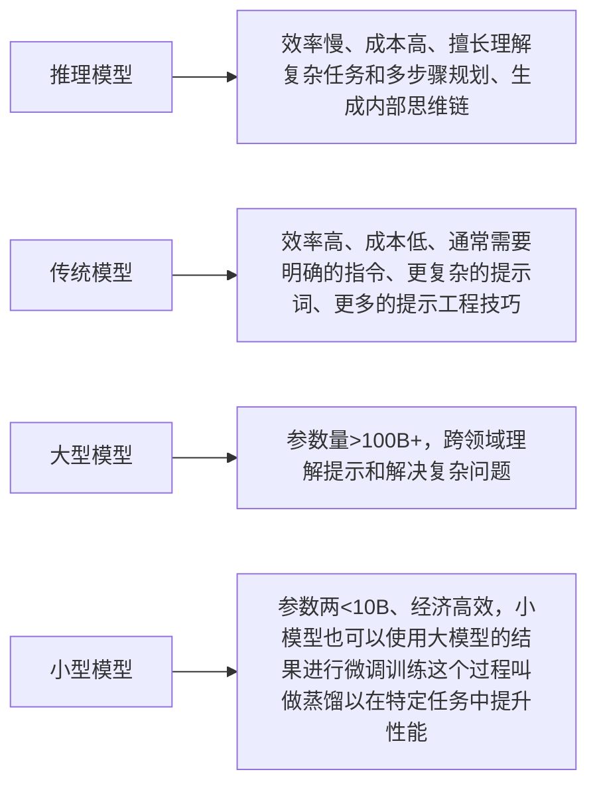

# 模型

# 提示工程
又名 提示词工程，指为模型生成内容创建有效指令的过程，因为模型生成的内容通常是非确定性的，所以构建一个从模型生成正确内容的提示是艺术和科学的结合。
提示工程的通用指导原则
+ 为模型提供输入、输出的类型以及相应的示例（少样本学习）
+ 在指令中详细说明模型应该如何回复、以消除歧义
+ 当使用推理模型时，从目标和期望的结果两方面描述要完成的任务，而不是分布说明如何完成任务
+ 为prompt创建评测，最好使用真实数据或等价的数据来测试。

# 流式输出
流式传输是一种持续传输数据块的通信方式，与传统请求——响应模型不同，响应数据可分块发送。
**典型应用场景**  
+ 直播
+ 日志实时监控
+ 大模型生成文本模拟打字机效果

要了解流式输出，需要先了解长链接。长链接（Long Connection）是指在一次连接建立后，在一段时间内保持连接状态，持续进行数据传输，而不是每次传输数据都重新建立连接。与短链接相比，长链接减少了连接建立和断开的开销，适用于需要频繁交互的场景。
在HTTP/1.1协议中，默认支持长链接。通过在请求头中设置Connection: keep-alive，客户端和服务器可以在一次TCP连接上进行多次HTTP请求和响应，而不需要每次都重新建立TCP连接

**HTTP长链接**  
|技术|特点|适用场景|
|---|---|---|
|polling|定时轮询服务器|简单实时通知|
|long polling|保持连接直到又数据或超时|中等实时性需求|
|SSE|服务器单向推送事件流|实时数据更新|
|websocket|双向全双工通信|即时聊天、游戏|

**服务器发送事件-SSE**  
服务器发送事件（Server - Sent Events，SSE）是一种允许服务器向客户端实时推送更新的Web API。与传统的HTTP请求 - 响应模式不同，SSE建立一个长连接，服务器可以在有新数据时随时向客户端发送事件。客户端通过监听特定的事件流来接收数据。SSE使用text/event-stream MIME类型，以文本格式发送数据

**大模型为什么需要流式输出**  
当大模型生成长文本响应内容时，传统模式需要等待全部生成完成一次性返回，而使用流式输出的好处有：
+ 首字响应时间降低、实现打字机效果
+ 支持中间干预（如停止生成）
+ 防止超时断开连接

# 多模态：图片、语音、视频
多模态 指的是多种信息形式的结合，比如图片、音频、视频等。而多模态模型则是能够同时理解和处理这些不同形式信息的人工智能模型。它就像一个“全能型选手”，能够像人类一样同时处理视觉、听觉和语言信息，从而实现更复杂的任务。

## 图片处理
+ 通过URL传递图像
+ 通过base64编码传递图像

## 语音处理
+ 语音代理：通过理解音频来处理任务，并以自然语言进行回应
+ 流式音频： 实时处理音频，构建语音代理和其他低延迟应用，包括转录用例
+ 文本到语音：要将文本转换为语音，使用音频 API的 audio/speech 端点
+ 语音到文本：要将语音转换为文本，使用音频 API 的 audio/transcriptions 端点
+ 控制脚本与模型对话：要将语音转换为文本，使用音频 API 的 audio/transcriptions 端点

## 视频处理
+ 视频理解：通过多模态模型对视频内容进行理解和提取信息的过程，其输入可以是文字、图像、音频等多种模态的信息，或者他们的混合，输出通常是文本
+ 视频生成：通过多模态模型根据输入的文本、图像或其他信息，自动生成对应的视频内容，这种技术的核心在于将非视频信息转化为动态、连贯的视觉内容。其输入可以是文字、图像、视频等，输出通常为视频

**视频理解**  
多模态模型处理视频内容的核心思路是将视频转换为模型可理解的形式，通常通过抽帧（将视频分解为连续的图像帧）并结合其他模态（如文本、音频）进行综合分析和理解。

主要功能：
+ 视频内容理解​：识别视频中的场景、物体、人物、动作等
+ 关键帧提取​：从视频中提取关键帧，帮助快速获取视频的主要内容
+ 动作识别​：分析视频中的人物动作或物体运动
​+ 场景分割​：将视频分割成不同场景或片段，便于后续处理
+ 语音识别与字幕生成​：提取视频中的语音内容并生成字幕
+ 情绪分析​：分析视频中人物的情绪或视频整体的情感基调

应用场景：
+ 视频分类​：自动分类视频内容，例如将视频分为“体育”“教育”“娱乐”等类别
+ 内容审核​：快速检测视频中是否存在违规内容（如暴力、色情等）
+ 广告推荐​：根据视频内容推荐相关广告
+ 视频剪辑工具​：自动提取视频中的关键内容，帮助用户快速剪辑视频

**视频生成**  
主要功能：
+ 文本驱动生成​：用户只需输入一段文字描述，即可自动生成对应的视频内容，无需复杂的操作或手动调整
+ 多模态融合​：整合了视觉、语言等多种模态信息，能够更精准地理解文本描述，并生成符合预期的视频
+ 高效处理​：通过优化算法和模型结构，在生成视频时表现出较高的效率，适用于实时或快速生成的需求
+ ​高质量输出​：生成的视频在画面质量、动作连贯性和场景真实性方面表现出色，具备较高的视觉效果

应用场景：
+ 影视制作​：创作者可以通过简单的文字描述快速生成视频片段，加速制作流程
+ 教育培训​：用于制作教学视频或演示，提升教学内容的可视化效果
+ 广告创意​：帮助企业快速生成广告视频，提高创意表现力
+ 游戏开发​：辅助生成游戏场景或角色动作，加快开发周期

