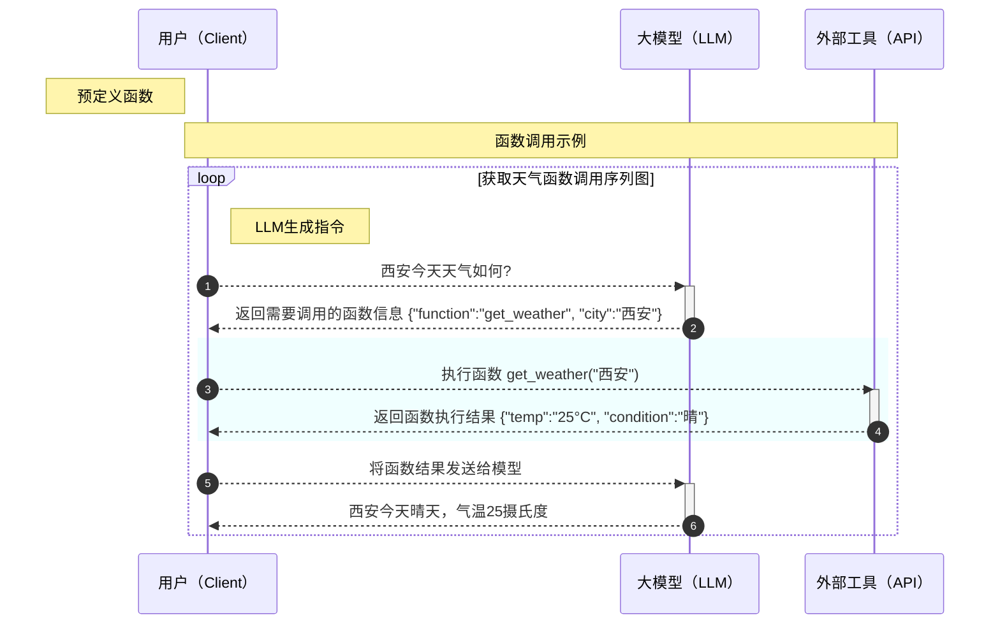

# 模型

# 提示工程
又名 提示词工程，指为模型生成内容创建有效指令的过程，因为模型生成的内容通常是非确定性的，所以构建一个从模型生成正确内容的提示是艺术和科学的结合。
提示工程的通用指导原则
+ 为模型提供输入、输出的类型以及相应的示例（少样本学习）
+ 在指令中详细说明模型应该如何回复、以消除歧义
+ 当使用推理模型时，从目标和期望的结果两方面描述要完成的任务，而不是分布说明如何完成任务
+ 为prompt创建评测，最好使用真实数据或等价的数据来测试。

# 流式输出
流式传输是一种持续传输数据块的通信方式，与传统请求——响应模型不同，响应数据可分块发送。
**典型应用场景**  
+ 直播
+ 日志实时监控
+ 大模型生成文本模拟打字机效果

要了解流式输出，需要先了解长链接。长链接（Long Connection）是指在一次连接建立后，在一段时间内保持连接状态，持续进行数据传输，而不是每次传输数据都重新建立连接。与短链接相比，长链接减少了连接建立和断开的开销，适用于需要频繁交互的场景。
在HTTP/1.1协议中，默认支持长链接。通过在请求头中设置Connection: keep-alive，客户端和服务器可以在一次TCP连接上进行多次HTTP请求和响应，而不需要每次都重新建立TCP连接

**HTTP长链接**  
|技术|特点|适用场景|
|---|---|---|
|polling|定时轮询服务器|简单实时通知|
|long polling|保持连接直到又数据或超时|中等实时性需求|
|SSE|服务器单向推送事件流|实时数据更新|
|websocket|双向全双工通信|即时聊天、游戏|

**服务器发送事件-SSE**  
服务器发送事件（Server - Sent Events，SSE）是一种允许服务器向客户端实时推送更新的Web API。与传统的HTTP请求 - 响应模式不同，SSE建立一个长连接，服务器可以在有新数据时随时向客户端发送事件。客户端通过监听特定的事件流来接收数据。SSE使用text/event-stream MIME类型，以文本格式发送数据

**大模型为什么需要流式输出**  
当大模型生成长文本响应内容时，传统模式需要等待全部生成完成一次性返回，而使用流式输出的好处有：
+ 首字响应时间降低、实现打字机效果
+ 支持中间干预（如停止生成）
+ 防止超时断开连接

# 多模态：图片、语音、视频
多模态 指的是多种信息形式的结合，比如图片、音频、视频等。而多模态模型则是能够同时理解和处理这些不同形式信息的人工智能模型。它就像一个“全能型选手”，能够像人类一样同时处理视觉、听觉和语言信息，从而实现更复杂的任务。

## 图片处理
+ 通过URL传递图像
+ 通过base64编码传递图像

## 语音处理
+ 语音代理：通过理解音频来处理任务，并以自然语言进行回应
+ 流式音频： 实时处理音频，构建语音代理和其他低延迟应用，包括转录用例
+ 文本到语音：要将文本转换为语音，使用音频 API的 audio/speech 端点
+ 语音到文本：要将语音转换为文本，使用音频 API 的 audio/transcriptions 端点
+ 控制脚本与模型对话：要将语音转换为文本，使用音频 API 的 audio/transcriptions 端点

## 视频处理
+ 视频理解：通过多模态模型对视频内容进行理解和提取信息的过程，其输入可以是文字、图像、音频等多种模态的信息，或者他们的混合，输出通常是文本
+ 视频生成：通过多模态模型根据输入的文本、图像或其他信息，自动生成对应的视频内容，这种技术的核心在于将非视频信息转化为动态、连贯的视觉内容。其输入可以是文字、图像、视频等，输出通常为视频

**视频理解**  
多模态模型处理视频内容的核心思路是将视频转换为模型可理解的形式，通常通过抽帧（将视频分解为连续的图像帧）并结合其他模态（如文本、音频）进行综合分析和理解。

主要功能：
+ 视频内容理解​：识别视频中的场景、物体、人物、动作等
+ 关键帧提取​：从视频中提取关键帧，帮助快速获取视频的主要内容
+ 动作识别​：分析视频中的人物动作或物体运动
​+ 场景分割​：将视频分割成不同场景或片段，便于后续处理
+ 语音识别与字幕生成​：提取视频中的语音内容并生成字幕
+ 情绪分析​：分析视频中人物的情绪或视频整体的情感基调

应用场景：
+ 视频分类​：自动分类视频内容，例如将视频分为“体育”“教育”“娱乐”等类别
+ 内容审核​：快速检测视频中是否存在违规内容（如暴力、色情等）
+ 广告推荐​：根据视频内容推荐相关广告
+ 视频剪辑工具​：自动提取视频中的关键内容，帮助用户快速剪辑视频

**视频生成**  
主要功能：
+ 文本驱动生成​：用户只需输入一段文字描述，即可自动生成对应的视频内容，无需复杂的操作或手动调整
+ 多模态融合​：整合了视觉、语言等多种模态信息，能够更精准地理解文本描述，并生成符合预期的视频
+ 高效处理​：通过优化算法和模型结构，在生成视频时表现出较高的效率，适用于实时或快速生成的需求
+ ​高质量输出​：生成的视频在画面质量、动作连贯性和场景真实性方面表现出色，具备较高的视觉效果

应用场景：
+ 影视制作​：创作者可以通过简单的文字描述快速生成视频片段，加速制作流程
+ 教育培训​：用于制作教学视频或演示，提升教学内容的可视化效果
+ 广告创意​：帮助企业快速生成广告视频，提高创意表现力
+ 游戏开发​：辅助生成游戏场景或角色动作，加快开发周期

# 对话状态管理
对话状态管理是与AI模型交互中的关键环节。通过合理管理对话状态，可以在多轮对话中保持信息的连贯性，从而提升用户体验

**手动管理对话状态**  
尽管每次文本生成请求都是独立的，但开发者可以通过在请求参数中添加历史消息来实现多轮对话
可以在一次请求中捕获对话的前一个状态，从而实现多轮对话的管理。为了手动共享上下文，可以将模型的上一个回复作为输入的一部分，并将其附加到下一个请求中，可以实现对话的连续性

**上下文窗口管理**  
指的是模型在单次请求中可以处理的最大令牌数，包括输入、输出以及用于推理的令牌数。每种模型都有不同的上下文窗口限制
在处理复杂输入或包含多轮对话的请求时，需要特别注意输出令牌和上下文窗口的限制。模型在生成响应时，会根据输入的复杂程度消耗不同数量的令牌。如果输入的上下文过多，可能会导致超出上下文窗口的限制，从而影响输出的质量和完整性

上下文窗口的令牌计算包括以下部分
+ 输入令牌：用户输入内容
+ 输出令牌：模型响应内容
+ 推理令牌：模型用于规划响应的内部计算

如果生成的令牌数量超过了上下文窗口的限制，超出部分可能会被截断，从而影响最终的输出结果

# 分词器与对话模板

+ 为什么需要 chat-template?：大型语言模型（LLMs）在处理对话时，都有自己期望的特定输入格式。例如，即便两个模型都基于相似的架构，如 Mistral 和 Zephyr，它们在训练过程中可能采用了完全不同的对话格式。某些模型可能要求对话以特定角色标签（如 [INST] 和 [/INST]）包裹，而另一些可能使用特殊的标记（如 <|user|>、<|assistant|>) 来区分发言者
  - 多样性挑战：每个模型都有其独特的对话格式
  - 复杂性： 手动构建这些复杂而精确的格式既耗时又容易出错
  - 性能影响：错误的格式会导致模型性能显著下降， 模型没有在错误的格式上进行训练，可能无法理解输入意图
+ chat-template的定义与作用： 它是一种用于将人类可读的对话历史转换为模型能够理解的单一可标记化字符串的标准、鲁棒的方式。当您加载一个预训练的对话模型时，其对应的 tokenizer（标记器）通常会自带一个与该模型训练时所用格式相匹配的 chat-template
  - 统一格式： 自动化将结构化的对话（如列表）转换为模型所需的特定字符串格式
  - 避免错误： 大大减少手动格式化可能引入的错误
  - 提升性能：确保模型接收到其训练时期望的精确格式，从而最大化模型性能和一致性

**chat-template高级应用与定制**  
+ 多模板场景： 复杂模型可能设计不止一个chat-template，以适应不同的使用场景
  - 默认模板： 用于一般的对话交互
  - 工具使用模板（tool_use）：专门用于模型调用外部工具的特定格式
  - 检索增强生成模板（rag）：结合了检索到的信息，需要在输入中以特定方式呈现

# 函数调用
大模型函数调用是一种强大的能力，允许大型语言模型 (LLM) 与外部工具或 API 交互，从而扩展其功能并解决更复杂的问题。 简单来说，就是让LLM不仅能理解和生成文本，还能调用函数来完成实际操作

**核心思想**  
+ LLM生成指令：当用户提出的问题需要外部工具或API解决时，LLM会识别出这种需求，并生成一个包含函数名称和参数的指令
+ 执行函数：该指令被传递给相应的外部工具或 API，执行相应的操作
+ 返回结果：工具或API将执行结果返回给LLM
+ LLM整合结果：LLM将接收到的结果整合到其回复中，提供给用户一个完整，有用的答案

**工作流程**  
+ 预定义函数：使用 JSON Schema 定义函数，包括名称、描述、参数和参数类型
+ 发送请求：将函数定义和用户输入一起发送到 OpenAI API
+ 处理响应：API 会返回一个 JSON 对象，指示是否需要调用函数，以及需要调用的函数名称和参数
+ 执行函数：根据 API 返回的函数名称和参数，执行相应的函数
+ 返回结果：将函数执行结果发送回 OpenAI API
+ 生成最终回复：API 会将函数执行结果整合到回复中，并返回给用户

**使用场景**  
+ 获取天气
+ 发送邮件
+ 搜素知识库

# 什么是推理模型（慢思考模型）
**什么是推理模型**  
如 OpenAI o1、o3-mini，DeepSeek-R1 等，是通过强化学习训练的新型大型语言模型，专为执行复杂推理任务而设计。这些模型在回答之前会进行深入思考，形成一个长长的内部思维链（a.k.a. CoT），从而能够更好地响应用户
推理模型在复杂问题上——例如：编程、科学推理以及智能体工作流程的多步骤规划方面——表现卓越

**努力值 reasoning_effort**  
reasoning_effort 参数用于指导模型思考过程应该生成多少推理 token，目前 OpenAI 提供的 API 可以为此参数指定 low、medium 或 high 中的一个，其中low将优先考虑速度和经济的token使用，而high将优先考虑更完整的推理，但会以生成更多token和响应速度较慢为代价。默认值为medium，这是速度和推理准确性之间的平衡。而 DeepSeek API 暂时还不支持调整努力值

**工作原理**  
推理模型除了输入和输出外，还引入了思考过程，OpenAI 称其为 推理token，DeepSeek 则称之为深度思考。它可以帮助模型更好地理解问题，从而提升输出质量。在思考过程生成后，模型会正常生成最终输出，并从上下文中丢弃思考过程

**最大输出长度**  
为了管理推理模型的使用成本，OpenAI API 新增 `max_completion_tokens`参数来限制模型生成的总 token 数量（包括思考过程和最终输出）。
在以前的模型中，max_tokens 参数控制生成的 token 数量和最终输出的 token 数量，这两者总是相等的。
然而，对于推理模型，由于思考过程的存在，生成的总 token 数量总是大于等于最终输出的 token 数量。
DeepSeek API 则有些不同。max_tokens 表示最终输出的最大长度，因此不包含思考过程。控制思考过程则需要使用 reasoning_effort 参数。
如果生成的 token 数量达到上下文窗口限制或请求中设置的 max_completion_tokens 值，客户端将收到一个 finish_reason 设置为 length 的响应，通常表现为截断，或者最终输出为空，或者 </think> 不能闭合

**提示词 prompt**  
推理模型在较为抽象的指令下会提供更好的结果，而传统模型则要求提示词尽量非常精确
+ 传统模型像一位初级程序员，只有在明确的指令指导和简单的任务下才能较为出色的完成任务。
+ 推理模型就像一位高级程序员，给他制定OKR，他自己会用自己的知识和经验来完成复杂的任务

**传统模型 v.s 推理模型**  
推理模型并不意味着永远更好，与传统模型相比，二者各有所长。
OpenAI 称 o系列模型为“规划者”，能够对复杂任务进行更长时间、更深入的思考，使它们在制定策略、规划复杂问题解决方案以及基于大量模糊信息做出决策方面非常有效。这些模型还能以高精度和准确性执行任务，使其成为数学、科学、工程、金融服务和法律服务等原本需要人类专家参与的领域的理想选择。
另一方面，传统模型（比如 gpt-4o，Qwen，DeepSeek-V3）提供低延迟、更具成本效益等优点

**最佳选择**  
+ 速度和成本： 传统模型更快且成本更低
+ 明确定义的任务： 传统模型能很好的处理明确定义的任务
+ 准确性和可靠性： 推理模型是可靠的决策者
+ 复杂问题解决： 推理模型能处理模糊性和复杂性

**使用推理模型的一些场景**  
+ 处理模糊任务：推理模型特别擅长处理有限信息或分散的信息片段，通过简单的提示理解用户意图并处理指令中的信息缺失
+ 大海捞针：当传递大量非结构化信息时，推理模型擅长理解并仅提取最相关的信息来回答问题
+ 在大型数据集中发现关系和细微差别：推理模型特别擅长推理复杂文档，这些文档包含数百页密集、非结构化的信息——如法律合同、财务报表和保险索赔。这些模型在文档之间建立联系并基于数据中隐含的事实做出决策方面表现特别强大
+ 多步智能体Agent规划：推理模型对智能体规划和策略制定至关重要。当推理模型用作"规划者"时，它能产生详细的多步骤解决方案，然后根据高智能或低延迟的重要性选择并分配合适的GPT模型（“执行者”）来完成每个步骤
+ 视觉推理：截至目前，o1是唯一支持视觉能力的推理模型。它与GPT-4o的区别在于，o1能够理解最具挑战性的视觉内容，如结构模糊的图表和表格，或图像质量较差的照片
+ 审查、调试和改进代码质量：推理模型在审查和改进大量代码方面特别有效，考虑到模型的较高延迟，通常在后台运行代码审查
+ 评估和基准测试其他模型响应：推理模型在基准测试和评估其他模型响应方面表现良好。数据验证对确保数据集质量和可靠性非常重要，尤其是在医疗保健等敏感领域。传统的验证方法使用预定义的规则和模式，但像o1和o3-mini这样的高级模型可以理解上下文并推理数据，为验证提供更灵活、更智能的方法

**编写有效的推理模型提示词**  
推理模型在接收直接明了的提示时表现最佳。某些提示工程技术，例如思维链魔法"让我们一步一步思考"，可能并不会提升性能（有时甚至会适得其反）。以下内容来自 《OpenAI 推理模型最佳实践》，更多示例请参考上文“提示示例”。
+ 开发者消息是新的系统消息
+ 保持提示简单直接：这些模型擅长理解并回应简短、清晰的指令
+ 避免思维连提示：由于这些模型内部已进行推理，提示它们"逐步思考"或"解释你的推理过程"是不必要的
+ 使用分隔符增强清晰度：使用markdown、XML标签和章节标题等分隔符来明确区分输入的不同部分，帮助模型正确解读各个部分
+ 先尝试零样本，需要时再使用少样本：推理模型通常不需要少样本示例就能产生良好结果，因此首先尝试编写不含示例的提示。如果您对期望输出有更复杂的要求，在提示中包含几个输入和期望输出的示例可能会有所帮助。但请确保示例与您的提示指令高度一致，因为两者之间的不一致可能会导致较差的结果
+ 提供具体指导：如果希望以特定方式限制模型的回应（例如"制定一份预算低于5000元的旅游方案"），请在提示中明确列出这些约束条件
+ 明确说明您的最终目标：在指令中，尽量为成功的回应提供非常具体的参数，并鼓励模型持续推理和迭代，直到符合您的成功标准
+ markdown格式：API中的推理模型将避免生成带有markdown格式的回应。如果您确实希望回应中包含markdown格式，请在开发者消息的第一行包含"Formatting re-enabled"字符串。这条 DeepSeek 暂时不支持

# MCP（Model Context Protocol）
LLM与外部环境之间操作协议的标准。MCP就是AI大模型的工具协议，一个USB转换器，一个RESTful协议。
MCP就是AI大模型的工具协议，一个USB转换器，一个RESTful协议

