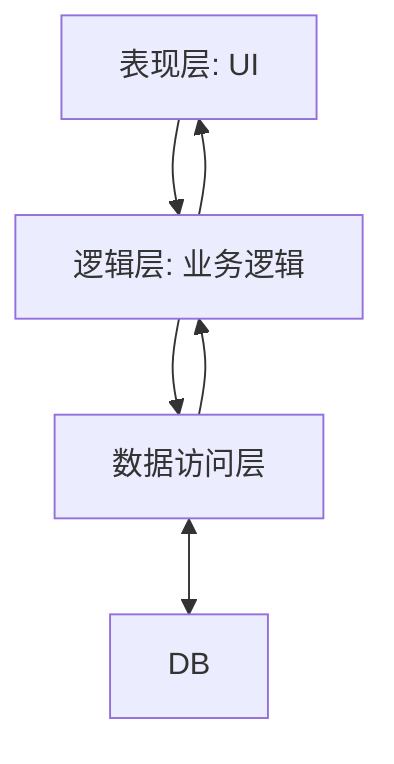
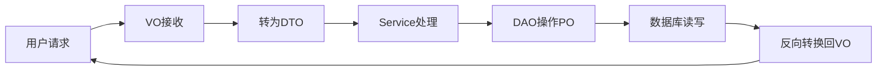
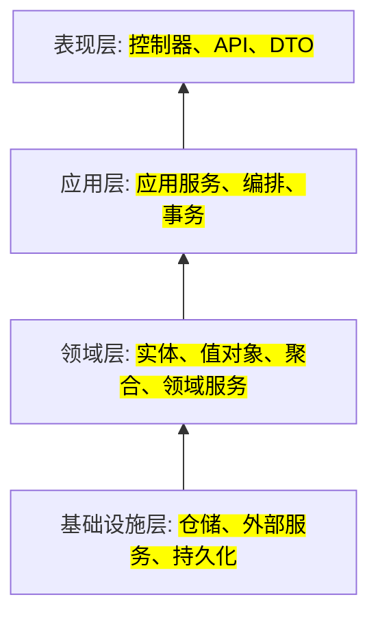
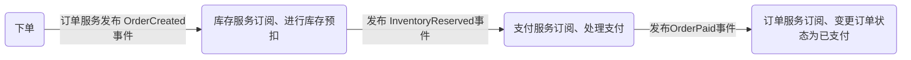
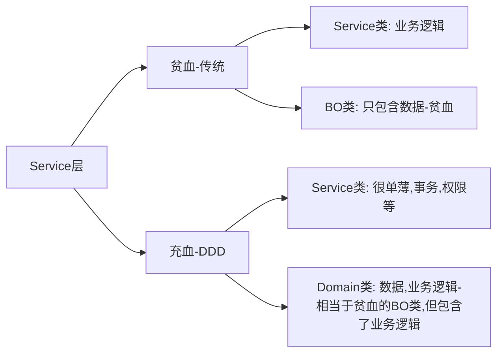

## 架构演进
常见的软件架构模型是三层架构，它将应用程序分为展示层、业务逻辑层和数据访问层， 这种架构模式在互联网发展早期业务规模较小时发挥了重要作用。

### 三层架构

其中在前后端分离的架构中，UI层又进一步分化为MVC的形式，MVC是协作关系而不是分层模式

#### 三层架构优点
+ 分离解耦关注点： 将不用功能模块分开，每个模块专注于特定任务，一定程度上降低了代码复杂性
+ 可维护和可扩展性

#### 三层架构缺点
+ 业务逻辑分散：业务逻辑可能分散在不同的层，复杂业务场景难以理清，影响了代码的可读性和可维护性
+ 领域模型贫血： 业务逻辑和数据存储混在一起，领域业务扩展受限，难以表达复杂的业务场景规则

#### 分层架构
+ Dao层：操作数据库（PO+DAO）
+ Service层：处理业务逻辑（DTO+BO）
+ Controller层：接收请求/返回响应（DTO<-->VO）

##### 术语（类比现实场景）
+ DAO：仓库管理员（执行存取操作），封装数据库操作的接口，隔离业务层与持久层，提供CRUD方法。
+ PO：仓库中的原始货物（数据库记录）
+ DTO：物流运输中的标准包装（跨层传输数据对象），不包含业务逻辑
+ VO：商品货架上的陈列展示（前端展示），可包含数据展示方法和逻辑

##### DTO vs VO
DTO可能被多个VO复用， VO可能组合多个DTO

##### PO vs Entity
两者常等同，但 Entity在DDD中可能包含业务逻辑

##### 数据流转过程

随着互联网的发展和公司业务的不断扩展，业务规模越来越大，场景越来越复杂，service层也越来越庞大，服务与服务之间的相互调用越来越混乱，这种情况下项目的迭代也越来越慢，增加一个功能或者一个微小的改动牵一发而动全身，这为项目带来了极高的风险和不确定性。
一般情况下，解决这种问题可以通过引入领域驱动设计来解决。

### 领域驱动设计（DDD）
+ 领域的划分：DDD将service层按照业务场景划分为不同的领域，每个领域包含实体、值对象、聚合根等元素。
+ 领域的内聚：在领域内，业务尽量要内聚，避免领域之间的耦合。每个领域内可以根据需要进一步划分为更细粒度的子域，进一部提高内聚性。

#### DDD术语
##### 战略设计（高层结构）
+ 限界上下文（Bounded Context、BC）： 明确子域边界，外部通过接口/集成通信、每个微服务通常对应一个限界上下文
+ 领域/子域（Domain/Subdomain）
  - 核心域：核心业务，需重点建模
  - 通用域：同时被多个子域使用的通用功能子域或与行业无关的通用服务（如支付、认证），可采用第三方服务或者通用方案
  - 支撑域：辅助业务，且支撑域具有企业特性，但不具通用性
+ 上下文映射：描述各限界上下文之间的关系（如防腐层、共享内核、开放主机等等）

##### 战术设计（代码层落地）
+ 实体： 有唯一标识的业务对象、生命周期内标识不变，属性可变（如订单、用户）
+ 值对象：无唯一标识，属性决定其身份（如金额、数量、地址等），值对象不可变、可复用、可作为实体属性
+ 聚合/聚合根：业务一致性边界，聚合根是唯一入口（如订单聚合根管理订单行）
+ 领域服务：业务逻辑不属于某个实体/值对象时，可抽象为领域服务（如定价服务、风控服务等）
+ 仓储：抽象持久化操作，负责聚合根的存取、屏蔽底层数据库细节
+ 工厂：负责复杂对象或聚合的创建过程

#### 代码组织
+ domain层：是DDD的核心，包含领域对象、值对象、聚合根。以及领域内的业务逻辑和规则。在领域内业务逻辑尽量内聚，而领域之间尽量松耦合。
+ 基础架构层：包括存储实现、队列实现、缓存实现等系统需要的基础设施能力，这一层主要为整个系统提供基础支撑
+ application层：用于组合领域内的服务，它不包含具体的业务逻辑，只是通过调用领域内的服务实现具体的功能
+ ui层：只是展示数据和接收用户输入，不包含业务逻辑，只是通过调用application层触发业务流程

#### 分层架构推荐示例

#### 限界上下文
业务模型的边界，每个上下文内模型语义一致，外部通过接口/集成通信。

通过对业务的划分，如订单系统，订单是一个子域，库存是另一个子域。 一个商品在不同的子域中表示的含义不同，在订单子域上下文中表示商品的单价、折扣等，在库存子域的上下文中商品表示 库存量、成本、存放位置。 多个子域之间的关联需要在应用层聚合，聚合的过程中就引出了技术方案， 比如订单——库存——支付需要采用同步方式；而这三个子域的通知调用可以采用异步方式，异步可能采用消息中间件等技术方案。

##### 划分示例（电商领域）
+ 订单上下文：订单生命周期管理、订单聚合、订单状态转移
+ 库存上下文： 库存管理、库存扣减、库存同步
+ 支付上下文：支付处理、退款、结算
+ 用户上下文： 用户信息、地址、配置
通常每个上下文可对应一个微服务，可独立部署和演进

##### BC划分规则
+ 先考虑团队规模：根据团队规模来确定需要划分多细粒度的BC，如果BC划分过小，而团队规模也小，可能对后期的开发、部署、上线、运维造成很大的负担
+ 考虑相关性：确定好粒度后，对语义相关性、功能相关性——业务方向、功能相关性——非业务方向进行划分

#### 事件驱动架构
+ 领域事件：业务状态的重要变化和转移； 如 订单已创建、订单已付款
+ 事件发布/订阅： 上下文之间通过事件异步解耦、集成。

##### 事件链示例（电商领域）

##### 领域事件技术实现
+ 消息总线（如 kafka、rabbitmq、rocketmq）负责事件分发
+ 事件消息体建议用领域语言和事件溯源ID

#### DDD与微服务/现代架构的关系
+ 限界上下文边界 == 微服务边界： 每个微服务聚焦单一业务子域，模型独立，松耦合。
+ 事件驱动： 领域事件实现服务间解耦，异步串联
+ CQRS/事件溯源： 复杂业务可用命令/查询分离、事件溯源提升可扩展性和审计能力
+ 高内聚低耦合： DDD天然支持微服务架构的高内聚、低耦合特点

#### DDD实践常见误区
+ 只做分层，不做领域建模，结果导致 贫血模型 的产生（只有属性没有行为）
+ 领域模型被 数据库、DTO、外部系统污染，丧失业务表达力
+ 过度追求 纯DDD，忽略了实际交付效率

#### DDD落地实践建议
+ 优先建模核心域，支撑/通用域 可用通用方案或外包
+ 与领域专家紧密合作，业务语言驱动建模
+ 仓库只暴露聚合根，持久化细节通过依赖倒置解耦
+ 领域事件驱动跨上下文集成，防腐层保护核心模型
+ 结合微服务、自动化测试、持续交付，提升团队协作与交付效率

## 架构设计
### 4A架构
4A架构是业务架构、应用架构、数据架构和技术架构的统称。
架构是为了构建一个满足业务需求、达成业务目标、运行稳定可靠、可扩展、可快速迭代功能的系统而进行的设计

### 4A架构之-业务架构
描述了企业如何通过价值流、工作流程、业务能力、组织架构等方面实现业务战略。
业务架构设计企业的治理架构、商业能力与价值流的正式蓝图。明确定义了企业的治理架构、业务能力、业务流程、业务数据。
业务架构定义企业做什么，业务流程定义企业怎么做。

#### 示例
+ 采购、供应商、财务业务架构
+ 工程采购业务流

### 4A架构之-应用架构
连接业务架构和技术架构的桥梁，将业务需求转化为技术可实现的功能
阐述再支撑业务运转的整个系统中，服务是如何切分的，一般每个服务都是由独立的开发小组进行迭代和维护的。简单分为“ 支撑应用、前台应用、后台应用。

#### 示例
+ 支撑应用： 用户权限、基础数据、解决方案、运营运维、数据底座
+ 后台应用：xx服务、订单服务..
+ 前台应用：租户、运营门户、供应商系统..

### 4A架构之-数据架构
数据资产管理蓝图，数据架构描述企业主要数据类型及来源，逻辑数据资产，物理数据资产，数据管理职责
指导如何分析数据需求、做好数据设计
**数据需求分析表示例**
|序号|数据实体|表名|数据量|数据实体说明|
|----|-------|----|------|-------------|
|1|采购订单行表|po_line_t|100w|采购订单行信息|

## FAQ
### 一个BC代表一个微服务？
微服务一般是有高度相关功能的一个独立的开发部署单元，有自己的技术自治性、技术选型、弹性扩缩容，发布上下频率，可以各自维护，多个微服务可以组成一个完整的系统，多个业务之间各自管理
BC对应一个领域或一个模块或一个高内聚的业务，如果两个领域相关性很高，则一个微服务也可包含多个BC， 如果其中一个领域的访问量非常大， 则需要单独拆分为一个微服务中，弹性扩容以提高性能。
它俩之间没有必然的一一对应关系，限界上下文是领域模型的边界，用于明确业务领域的范围和规则，而微服务是架构上的决策，用于划分独立的服务单元。限界上下文可以作为设计微服务的指导原则，但具体如何对应需要根据实际的业务需求、系统复杂性和技术架构来决定，因此一个限界上下文不一定代表一个微服务。

### 聚合根与领域服务之间的关系？
聚合根与领域服务负责封装实现业务逻辑。领域服务负责对聚合根进行调度和封装，同时可以对外提供服务，对于不能直接通过聚合根完成的业务操作就需要通过领域服务。

### 什么是贫血模型？什么是充血模型？
贫血模型的实体有一堆属性和get、set方法，看不出具体的业务逻辑，要梳理这个实体关联什么业务，只能一层层的搜service，这就是贫血失忆症，不够面向对象。
而充血模型，除了get、set方法，还包含具体的业务方法，每个实体都是清晰的，这样的模型就叫充血模型，充血模型内存计算会多一些，内聚核心业务逻辑处理。这才是面向对象的本质。
+ 贫血模型：重 Service，轻 BO
+ 充血模型：轻 Service，重 Domain

### 领域模型应该是贫血还是充血？
看情况，推荐充血

### 应用层和领域层如何划分？
应用层更适合场景，领域层是基于业务规则和领域只是与场景和技术无关

### DDD的适用原则？
DDD适合大项目，逻辑复杂的场景，一般的小项目，MVC足够，在架构选型时，一定要先业务，后技术，先做语文题，后做数学题。聚合要先足够小，领域层先薄后厚，微服务先大后小。业务不稳定先不动，先做到职责单一化。

### DDD的价值？
+ 解决微服务拆分困境：使用ddd分析业务时，使用【聚合】把关联性强的业务概念划分到一个边界下，限定 聚合 和 聚合 之间只能通过 【聚合根】访问， 这是第一层边界。 在【聚合】基础上根据 业务相关性、业务变化频率、组织结构 等约束条件定义【限界上下文】，这是第二层边界。 有了这两层边界作为约束和限制，微服务的边界就比较清晰了，拆分微服务也就简单多了。
+ 应对系统复杂性：ddd的核心思想是避免业务逻辑的复杂度与技术实现的复杂度混淆在一起，确定业务逻辑与技术实现的边界，从而隔离各自的复杂度，业务逻辑并不关心技术是如何实现的。不管采用何种技术实现，只要业务需求不变，业务规则也就不会变化。
