## 架构演进
系统架构的演进大体上经历了这几个阶段
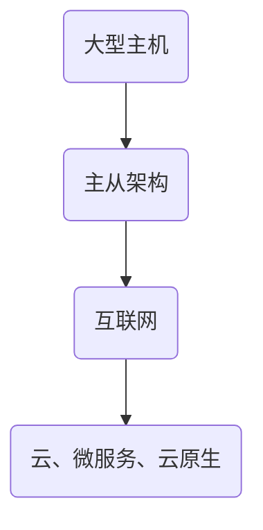
### 第一代单体架构
所有功能打包在一个进程中，集成了系统的所有功能
单体架构后来又衍生出垂直单体， 当单节点的单体应用无法满足流量需求，企业将单体应用部署多份，分别放在不同服务器上就叫垂直单体架构
+ 紧耦合
+ 错综交互
+ 重复造轮子
+ 封闭

### 介入一、二代中间-界面和数据库分开的二层架构
+ 引入面向对象设计模式
+ 界面和数据库分离

### 第二代SOA架构
面向服务的架构，所有服务都注册在总线上，从总线上查找服务信息进行调用
+ 松耦合
+ 集中式架构
+ 停机手动扩容
+ 有状态

### 三层架构
常见的软件架构模型是三层架构，它将应用程序分为展示层、业务逻辑层和数据访问层， 这种架构模式在互联网发展早期业务规模较小时发挥了重要作用。属于典型的贫血模型。
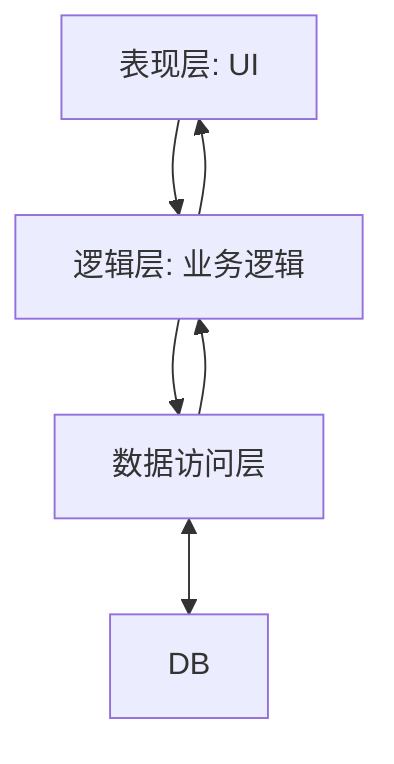
其中在前后端分离的架构中，UI层又进一步分化为MVC的形式，MVC是协作关系而不是分层模式。

#### 三层架构优点
+ 分离解耦关注点： 将不用功能模块分开，每个模块专注于特定任务，一定程度上降低了代码复杂性
+ 可维护和可扩展性

#### 三层架构缺点
+ 业务逻辑分散：业务逻辑可能分散在不同的层，复杂业务场景难以理清，影响了代码的可读性和可维护性
+ 领域模型贫血： 业务逻辑和数据存储混在一起，领域业务扩展受限，难以表达复杂的业务场景规则

### 第三代 微服务容器化
更彻底的面向服务的架构，有完善的服务治理组件。每个功能形成独立服务，通过服务注册进行调用。
+ API契约解耦
+ 自动弹性扩缩容
+ 无状态服务
+ 升级扩容无感知
+ 资源利用不充分
+ 分布式事务、运维复杂度高

### 无服务架构
+ 资源按需使用付费
+ 更高效的资源利用
+ 100%平台托管
+ 自动伸缩
+ 不合适调用频繁的业务服务
+ 不适合复杂业务服务

### 单体到微服务的架构演进历程
在单体到微服务的架构演进历程中，有发展出了非常流行的分布式架构。
进入互联网时代后，用户从各个终端访问目标系统，单体架构无法支撑如此大流量和高并发的场景的背景下，分布式架构登上互联网历史舞台。
分布式架构是将单体服务架构中的各个功能模块拆分，部署到不同的服务器或者进程中进行独立管理和维护。

分布式架构的系统也会产生一些问题，比如分布式的数据一致性。
在分布式系统中，数据会存在多个副本，加上网络延迟等因素，数据同步会存在问题。  
**数据一致性问题**
+ 强一致性
+ 最终一致性（弱一致性）： 在可接受的时长内，数据副本保持一致。

**分布式架构 CAP定理**
+ 一致性（C）：所有节点访问时都是同一份最新的数据副本
+ 可用性（A）：非故障的节点在合理的时间内返回响应，丹不保证获取的数据是最新数据
+ 分区容错性（P）：遇到任何网络分区故障时仍然能够对外提供服务
有三种组合：CA、CP、AP

**分布式架构 BASE理论**
核心思想是：如果无法做到强一致性，每个应用可以根据自身业务特点，采用适当的方式达到最终一致性。BASE理论是CAP定理中的一致性和可用性权衡的结果。

**典型的分布式架构**
+ SOA架构
+ 微服务架构（MSA）

#### 分层架构
将软件模块按照水平切分的方式分成多层，一个系统由多个模块组成。同时，每层有自己独立的职责，多个层次协同提供完整的功能。
+ Dao层：操作数据库（PO+DAO）
+ Service层：处理业务逻辑（DTO+BO）
+ Controller层：接收请求/返回响应（DTO<-->VO）

#### 系统架构分层的目标
+ 高内聚
+ 低耦合
+ 复用
+ 扩展性

#### 典型的软件架构模式
+ 经典三层架构（见上三层架构介绍）
+ MVC架构（见下）
+ 六边形架构

#### MVC（模型、视图、控制器）
使用业务逻辑、数据、界面显示分离的方法组织代码。

##### 术语（类比现实场景）
+ DAO：仓库管理员（执行存取操作），封装数据库操作的接口，隔离业务层与持久层，提供CRUD方法。
+ PO：仓库中的原始货物（数据库记录）
+ DTO：物流运输中的标准包装（跨层传输数据对象），不包含业务逻辑
+ VO：商品货架上的陈列展示（前端展示），可包含数据展示方法和逻辑

##### DTO vs VO
DTO可能被多个VO复用， VO可能组合多个DTO

##### PO vs Entity
两者常等同，但 Entity在DDD中可能包含业务逻辑

##### 数据流转过程
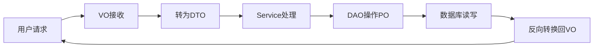

随着互联网的发展和公司业务的不断扩展，业务规模越来越大，场景越来越复杂，service层也越来越庞大，服务与服务之间的相互调用越来越混乱，这种情况下项目的迭代也越来越慢，增加一个功能或者一个微小的改动牵一发而动全身，这为项目带来了极高的风险和不确定性。
一般情况下，解决这种问题可以通过引入领域驱动设计来解决。

### 领域驱动设计（DDD）
DDD是一种处理高度复杂领域的设计思想，它试图分离技术实现的复杂性，同时围绕业务概念构建领域模型。
DDD分层架构将数据、缓存等视为基础层，可以被所有层调用；抽离了领域层，负责核心业务逻辑处理，领域层调用外部依赖全部通过接口以保证领域层100%单测覆盖率；应用层聚合多个领域层的能力，只做功能的组合、转发、不复杂具体业务逻辑。
+ 领域的划分：DDD将service层按照业务场景划分为不同的领域，每个领域包含实体、值对象、聚合根等元素。
+ 领域的内聚：在领域内，业务尽量要内聚，避免领域之间的耦合。每个领域内可以根据需要进一步划分为更细粒度的子域，进一部提高内聚性。
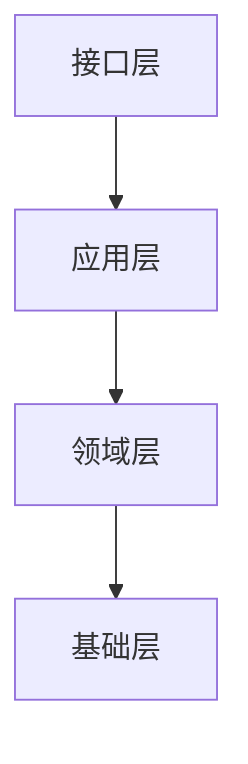
注：箭头指向被依赖方

+ 接口层：负责与其他服务，系统交互。处理传入数据的定义、校验、编解码、序列化操作。入参为DTO来协助数据转换，同时与领域对象、实体等解耦。如RESTful接口、MQS消费方
+ 应用层：负责完成完整的用例。协调多个领域服务、领域对象（实体、聚合根）实现服务编排和组合，该层通常不包含具体业务逻辑。该层设计：微服务编排和组合，分布式事务实现，消息驱动事件的驱动。
+ 领域层：实现企业核心业务逻辑，通过各种校验手段保证业务的正确性。领域层主要体现领域模型的业务能力，表达业务概念、业务状态和业务规则。领域层包含聚合根、实体、值对象、领域服务等领域模型中的领域对象。
+ 基础层：包含网关、缓存、数据库存储、消息中间件、监控、应用程序服务等通用的技术和基础服务以及其他服务的防腐。基础层以不同方式支持到其他三层，促进各层间通信。
  

#### DDD术语
##### 战略设计（高层结构）
也称为 战略建模；是指对业务进行高层次的抽象和归类
战略设计关注模型的分离，解决将大的模型如何划分为小模型以及相互之间如何关联。产出通常为限界上下文、模块、微服务划分等。  
**战略设计的几个关键术语**
+ 限界上下文（Bounded Context、BC）： 明确子域边界，外部通过接口/集成通信、每个微服务通常对应一个限界上下文，通常用于微服务的划分；同一个限界上下文内概念一致，跨限界上下文同一个概念可以不同含义。
+ 通用语言：业务人员和开发人员无歧义的统一语言，每个名词有清晰的概念和边界，同时是领域知识和抽象归纳的体现，形成了系统最重要的语义架构，是DDD中最核心的部分。
+ 领域/子域（Domain/Subdomain）：业务相关知识的集合
  - 核心域：核心业务，需重点建模
  - 通用域：业界已经有成熟方案的业务。同时被多个子域使用的通用功能子域或与行业无关的通用服务（如支付、认证），可采用第三方服务或者通用方案；通常偏技术，如消息通知、搜素、支付等。
  - 支撑域：辅助业务，且支撑域具有企业特性，但不具通用性，它是为了实现核心业务而不得不开发的业务所对应的相关知识的集合。
+ 上下文映射：描述各限界上下文之间的映射关系（如防腐层、共享内核、开放主机等等）

##### 战术设计（代码层落地）
是指对特定上下文下的模型进行详细设计
战术设计的对象包括聚合、实体和值对象。产出可以是用 UML表达的类图，需要细化到具体的属性，同时确保在代码级别可实现。
+ 实体： 在相同限界上下文中具有唯一标识（ID）的业务对象或领域模型、生命周期内标识不变，属性可变（如订单、用户），通过标识判断同一性。
+ 值对象：无唯一标识，属性决定其身份（如金额、数量、地址等），值对象不可变、可复用、可作为实体属性
+ 聚合：业务和领域模型中最小内聚单元，表现为一组生命周期强一致，修改规则强关联的实体和值对象的集合，表达统一的业务意义，对外屏蔽细节。
+ 聚合根：是聚合中最核心的实体，其他的实体和值对象都从属于这个实体。聚合根负责管理聚合内实体和值对象，同时是聚合对外的接口人。 聚合根是唯一入口（如订单聚合根管理订单行）
+ 领域服务：业务逻辑不属于某个实体/值对象时，可抽象为领域服务（如定价服务、风控服务等）。通常一个聚合有一个对应的领域服务，组织多个实体实现相对复杂的业务逻辑。
+ 领域事件：事件是系统状态发生的某种客观现象，领域事件是和领域有关的事件。通常由聚合内发起，聚合外监听处理。
+ 仓储：以持久化领域模型为职责的类，抽象持久化操作，负责聚合根的存取、屏蔽底层数据库细节。仓储的目的是屏蔽业务逻辑和持久化基础设施的差异，业务模型和存储解耦。
+ 工厂：负责复杂对象或聚合的创建过程

#### 代码组织
+ domain层：是DDD的核心，包含领域对象、值对象、聚合根。以及领域内的业务逻辑和规则。在领域内业务逻辑尽量内聚，而领域之间尽量松耦合。
+ 基础架构层：包括存储实现、队列实现、缓存实现等系统需要的基础设施能力，这一层主要为整个系统提供基础支撑
+ application层：用于组合领域内的服务，它不包含具体的业务逻辑，只是通过调用领域内的服务实现具体的功能
+ ui层：只是展示数据和接收用户输入，不包含业务逻辑，只是通过调用application层触发业务流程

#### 分层架构推荐示例
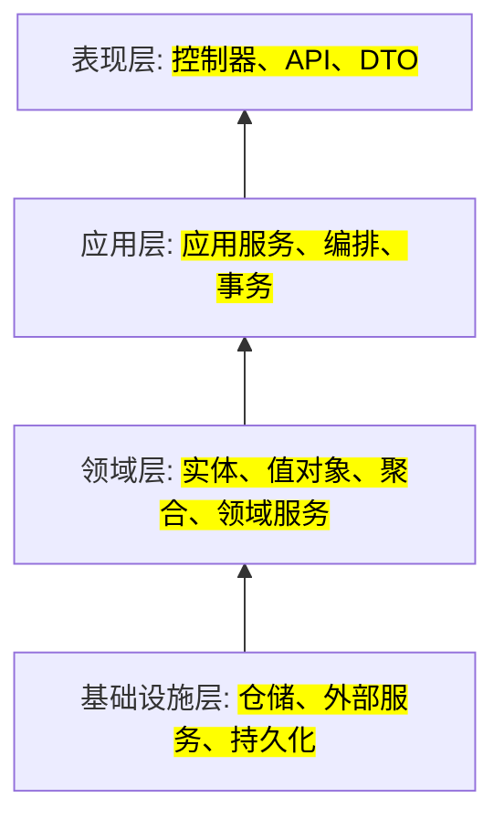
#### 限界上下文
业务模型的边界，每个上下文内模型语义一致，外部通过接口/集成通信。

通过对业务的划分，如订单系统，订单是一个子域，库存是另一个子域。 一个商品在不同的子域中表示的含义不同，在订单子域上下文中表示商品的单价、折扣等，在库存子域的上下文中商品表示 库存量、成本、存放位置。 多个子域之间的关联需要在应用层聚合，聚合的过程中就引出了技术方案， 比如订单——库存——支付需要采用同步方式；而这三个子域的通知调用可以采用异步方式，异步可能采用消息中间件等技术方案。

##### 划分示例（电商领域）
+ 订单上下文：订单生命周期管理、订单聚合、订单状态转移
+ 库存上下文： 库存管理、库存扣减、库存同步
+ 支付上下文：支付处理、退款、结算
+ 用户上下文： 用户信息、地址、配置
通常每个上下文可对应一个微服务，可独立部署和演进

##### BC划分规则
+ 先考虑团队规模：根据团队规模来确定需要划分多细粒度的BC，如果BC划分过小，而团队规模也小，可能对后期的开发、部署、上线、运维造成很大的负担
+ 考虑相关性：确定好粒度后，对语义相关性、功能相关性——业务方向、功能相关性——非业务方向进行划分

#### 事件驱动架构
+ 领域事件：业务状态的重要变化和转移； 如 订单已创建、订单已付款
+ 事件发布/订阅： 上下文之间通过事件异步解耦、集成。

##### 事件链示例（电商领域）
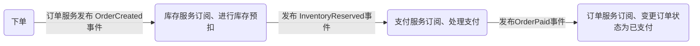
##### 领域事件技术实现
+ 消息总线（如 kafka、rabbitmq、rocketmq）负责事件分发
+ 事件消息体建议用领域语言和事件溯源ID

#### DDD与微服务/现代架构的关系
+ 限界上下文边界 == 微服务边界： 每个微服务聚焦单一业务子域，模型独立，松耦合。
+ 事件驱动： 领域事件实现服务间解耦，异步串联
+ CQRS/事件溯源： 复杂业务可用命令/查询分离、事件溯源提升可扩展性和审计能力
+ 高内聚低耦合： DDD天然支持微服务架构的高内聚、低耦合特点

#### DDD实践常见误区
+ 只做分层，不做领域建模，结果导致 贫血模型 的产生（只有属性没有行为）
+ 领域模型被 数据库、DTO、外部系统污染，丧失业务表达力
+ 过度追求 纯DDD，忽略了实际交付效率

#### DDD落地实践建议
+ 优先建模核心域，支撑/通用域 可用通用方案或外包
+ 与领域专家紧密合作，业务语言驱动建模
+ 仓库只暴露聚合根，持久化细节通过依赖倒置解耦
+ 领域事件驱动跨上下文集成，防腐层保护核心模型
+ 结合微服务、自动化测试、持续交付，提升团队协作与交付效率

## 架构设计
日常软件开发中，总是能看到一些诠释项目软件结构的图表。  
图表主要的主要作用是帮助项目上的人员能够理解正在构建的软件架构，建立一个共同的愿景。当我们开发一个新功能时，能够参考已经建立起来的架构，以后的开发过程中向原有的架构靠拢。图表的存在也可以让新人快速理解项目架构，也能够帮助向非开发人员解释项目架构。

但是在图表中会有一些不容易理解的点，例如不同的颜色，不同的线条，不同的线框，分别代表了什么意思。
所以用图表来可视化软件，需要注意下面这些点：
+ 清晰明确的表示图表中每一种颜色代表的意思
+ 清晰明确的表示不同的图表元素的意义，例如不同形状的元素、虚线、实线、各种线框等等
+ 清晰明确的表示图表元素之间的关系，不要遗漏了
+ 不要使用模糊或太过抽象的术语
+ 不要遗漏了技术选择
+ 层次不要太混乱
+ 不要包含太多的细节
+ 不要遗漏了语境或逻辑起点
为了清晰明了的表达图表的含义，给图表添加一个简单的图例（解释颜色编码、线条样式、形状等）是很有用的办法，图例的主要意义就是让团队保持一致的标记，避免歧义。

### C4模型
C4是软件架构可视化的其中一种方案（架构可视化）。用图例的方式，指导开发者把软件架构设计准确、清晰、美观表达出来。 
除了C4模型，还有上述提到的”4+1“视图模型。
视图模型描述的是架构本身，架构确定之后，不管用什么模型表达，本质应该是一样的没有优劣之分。

面向对象语言编程的软件系统一般由多个容器构成，一个容器又由多个组件构成，一个组件由一个或多个类实现。
对于类/组件/容器/系统的解释：
+ 类：在面向对象系统中，类是软件系统中的最小单元。
+ 组件：组件是由至少一个类组成的逻辑群组。
+ 容器：容器指的是能够在它内部执行组件或者驻留数据的东西，一般容器都是可执行文件，容器和容器之间的通信需要远程接口，例如SOAP网络服务、RESTful接口等等。
+ 系统：系统是能够提供价值的最高抽象层次。

**【C4模型特点】**  
+ 易于学习
+ 对开发人员友好的软件架构图示法
+ 无规定使用特定图形、特定建模语言画图，灵活性高
+ C4模型将系统从上到下 分为 上下文、容器、组件、代码 4层视图；每一层是对上层的展开和完善。层层递进对系统进行描述。

**【核心原则】**  
+ 渐进明细，迭代更新：从高层语境开始，逐步向下细化。架构是演进的，图也要随之更新
+ 沟通优先，工具其次：白板/纸笔是最快启动的方式。工具是为了持久化、版本化和分享
+ 聚焦关键视图：不必强求画出所有层级的所有图。几乎所有项目必备的就是Context 和 Container 图。Component 图用于关键/复杂容器。Class 图通常只在必要时（如核心算法、困难设计模式）才详细绘制，或直接看代码；在敏捷开发流行的当下，不建议详细手画第三、四层
+ 作为活文档：C4 图是架构文档的核心组成部分，需要像代码一样维护其时效性

#### 上下文-CEO、产品经理视角
位于顶层，是软件系统架构图启点，表达系统全貌。本层不涉及具体细节（技术选型、协议、部署方案等其他细节），因此可以更好的向非技术人员介绍系统。

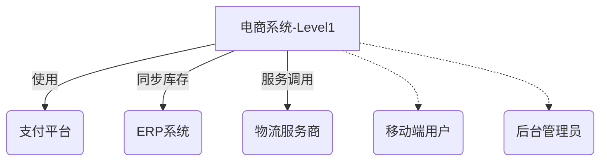

**【范围】**  
待描述的核心系统以及相关用户、支撑系统、不应出现与核心系统无关的其他系统
+ 主系统边界
+ 外部角色/用户
+ 第三方系统

**【受众】**  
业务决策者、产品经理、技术人员、非技术人员

#### 容器-架构师视角
这里的容器不是docker等容器、这个的容器表示一个可单独运行/可独立部署的单元。 这里的容器指应用以及依赖的中间件，如 服务器端web应用程序、单页应用程序、桌面应用程序、移动应用程序、数据库架构、文件系统、redis、es、mq等
它展示了软件架构的高级形状以及系统内各容器之间的职责分工；这一层还展示了系统的主要技术选型以及容器间的通信和交互。
该层视图没有说明部署方案、集群、复制、故障转移等。部署相关的视图通过 Deployment视图展示。

**如何画容器图**  
+ 名称：容器的逻辑名称（如“面向互联网的Web服务器”、“数据库”等）
+ 技术：容器的技术选择（如ApacheTomcat7等）
+ 职责：容器职责的高层次声明或清单

之后就是画各个容器之间的通信：
+ 容器之间交互的目的（如“读/写数据”、“发送报告“等）
+ 容器之间的通信方法（如Web服务、REST、Java远程方法调用、Java消息服务）
+ 容器之间的通信方式（如同步、异步、批量等）
+ 容器之间的协议和端口号（如HTTP、HTTPS、SOAP/HTTP、SMTP、FTP等）

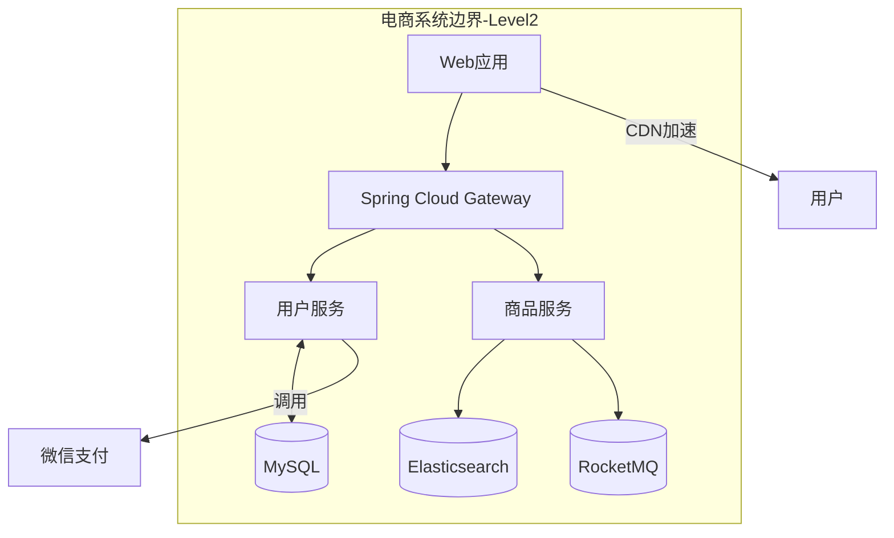

**【作用】**  
展示系统整体的开发边界、体现高层次的技术选型，暴露系统内各容器之间的分工交互。
揭示系统内部运行时的技术组成部分，回答”系统由哪些技术服务组成“

**【技术规格】**  
+ 部署形态：docker容器/K8S集群部署
+ 通信协议：gRPC/REST
+ 存储引擎：MYSQL、PG、MongoDB..
+ 技术栈：Java/C、C++/Python/NodeJS..

**【范围】**  
单个软件系统，关注系统内部的应用构成

**【受众】**  
软件开发团队内外技术人员、软件架构师、开发人员、运营/支持人员等

#### 组件-开发团队视角
将单个容器放大，会显示该容器内的内部组件。该层视图展示了一个容器是如何由许多个“组件”组成的，每个组件是什么，它们的职责以及技术实现细节

**如何画组件图**  
组件图就是将单个容器放大，它可以让你清晰的看到容器的关键逻辑组件、组件之间的层级关系和依赖。
+ 名称：组件的名称
+ 技术：对组件的技术选择
+ 职责：对组件职责的高层次的声明

```
@startuml
package "用户服务" {
    [认证组件] as Auth
    [会员组件] as Member
    [权限组件] as ACL
    [消息通知] as Notify
}

Auth --> Member : 查询用户数据
Member --> ACL : 鉴权
Auth --> Notify : 发送验证码
@enduml
```


**【范围】**  
单个容器，该容器由哪些组件（模块、服务）构成，该层需要平衡细节和清晰度，不要过度复杂化。

**【编码级关注点】**  
+ 组件间依赖关系
+ 接口契约定义
+ 领域模型边界划分
+ 事务传播方式

**【主要元素】**  
容器内的组件可以是：rest接口、service、dao等

**【受众】**  
软件架构师、开发人员

#### 代码-程序员视角
放大组件视图，会得到组件的代码视图；该层视图一般使用 UML类图、ER图等。由于内容较为技术化，是一个可选的详细级别（通常可以通过IDE等工具按需生成）。 除了最重要最核心最复杂的组件外，不建议将这种详细程度用于其他内容。
在注重敏捷开发的项目中，不建议产出非重要的代码级视图。
其中类图是一个可选的细节层次。如果想解释某个组件被怎样实现，可以画少量高层次UML类的图。一般是出于软件的复杂性，团队的规模和经验的考虑才画这个图。

```
@startuml
title 用户认证流程类图

class AuthController {
    + login() : ResponseEntity
    - authService: AuthService
}

class AuthService {
    + authenticate() : UserDTO
    - userRepo: UserRepository
    - jwtUtil: JwtUtils
}

interface UserRepository extends JpaRepository<User, Long> {
    User findByUsername(String name);
}
@enduml
```


**【范围】**  
单个组件

**【实现细节】**  
+ 类方法、属性定义
+ 设计模式
+ 方法
+ 缓存、锁、并行、并发

**【主要元素】**  
组件内的代码元素， 如 类、接口、对象、函数、数据库表

**【受众】**  
软件架构师、开发人员

#### 系统全景图（System Landscape diagram）
C4模型提供了单个软件系统的静态视图，这些视图都是对单个软件系统进行描述的。但在一个包含多种业务系统的复杂组织下，不会只有单个系统支撑其业务运行。 为描述这些软件系统如何在给定企业、组织、部门中与其他系统组合在一起，C4采用扩展视图System Landscape。
系统景观图实际上只是一个没有特定关注的软件系统的系统上下文图（System Context diagram），系统景观图内的软件系统都可以采用C4进行深入分析。

**【范围】**  
企业、组织、部门等

### 动态图（Dynamic diagram）
用于展示静态模型中的元素如何在运行时协作。动态图允许图表元素自由排列，并通过带有编号的箭头以指示执行顺序。

**【范围】**  
特定功能、故事、用例等

#### 部署图（Deployment diagram）
用于说明静态模型中的软件系统（或容器）的实例在给定环境（例如生产、测试、预发、开发等）中的部署方案
C4的部署图基于UML 部署图，但为了突出显示容器和部署节点之间的映射会做略微的简化

部署节点表示表示软件系统/容器实例运行的位置，类似于物理基础架构（例如物理服务器或设备）、虚拟化基础架构（例如 IaaS、PaaS、虚拟机）、容器化基础架构（例如 Docker 容器）、执行环境（例如数据库服务器、Java EE web/应用服务器、Microsoft IIS）等。部署节点可以嵌套，也可以将基础设施节点包括进去，例如 DNS 服务、负载平衡器、防火墙等

可以在部署图中随意使用 Amazon Web Services、Azure 等提供的图标，只需确保被使用的任何图标都包含在图例中，不产生歧义

**【范围】**  
单个部署环境中的一个或多个软件系统。如 生产、开发

**【受众】**  
软件开发团队内外的技术人员；包括软件架构师、开发人员、基础架构架构师和运营/支持人员

#### C4模型规范
**【图表】**  
+ 每个图都应该有一个描述图类型和范围的标题。如 xxx软件系统的xx图
+ 每个图表都应该有一个关键/图例解释所使用的符号。如 形状、颜色、边框样式、线型、箭头等
+ 首字母缩略词和缩写词（业务/领域或技术）应为所有受众所理解，或在图表键/图例中进行解释

**【元素】**  
+ 明确指定每个元素的类型。如 人员、软件系统、容器、组件等
+ 每个元素都应该有一个简短的描述，让人一目了然
+ 每个容器和组件都应该有明确指定的技术

**【关系】**  
+ 每条线都应该代表一个单向关系
+ 每一行都应该被标记，标记与关系的方向和意图一致。如 依赖或数据流
+ 容器之间的关系（通常代表进程间通信）应该有明确标记的技术/协议

#### Review checklist
C4模型图表绘制完成后，可以通过Review Checklist 进行自查，检查是否有不规范之处。Review Checklist被制成网页，可以通过 [Diagram review checklist](https://c4model.com/review/) 进行访问。

#### C4图与其它架构图区别
|对比维度|传统架构图|C4模型|
|----|-----|---|
|核心思想|单一技术视图|分角色分层视图递进展开|
|信息含量控制|混杂呈现所有信息|分层屏蔽不相关细节|
|文档可维护性| 修改牵一发动全身 | 支持增量更新 各层独立演进|
|工具支持|Visio、PPT通用绘图工具 | PlantUML、Structurizr等专业工具|
|生命周期|侧重设计阶段|贯穿需求、设计、开发全流程|

#### 架构图绘制实践-文本绘图工具选型
+ 采用绘图工具，拖拽元素、调整样式；如draw.io、visio、ppt、processon、亿图等；这类工具直观灵活，但是调整元素样式比较繁琐
+ 采用文本绘图工具，按语法描述图片元素，根据文本自动渲染图片；如 plantuml、markdown-mermaid、diagrams等 绘图快捷，但是样式不一定符合要求的风格，但是某些工具可以自定义比如diagrams

|工具|语法|使用方式|适用场景|
|----|----|--------|--------|
|structurizr|DSL|提供web界面渲染图片，可以生成C4-PlantUML和mermaid的代码|专业架构设计|
|C4-PlantUML|PlantUML|vscode等ide插件、文本转图|开发人员快速草图|
|mermaid|mermaid|markdown插件，提供live editor|~|

**【C4模型静态元素】**  
+ Person：系统的用户，可能是人或者其他系统
+ System：代表即将建设的系统，通常渲染为蓝色方块。
+ System_Ext：代表已存在的系统，通常渲染为灰色方块。
+ System_Boundary：某系统展开为容器时，则将System改为System_Boundary，代表系统的边界，内部放置容器元素，通常渲染为虚线框。

+ Container：待建设的容器，通常渲染为蓝色方块。
+ Container_Ext：已建设容器，通常渲染为灰色方块。
+ Container_Boundary：某容器展开为组件之后，则将Container改为Container_Boundary，代表容器的边界，内部放置组件元素，通常渲染为虚线框。

+ ContainerDb：待建设数据库，通常渲染为蓝色圆柱。
+ ContainerQueue：待建设消息队列，通常渲染为水平放置的蓝色圆柱。

+ Component：待建设组件，通常渲染为蓝色方块。
+ Component_Ext：已建设组件，通常渲染为灰色方块

**【静态元素的语法】**  
```python
Container(alias, "label", "technology", "description")
```
+ alias：是图内元素的唯一ID，其他地方可以通过alias进行引用，比如在Rel中引用
+ label：代表元素的显示名称
+ technology：代表元素采用的核心技术，包括但不限于开发语言、框架、通信协议等
+ description：代表元素的简单描述

**【典型反模式】**  
+ 错误：将消息队列画在 context层，应该属于 containers层
+ 错误：在容器图中标注python版本号，该层不应关注细节
+ 正确：将技术规则描述与图示分离，用侧边文档说明

**【C4图核心价值】**  
+ 打破沟通壁垒：产品经理看Context图 → 架构师讨论Containers → 开发人员实现Components → 无需所有人理解全量细节
+ 精准防控软件腐化
  - 自动化SDLC核验（如API调用不符组件图时告警）
  - 架构守护工具 (ArchtUnit) 基于C4规范约束
+ 降低认知负荷

**【参考链接】**  
+ [https://c4model.com/](https://c4model.com/)
+ https://blog.csdn.net/mclongyi/article/details/131142989
+ https://www.cnblogs.com/wzzkaifa/p/19054361
+ https://www.cnblogs.com/jimoliunian/p/18777560
+ https://www.jianshu.com/p/c90203659433
+ https://blog.csdn.net/csdn_tom_168/article/details/148869213

### 4A架构
4A架构是业务架构、应用架构、数据架构和技术架构的统称。
架构是为了构建一个满足业务需求、达成业务目标、运行稳定可靠、可扩展、可快速迭代功能的系统而进行的设计

#### 4A架构之-业务架构
描述了企业如何通过价值流、工作流程、业务能力、组织架构等方面实现业务战略。
业务架构设计企业的治理架构、商业能力与价值流的正式蓝图。明确定义了企业的治理架构、业务能力、业务流程、业务数据。
业务架构定义企业做什么，业务流程定义企业怎么做。

##### 示例
+ 采购、供应商、财务业务架构
+ 工程采购业务流

#### 4A架构之-应用架构
连接业务架构和技术架构的桥梁，将业务需求转化为技术可实现的功能
阐述再支撑业务运转的整个系统中，服务是如何切分的，一般每个服务都是由独立的开发小组进行迭代和维护的。简单分为“ 支撑应用、前台应用、后台应用。

##### 示例
+ 支撑应用： 用户权限、基础数据、解决方案、运营运维、数据底座
+ 后台应用：xx服务、订单服务..
+ 前台应用：租户、运营门户、供应商系统..

### 4A架构之-数据架构
数据资产管理蓝图，数据架构描述企业主要数据类型及来源，逻辑数据资产，物理数据资产，数据管理职责
指导如何分析数据需求、做好数据设计

**数据需求分析表示例**
|序号|数据实体|表名|数据量|数据实体说明|
|----|-------|----|------|-------------|
|1|采购订单行表|po_line_t|100w|采购订单行信息|

#### 4A架构之-技术架构
技术架构阐述的技术选型、服务发布管理，涉及到的工具较广。
从开发流程看： 开发、构建、测试、部署、运行
从搭建顺序看：基础设施、基础服务、数据存储、服务实现、负载均衡/网关等

##### 搭建顺序示例
由下至上： 计算-->中间件-->公共服务-->应用服务-->编排中心-->门户

#### 系统架构的4+1视图
4+1从不同关键角色的角度描述系统，并组成完整的系统架构描述。
参与和使用这些视图的角色有： 系统用户、开发者、系统工程师、项目经理、实施人员。
|视图|场景视图|逻辑视图|物理视图|处理视图|开发视图|
|:---:|:---:|:---:|:---:|:---:|:---:|
|阶段|分析阶段|分析阶段|设计阶段|设计阶段|设计阶段|
|视角|用户/使用者视角|软件系统分析、架构师视角|系统安装、调试工程师视角|系统处理分解|开发者、项目管理视角|
|关注点|用户可用性|软件功能、子系统、模块、组件的拆分|系统拓扑结构、系统安装、以及之间的交互|进程分解、并发、性能、吞吐量|软件开发|
|聚焦|功能特性的分析和分解|系统的功能分层|软件系统到物理的部署，服务器、数据库实例，网络VPN，网关等物理节点|处理逻辑分解|系统到子系统、模块、组件，代码仓的拆分|
|模型|用例视图，用户故事|组合结构图、类图|部署视图|时序图、协作图、状态图、活动图|组件视图、包视图|

+ 场景视图：是4+1视图的+1，核心，是其他视图的输入，其他视图围绕场景视图进行设计。
+ 逻辑视图：使用者的视角，从功能角度描述不同功能组件的层次关系
+ 处理视图：不同组件之间的行为关系，通常以时序图的方式表示
+ 开发视图：开发者视角下，从实现层面描述不同代码的包、类、库构成关系
+ 物理视图：系统所依托的物理视图，例如部署视图

#### 系统架构的4+1视图——处理视图
处理视图有多个视角，常见的有：时序图、活动图、协作图（合作图）、状态图

#### 系统架构的4+1视图——物理视图（部署视图）
物理视图用于描述系统软件到物理软硬件的映射关系，反映出系统的组件是如何部署到一组可计算机器节点上的。用于指导软件系统的部署实施过程。
物理环境可以是：服务器、PC机、移动终端等
软件环境可以是：容器、虚拟机、进程、线程。

##### 物理视图（部署视图）示例
+ 前台网关： 做用户校验、负责路由到中台网关
+ ALB：中台服务HTTP、HTTPS API负载均衡
+ WCM：静态资源服务器
+ 中台网关：复杂路由到相关中台服务
+ Eruka：中台服务的注册与发现
+ EKS：K8S集群负责容器化中台服务的部署，扩容和管理
+ 服务容器的规格：CPU，内存的上下限，弹性最小、最大POD个数
+ Redis缓存的规格：CPU，内存以及主备节点数
+ OpenGuass数据库规格：CPU，内存以及主备节点数

## 技术DFX设计
DFX是面向产品生命周期各环节的设计，其中X代表产品生命周期的某一个环节或特性，它是一种新的设计技术。在设计阶段尽可能早地考虑产品的性能、质量、可实现性、可测试性、产品服务和价格等因素，而对产品进行优化设计或再设计。

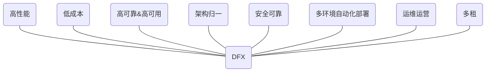
+ 高可靠&高可用：设计系统提供无故障服务，以避免因服务器宕机造成的服务不可用为目标做的架构设计；要达到高可用，系统要做好软硬件冗余，消除单点故障，同时做好故障转移，最短时间内发现故障，及时切换备用环境，
+ 高性能：针对应用的性能提升进行设计，包含后台服务的250ms（甚至更少 如200ms），页面3s性能保障；高并发，大单等极限场景的性能保障。
+ 安全可靠：如何防止攻击，防软件漏洞。设计安全编码，二三方软件安全可靠，敏感、隐私数据加密、保护、过滤、三面隔离等
+ 低成本：以节省和降低成本进行设计，在保证高可用的前提下，降低资源浪费，提高资源利用率，提高业务端到端的运行成本等。
+ 架构归一：架构统一管控设计，如 统一使用某种数据库，统一接入原生k8s，统一二三方件使用范围和版本管控，统一接入某种认证体系等。
+ 多环境自动化部署
+ 运营运维：应用监控、告警、运维运营设计合理的解决方案
+ 多租：针对不同模式的多租场景进行设计，涉及应用、数据、中间件、平台服务等放方面的多组方案，以及租户开租、管理等优化方案。

### 高可靠高可用之-数据库高可用架构
数据库架构主要分为：主备、主从、双活（双主）、存算分离

**主备**
+ 主备之间通过数据库日志同步数据
+ 备库只做数据备份，不具备实时切换能力
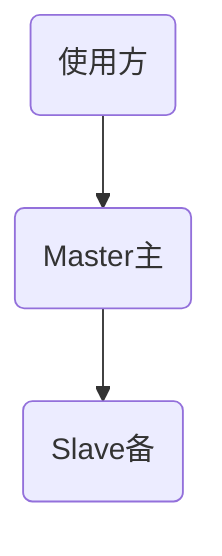

**主从**
+ 主从之间通过数据库日志实时同步
+ 主要一般承担写入，从库读取
+ 主从具备实时切换能力
+ 通过监控方式，当主库故障时，其中一个从库转为主库承担写入职责，同时作为新的数据源头，负责向其他从库同步数据
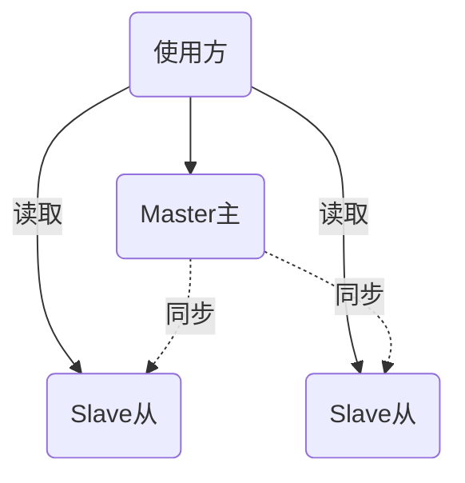
当主节点发生故障，主从切换， Master主被移出集群，其中一个Slave从转为主节点承担写入职责，并将结果同步给另一个Slave从节点。

**双主（双活）**
+ 数据库多个实例不分主从，都是主库，应用随机接入其中一个实例
+ 实例之间数据同步
+ 只要有一个实例存活即为可用，应用无感知
+ 主要难点在于数据同步一致性

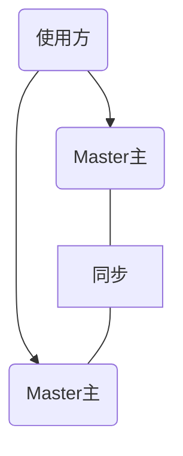

**存算分离**
+ 原有的数据库计算能力与存储分开，通过高速网络链接
+ 计算层具备计算弹性伸缩能力，大幅提高CPU利用率
+ 存储层只负责存储

## FAQ
### 一个BC代表一个微服务？
微服务一般是有高度相关功能的一个独立的开发部署单元，有自己的技术自治性、技术选型、弹性扩缩容，发布上下频率，可以各自维护，多个微服务可以组成一个完整的系统，多个业务之间各自管理
BC对应一个领域或一个模块或一个高内聚的业务，如果两个领域相关性很高，则一个微服务也可包含多个BC， 如果其中一个领域的访问量非常大， 则需要单独拆分为一个微服务中，弹性扩容以提高性能。
它俩之间没有必然的一一对应关系，限界上下文是领域模型的边界，用于明确业务领域的范围和规则，而微服务是架构上的决策，用于划分独立的服务单元。限界上下文可以作为设计微服务的指导原则，但具体如何对应需要根据实际的业务需求、系统复杂性和技术架构来决定，因此一个限界上下文不一定代表一个微服务。

### 聚合根与领域服务之间的关系？
聚合根与领域服务负责封装实现业务逻辑。领域服务负责对聚合根进行调度和封装，同时可以对外提供服务，对于不能直接通过聚合根完成的业务操作就需要通过领域服务。

### 什么是贫血模型？什么是充血模型？
贫血模型的实体有一堆属性和get、set方法，看不出具体的业务逻辑，要梳理这个实体关联什么业务，只能一层层的搜service，这就是贫血失忆症，不够面向对象。
而充血模型，除了get、set方法，还包含具体的业务方法，每个实体都是清晰的，这样的模型就叫充血模型，充血模型内存计算会多一些，内聚核心业务逻辑处理。这才是面向对象的本质。
+ 贫血模型：重 Service，轻 BO
+ 充血模型：轻 Service，重 Domain

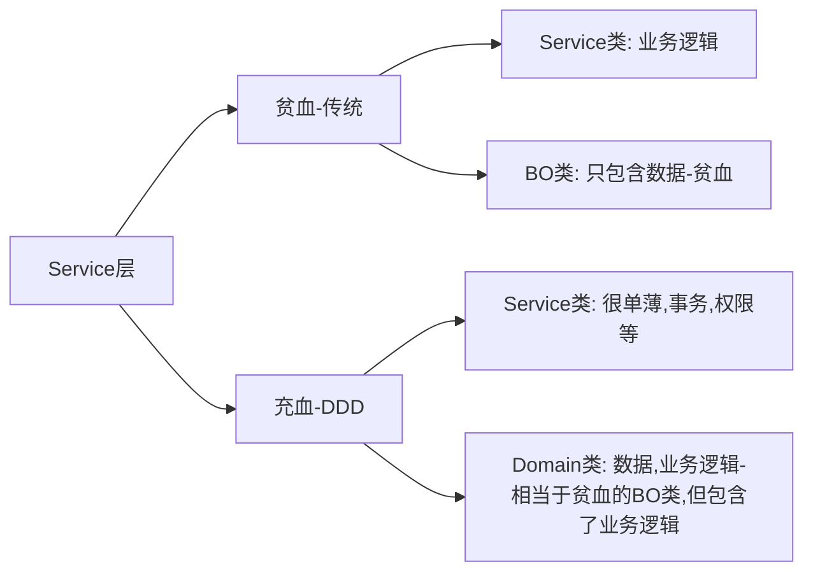

### 领域模型应该是贫血还是充血？
看情况，推荐充血

### 应用层和领域层如何划分？
应用层更适合场景，领域层是基于业务规则和领域只是与场景和技术无关

### DDD的适用原则？
DDD适合大项目，逻辑复杂的场景，一般的小项目，MVC足够，在架构选型时，一定要先业务，后技术，先做语文题，后做数学题。聚合要先足够小，领域层先薄后厚，微服务先大后小。业务不稳定先不动，先做到职责单一化。

### DDD的价值？
+ 解决微服务拆分困境：使用ddd分析业务时，使用【聚合】把关联性强的业务概念划分到一个边界下，限定 聚合 和 聚合 之间只能通过 【聚合根】访问， 这是第一层边界。 在【聚合】基础上根据 业务相关性、业务变化频率、组织结构 等约束条件定义【限界上下文】，这是第二层边界。 有了这两层边界作为约束和限制，微服务的边界就比较清晰了，拆分微服务也就简单多了。
+ 应对系统复杂性：ddd的核心思想是避免业务逻辑的复杂度与技术实现的复杂度混淆在一起，确定业务逻辑与技术实现的边界，从而隔离各自的复杂度，业务逻辑并不关心技术是如何实现的。不管采用何种技术实现，只要业务需求不变，业务规则也就不会变化。

### 对于初级架构师应该从哪种模型入手？
对于初级架构师，更推荐从4C 模型（C4 模型） 入手。原因如下：
4C 模型（Context-Container-Component-Code）以分层递进的方式（从宏观上下文到微观代码）可视化架构，逻辑清晰、门槛低，每个层级目标明确（如 Context 层聚焦系统与外部的关系，Container 层关注部署单元），容易理解和实操，能帮助初级架构师快速建立 “从整体到局部” 的架构思维，且工具支持丰富（如 PlantUML、Mermaid 等），适合快速落地。
而 4A+1 视图（通常指类似 RUP 的 4+1 视图，涵盖逻辑、开发、物理、进程视图 + 用例视图）更强调多维度的完整性，涉及的概念和视角更复杂，需要对架构的不同层面（如开发实现、物理部署）有较深理解才能协调运用，对初级架构师来说容易陷入细节，上手难度更高。
因此，初级阶段先用 C4 模型打基础，掌握架构分层描述的逻辑后，再逐步学习多视图模型会更高效

### C4模型的优缺点分别是什么？
C4模型作为架构可视化工具，其优缺点主要体现在对架构描述的简洁性、层次性和适用场景局限性上，具体如下：

**优点**  
+ 分层清晰，易理解和上手：从宏观的 “系统上下文（Context）” 到微观的 “代码组件（Code）”，四层结构逻辑递进，符合人类 “从整体到局部” 的认知习惯，无论是初级架构师还是非技术人员（如产品、业务方）都能快速理解，降低沟通成本。
+ 聚焦核心架构要素，避免冗余：核心关注 “系统边界、部署单元（Container）、组件分工” 等关键信息，不纠缠于技术细节（如具体框架、语法），帮助团队聚焦架构设计的核心逻辑（如模块职责、依赖关系）。
+ 灵活性高，适配多种场景：不绑定特定工具（支持 PlantUML、Mermaid、draw.io 等），可根据项目规模灵活选择展示层级（如小项目只需 Context+Container 层，复杂项目再深入 Component 层），轻量化且易落地。
+ 强沟通属性，促进团队对齐：标准化的可视化语言让架构师、开发、测试等角色能基于同一套 “图纸” 对齐认知，减少因文字描述模糊导致的理解偏差。

**缺点**  
+ 层级有限，复杂系统可能不够细致：原生仅 4 层，对于超大规模系统（如分布式微服务集群、跨组织的复杂生态），可能难以完全覆盖细粒度的架构细节（如组件内部的子模块、跨容器的网络交互规则），需额外扩展或结合其他模型补充。
+ 偏静态结构，弱于动态行为描述：主要聚焦 “系统由什么组成、如何关联” 的静态结构，对架构的动态行为（如流程流转、并发处理、故障恢复）描述能力较弱，需配合时序图、状态图等工具才能完整表达。
+ 对非功能性需求支持不足：较少直接体现性能、安全、可扩展性等非功能性架构设计（如负载均衡策略、数据加密层级），需依赖架构师在图外补充说明，可能导致关键约束被忽略。
+ 依赖使用者的架构素养：组件（Component）的划分、容器（Container）的边界定义等依赖架构师的经验，若使用者对业务或技术理解不足，易出现 “过度拆分” 或 “边界模糊” 的问题，影响模型的准确性。

**总结**  
C4 模型的核心价值是 “用最低成本实现架构的有效沟通”，适合中小型项目、快速迭代场景或架构入门阶段；但对于超复杂系统或需深度体现动态 / 非功能性设计的场景，需结合其他模型（如 4+1 视图、UML 动态图）补充使用。
