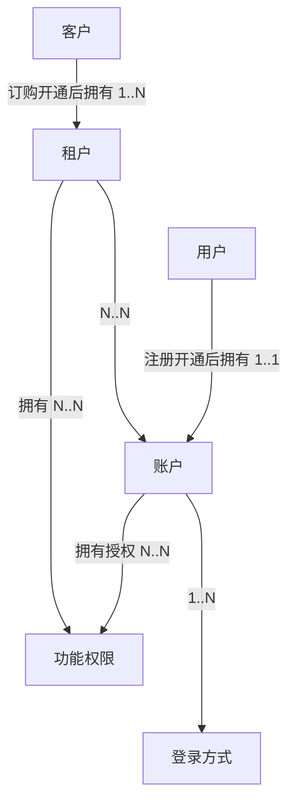

在学习ddd如何落地实践之前，先了解什么是限界上下文？

限界上下文是 DDD用于战略设计上提出的概念，用来确定语义所在的领域边界。  
限界就是 领域的边界， 上下文是 语义环境。 通过领域的限界上下文，可以在统一的领域边界内用统一的语言进行交流。  

其定义： 用来封装通用语言和领域对象，提供上下文环境，保证在领域内的一些术语、业务相关对象等（通用语言）有一个确切的含义，没有二义性。  
这个边界定义了模型的适用范围，使团队成员明确的知道什么应该在模型中实现，什么不应该在模型中实现。 比如 商品在销售阶段是商品，而在运输阶段是货物。同一个东西，由于业务领域不同，赋予这些术语不同的含义和职责边界，这个边界就是微服务设计的边界。领域边界就是通过限界上下文来定义的。

## 统一语言和概念明确，同一个团队，同一种语言
DDD中最重要的是要明确概念。 像做语文题一样，深究每个名词的含义。

### 概念不明确的常见情况
+ 概念过大、宽泛、涵盖了多层含义
+ 概念在不同上下文含义不同
+ 相似名称混用，比如混用同义词，但实际意义是有差别的
+ 同一个概念，随意的使用多个名称

### 明确概念的建议
+ 概念是名词
+ 概念是符合行业标准的
+ 概念是有边界的，有典型案例
+ 概念是分上下文语境的
+ 同一个概念，只有一个名词标表示
+ 命名直接，不产生歧义

### 概念可能混用的举例——用户、客户、账户、租户的区别

## 领域模型是技术无关的，是问题的核心
领域模型<——领域服务<——应用服务<——用户界面 （箭头指向依赖方向）
基础设施依赖  框架、DB、外部服务

## 建模的方式
理解领域——>明晰概念——>简历概念之间的关系
### 事件风暴
+ 命令
+ 实体
+ 事件
举例： 围绕商品； 商品（实体）、创建商品（命令）、商品已创建（事件）、上架商品（命令）、商品已上架（事件）

### 四色建模法
+ monent-interval
+ 角色
+ 人——事——物
+ 描述

### 用户故事地图
+ 角色： 如 上班族、父亲、工程师
+ 活动：活动分解
+ 任务：任务分解

### 建模==分析语言
张三去买房，中介让留个电话，有合适的房源了，会通知他过来看房

分析这个场景
+ 买房者：张三
+ 房产中介： 中介公司、中介员工
+ 电话： 联系方式
+ 工作机会
+ 看房：预约看房

中介公司——（1..*）——中介员工——（1..服务..*）——买房者——（1..预约..*）——>看房<——（*..产生..1）——房源
其实这个场景中还包含房主，房主也可以发布房源，也可以由中介录入房源。
中介和房主之间存在关联关系。

### 实体vs.值对象
先分析识别实体和值对象构建领域模型，再根据领域模型将其转为数据模型。

比如：
将 【领域模型】用户（ID、姓名、年龄、性别、地址），其中地址引用 地址值对象（省、市、县、街道）
再将【领域模型】转为【数据模型】。 可以用一张数据库表示数据模型； 用户（ID、姓名、年龄、性别、省、市、县、街道），其中（省、市、县、街道）属于地址相关的属性。这部分属性也可以根据实际情况单独成表。

### 聚合和聚合根
+ 聚合 能让 实体和值对象协同工作，它是用来确保这些领域对象在实现共同的业务逻辑时，能保证数据一致性。
+ 聚合 就是由 业务和逻辑紧密关联的实体和值对象组合而成的。 聚合是数据修改和持久化的基本单元，每一个聚合对应一个仓储，实现数据的持久化。
+ 聚合 有一个聚合根和上下文边界，这个边界根据业务单一职责和高内聚原则，定义了聚合内部应该包含哪些实体和值对象，而聚合之间的边界是松耦合的。

**聚合根**
+ 如果把聚合比作组织，聚合根就是这个组织的负责人
+ 聚合根作为实体本身，拥有实体的属性和业务行为，实现自身的业务逻辑
+ 聚合根作为聚合的管理者，在聚合内部负责协调实体和值对象按照固定的业务规则协同完成共同的业务逻辑
+ 最后在根据之间，它还是聚合对外的接口人，以聚合根 ID关联的方式接受外部任务和请求，在上下文内实现聚合之间的业务协同。
+ 聚合之间通过聚合根ID关联引用，如果需要访问其他聚合的实体，就先访问聚合根，在导航到聚合内部实体，外部对象不能直接访问聚合内实体。

### 聚合设计的步骤、方法
+ 事件风暴找出实体和值对象（哪些属于实体、哪些属于值对象，先列出来）
+ 找出聚合根（归类、确认聚合根）
+ 找出聚合
+ 对象引用和依赖模型

## 领域驱动设计（架构分层）
用户接口层——>应用层——>领域层——>基础设施层。
+ 接入层：只负责系统的输入和输出，只关心沟通协议，数据格式，而不关心数据内容、业务相关的数据校验。
+ 应用层：只负责组织业务场景，编排业务，隔离场景对领域层的差异。关心处理完一个完整的业务，不关心具体内部业务逻辑。不关心请求从何处来、关心谁来、做什么、有没有权限做。
+ 领域层：实现具体的业务逻辑、规则，为应用层提供无差别服务能力。不关心场景，关心模型完整性和业务规则。强一致性事务在领域层处理，领域层做业务规则校验，数据权限控制，跨上下文使用值对象做必要的数据冗余。
+ 基础设施层：提供具体的技术实现，比如存储、消息传递、通知，基础设施对业务保持透明。基础设施的权限由配置到应用的凭证控制。 比如 数据库、对象存储的凭证，技术设施层不涉及用户的权限。
+ 最核心是领域层，承载领域知识（业务规则，业务逻辑）
+ 理想状态下，领域层不依赖任何层。持久化也不在领域层操作，具体实现为在领域层定义 repository接口，在基础设施层是袭警案，并在 应用层调用。

### 防腐层&依赖倒置

