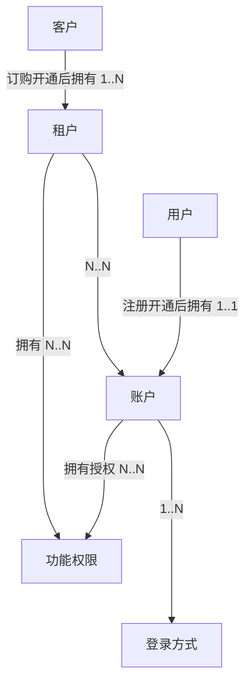

在学习ddd如何落地实践之前，先了解什么是限界上下文？

限界上下文是 DDD用于战略设计上提出的概念，用来确定语义所在的领域边界。  
限界就是 领域的边界， 上下文是 语义环境。 通过领域的限界上下文，可以在统一的领域边界内用统一的语言进行交流。  

其定义： 用来封装通用语言和领域对象，提供上下文环境，保证在领域内的一些术语、业务相关对象等（通用语言）有一个确切的含义，没有二义性。  
这个边界定义了模型的适用范围，使团队成员明确的知道什么应该在模型中实现，什么不应该在模型中实现。 比如 商品在销售阶段是商品，而在运输阶段是货物。同一个东西，由于业务领域不同，赋予这些术语不同的含义和职责边界，这个边界就是微服务设计的边界。领域边界就是通过限界上下文来定义的。

# DDD概念
## 统一语言和概念明确，同一个团队，同一种语言
DDD中最重要的是要明确概念。 像做语文题一样，深究每个名词的含义。

### 概念不明确的常见情况
+ 概念过大、宽泛、涵盖了多层含义
+ 概念在不同上下文含义不同
+ 相似名称混用，比如混用同义词，但实际意义是有差别的
+ 同一个概念，随意的使用多个名称

### 明确概念的建议
+ 概念是名词
+ 概念是符合行业标准的
+ 概念是有边界的，有典型案例
+ 概念是分上下文语境的
+ 同一个概念，只有一个名词标表示
+ 命名直接，不产生歧义

### 概念可能混用的举例——用户、客户、账户、租户的区别


## 领域模型是技术无关的，是问题的核心
领域模型<——领域服务<——应用服务<——用户界面 （箭头指向依赖方向）
基础设施依赖  框架、DB、外部服务

## 建模的方式
理解领域——>明晰概念——>简历概念之间的关系
### 事件风暴
+ 命令
+ 实体
+ 事件
举例： 围绕商品； 商品（实体）、创建商品（命令）、商品已创建（事件）、上架商品（命令）、商品已上架（事件）

### 四色建模法
+ monent-interval
+ 角色
+ 人——事——物
+ 描述

### 用户故事地图
+ 角色： 如 上班族、父亲、工程师
+ 活动：活动分解
+ 任务：任务分解

### 建模==分析语言
张三去买房，中介让留个电话，有合适的房源了，会通知他过来看房

分析这个场景
+ 买房者：张三
+ 房产中介： 中介公司、中介员工
+ 电话： 联系方式
+ 工作机会
+ 看房：预约看房

中介公司——（1..*）——中介员工——（1..服务..*）——买房者——（1..预约..*）——>看房<——（*..产生..1）——房源
其实这个场景中还包含房主，房主也可以发布房源，也可以由中介录入房源。
中介和房主之间存在关联关系。

### 实体vs.值对象
先分析识别实体和值对象构建领域模型，再根据领域模型将其转为数据模型。

比如：
将 【领域模型】用户（ID、姓名、年龄、性别、地址），其中地址引用 地址值对象（省、市、县、街道）
再将【领域模型】转为【数据模型】。 可以用一张数据库表示数据模型； 用户（ID、姓名、年龄、性别、省、市、县、街道），其中（省、市、县、街道）属于地址相关的属性。这部分属性也可以根据实际情况单独成表。

### 聚合和聚合根
+ 聚合 能让 实体和值对象协同工作，它是用来确保这些领域对象在实现共同的业务逻辑时，能保证数据一致性。
+ 聚合 就是由 业务和逻辑紧密关联的实体和值对象组合而成的。 聚合是数据修改和持久化的基本单元，每一个聚合对应一个仓储，实现数据的持久化。
+ 聚合 有一个聚合根和上下文边界，这个边界根据业务单一职责和高内聚原则，定义了聚合内部应该包含哪些实体和值对象，而聚合之间的边界是松耦合的。

**聚合根**
+ 如果把聚合比作组织，聚合根就是这个组织的负责人
+ 聚合根作为实体本身，拥有实体的属性和业务行为，实现自身的业务逻辑
+ 聚合根作为聚合的管理者，在聚合内部负责协调实体和值对象按照固定的业务规则协同完成共同的业务逻辑
+ 最后在根据之间，它还是聚合对外的接口人，以聚合根 ID关联的方式接受外部任务和请求，在上下文内实现聚合之间的业务协同。
+ 聚合之间通过聚合根ID关联引用，如果需要访问其他聚合的实体，就先访问聚合根，在导航到聚合内部实体，外部对象不能直接访问聚合内实体。

### 聚合设计的步骤、方法
+ 事件风暴找出实体和值对象（哪些属于实体、哪些属于值对象，先列出来）
+ 找出聚合根（归类、确认聚合根）
+ 找出聚合
+ 对象引用和依赖模型

## 领域驱动设计（架构分层）
用户接口层——>应用层——>领域层——>基础设施层。
+ 接入层：只负责系统的输入和输出，只关心沟通协议，数据格式，而不关心数据内容、业务相关的数据校验。
+ 应用层：只负责组织业务场景，编排业务，隔离场景对领域层的差异。关心处理完一个完整的业务，不关心具体内部业务逻辑。不关心请求从何处来、关心谁来、做什么、有没有权限做。
+ 领域层：实现具体的业务逻辑、规则，为应用层提供无差别服务能力。不关心场景，关心模型完整性和业务规则。强一致性事务在领域层处理，领域层做业务规则校验，数据权限控制，跨上下文使用值对象做必要的数据冗余。
+ 基础设施层：提供具体的技术实现，比如存储、消息传递、通知，基础设施对业务保持透明。基础设施的权限由配置到应用的凭证控制。 比如 数据库、对象存储的凭证，技术设施层不涉及用户的权限。
+ 最核心是领域层，承载领域知识（业务规则，业务逻辑）
+ 理想状态下，领域层不依赖任何层。持久化也不在领域层操作，具体实现为在领域层定义 repository接口，在基础设施层是袭警案，并在 应用层调用。

### 防腐层&依赖倒置

# DDD在Django项目中的实践
在ddd落地django项目前，先了解下分层设计模式。常见的主要有两种分层设计模式（MVT）和（MVC），django采用的是MVT模式，也就是 Model、View、Template，但其实在如今前后端分离项目中，我们很少用到django的template，我们只用到了MV，那T去哪了？
T就是前端的vue、react、等前端框架，前后端通过api接口交互。 那C（控制器）是什么？C就是Django框架本身， 它通过配置的路由将请求分发给匹配的视图处理。
```
@startuml
package "Django框架" {
    component [路由]  as Router
    [视图] as View
    [模板] as Template
    [模型] as Model
    [Django中间件] as MiddleWare
}

'cloud 服务器 as Server
'actor 用户 as User
'component 浏览器 as Browser
'User .-> Browser: 访问浏览器
'Browser .-> Server: http/https请求
'Server <-.-> "Django框架"

Router .-> MiddleWare: 路由匹配
MiddleWare .-> View: 中间件预处理
View -.-> Model: 业务逻辑、模型交互
Model -.-> View: 返回数据
View -.-> Template: 数据嵌入，视图函数将处理后的数据传递给模板
Template -.-> View: 模板引擎渲染成最终的HTML内容
View .-> MiddleWare: 中间件后处理
@enduml
```

## MVC分层模式
|名称|功能|
|---|---|
|Model|负责和数据相关的逻辑，数据库表操作相关|
|View|负责数据展示，将从model中或者用户处获取的数据进行展示，在循序MVC设计模式框架开发的web项目中，所有通过浏览器向用户展示的功能都由 视图模块实现|
|Controller|负责控制数据流向以及视图和模型之间的交互。 控制器会基于请求，由模型协助从数据库中获取数据，然后通过视图呈现|

## MVT分层模式
|名称|功能|
|---|---|
|Model|负责和数据相关的逻辑，数据库表操作相关|
|View|主要用于执行业务逻辑，从模型获取数据，将数据给到特定模板进行渲染后呈现给用户|
|Template|可视为表示层，主要是用户界面相关，也就是我们所说的前端|

如果拿MVC分层模式和MVT找对应关系，可以将MVC模式中的 控制器理解为 MVT模式中的视图， 将MVC模式中的视图理解为MVT模式中的模板。

## MVT和MVC的区别？
MVC和MVT两种模式的主要区别在于：在MVC模式中，开发者需要编写所有和控制器相关的代码，但是在MVT模式中，框架本身完成了控制器相关功能
在经典的MVC模式下，当用户通过浏览器发起一个请求后，将触发控制器中的一个功能调用，然后控制器要么告诉模型修改数据库并更新视图，要么基于模型返回一个更新后的视图。也就是说视图是由控制器和模型控制的
MVT模式的处理逻辑稍有不同：当一个用户发起一次HTTP请求后，相关的视图将通过模型执行一次查询，进而获取查询的结果，最后视图将结果数据填进模板后发送给用户

+ 职责划分
  - 在MVC中，Controller负责处理用户输入和业务逻辑，View负责展示数据
  - 在MTV中，View（视图）负责处理HTTP请求，协调Model和Template，而Template负责展示数据

+ 灵活性
  - MVC模式在桌面应用和Web应用中都有广泛应用
  - MTV模式特别适合Web开发，尤其是数据驱动的应用，因为Template可以更灵活地生成动态内容

## DDD分层与Django分层模式对应关系（DDD视角）
|Level|DDD|Django|
|-----|-----|------|
|表现层|负责与用户交互，展示数据和处理用户输入|View+Temaplte共同构成DDD表现层、无业务逻辑|
|应用层|协调业务流程，处理用例，调用领域层服务；此层可以包含简单的查询逻辑，但核心复杂业务逻辑必须下沉到领域层|View+自定义Service类（处理复杂的业务逻辑，而不直接在视图中实现）；\n视图可以作为应用层的入口，调用服务类处理业务逻辑；应用服务类协调领域层的服务。|
|领域层|包含业务逻辑、实体、值对象、仓储接口定义等核心业务模型|Model（避免直接依赖django的orm）+自定义领域服务（在模型中或外部实现领域服务，处理核心业务逻辑）|
|基础设施层|处理与外部系统的交互，如数据库访问、消息队列、外部API调用等；仓储实现层+PO持久化层|数据库后端+管理器类+第三方库和API；django中的某些中间件也属于基础设施层|
|仓储模式|用于将数据库访问逻辑从领域层分离保持领域层的独立性|django可以通过 自定义仓储类+使用django的orm 实现仓储模式（确保领域层不直接依赖ORM）。见[示例代码](#ddd01)|
|领域事件|用于处理领域内的事件驱动逻辑|可以使用信号 signals 实现领域事件的处理|

**<span id='ddd01'>仓储模式示例代码</span>**   
```
# 仓储接口
class UserRepository(ABC):
    @abstractmethod
    def get_user(self, user_id):
        pass

# 仓储实现
class DjangoUserRepository(UserRepository):
    def get_user(self, user_id):
        return User.objects.get(id=user_id)
```
