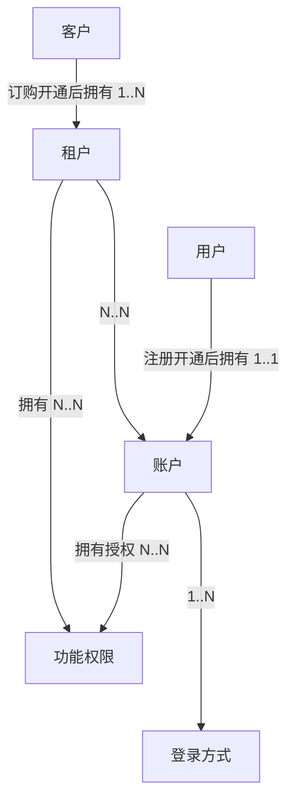

在学习ddd如何落地实践之前，先了解什么是限界上下文？

限界上下文是 DDD用于战略设计上提出的概念，用来确定语义所在的领域边界。  
限界就是 领域的边界， 上下文是 语义环境。 通过领域的限界上下文，可以在统一的领域边界内用统一的语言进行交流。  

其定义： 用来封装通用语言和领域对象，提供上下文环境，保证在领域内的一些术语、业务相关对象等（通用语言）有一个确切的含义，没有二义性。  
这个边界定义了模型的适用范围，使团队成员明确的知道什么应该在模型中实现，什么不应该在模型中实现。 比如 商品在销售阶段是商品，而在运输阶段是货物。同一个东西，由于业务领域不同，赋予这些术语不同的含义和职责边界，这个边界就是微服务设计的边界。领域边界就是通过限界上下文来定义的。

## 统一语言和概念明确，同一个团队，同一种语言
DDD中最重要的是要明确概念。 像做语文题一样，深究每个名词的含义。

### 概念不明确的常见情况
+ 概念过大、宽泛、涵盖了多层含义
+ 概念在不同上下文含义不同
+ 相似名称混用，比如混用同义词，但实际意义是有差别的
+ 同一个概念，随意的使用多个名称

### 明确概念的建议
+ 概念是名词
+ 概念是符合行业标准的
+ 概念是有边界的，有典型案例
+ 概念是分上下文语境的
+ 同一个概念，只有一个名词标表示
+ 命名直接，不产生歧义

### 概念可能混用的举例——用户、客户、账户、租户的区别

## 领域模型是技术无关的，是问题的核心
领域模型<——领域服务<——应用服务<——用户界面 （箭头指向依赖方向）
基础设施依赖  框架、DB、外部服务

## 建模的方式
理解领域——>明晰概念——>简历概念之间的关系
### 事件风暴
+ 命令
+ 实体
+ 事件

举例： 围绕商品； 商品（实体）、创建商品（命令）、商品已创建（事件）、上架商品（命令）、商品已上架（事件）
### 四色建模法
+ monent-interval
+ 角色
+ 人——事——物
+ 描述

### 用户故事地图
+ 角色： 如 上班族、父亲、工程师
+ 活动：活动分解
+ 任务：任务分解

