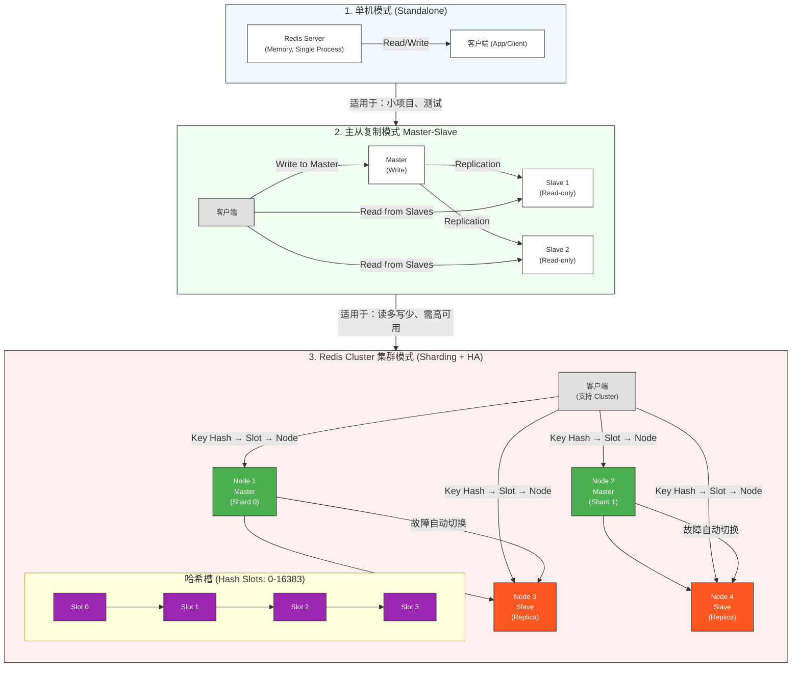
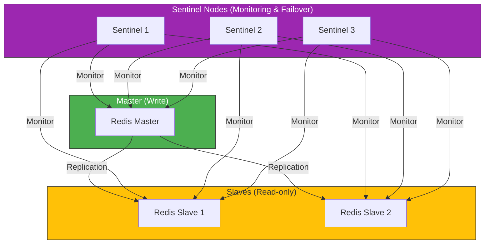

Redis是当今最流行的**内存数据库**和**高性能缓存系统**。

# 🎯 Redis 的核心优点与特点

| 优点 / 特点 | 说明 |
|----------------|------|
| ✅ **纯内存存储** | 所有数据都放在内存中，读写速度极快。 |
| ✅ **高性能（高并发）** | 单机可支撑 **10万+ QPS**（每秒查询数），是缓存系统的王者。 |
| ✅ **丰富的数据结构** | 支持 String、Hash、List、Set、Sorted Set（ZSet），甚至 Stream、Bitmap、HyperLogLog 等高级类型。 |
| ✅ **持久化机制** | 支持 **RDB 快照** 和 **AOF 日志**，兼顾性能与数据安全。 |
| ✅ **主从复制 + 哨兵 + 集群** | 提供完整的高可用架构方案，支持自动故障转移、数据分片。 |
| ✅ **支持多种编程语言客户端** | Java、Python、Go、Node.js、PHP 等都有成熟 SDK。 |
| ✅ **非阻塞 I/O + 单线程模型** | 通过 **事件驱动 + epoll** 实现高性能，避免锁竞争。 |
| ✅ **原子操作支持** | 如 `INCR`、`DECR`、`SETNX` 等操作天然原子，适合分布式锁、计数器等场景。 |

---

# 🔥 为什么 Redis 这么快？—— 核心原理拆解

Redis 的“快”不是偶然，而是源于一系列精心设计的底层机制：

---

## 1️⃣ **纯内存存储（Memory-Only）**

- 所有数据都在内存中，**避免了磁盘 I/O 的延迟**（磁盘访问通常在毫秒级，而内存是纳秒级）。
- 虽然数据持久化到磁盘，但**读写路径完全走内存**。

> 💡 举个例子：数据库查询一次可能要 5ms，而 Redis 一次读写只需 **0.1ms 左右**，快了 50 倍！

---

## 2️⃣ **单线程 + 事件驱动（Reactor 模式）**

- Redis 采用 **单线程模型**（主线程处理所有命令），**没有多线程锁竞争**，避免了上下文切换和锁开销。
- 通过 **epoll（Linux）或 kqueue（BSD）** 实现高效的 I/O 多路复用，**一个线程就能同时监听成千上万个连接**。

> ✅ 为什么单线程还能这么快？
> - 因为 Redis 的瓶颈在 **内存访问速度**，而不是 CPU 计算能力。
> - 而且 Redis 的命令执行非常高效，大多数操作是 O(1)。

---

## 3️⃣ **高效的底层数据结构**

Redis 内部使用了非常高效的数据结构实现，例如：

| 数据类型 | 内部实现 | 优势 |
|-----------|------------|------|
| String | SDS（Simple Dynamic String） | 避免 C 字符串的 `O(N)` 长度计算问题 |
| Hash | 哈希表（dict）或压缩列表（ziplist） | 快速查找，内存紧凑 |
| List | 双向链表（linkedlist）或压缩列表（ziplist） | 支持两端插入/删除 |
| Set / ZSet | 哈希表（dict） + 跳表（skiplist） | Set 哈希查找 O(1)，ZSet 支持范围查询 |

> 📌 特别强调：Redis 的 **跳表（skiplist）** 用于实现 Sorted Set，比红黑树更高效、更易实现，且支持范围查询（如 `ZRANGE`）。

---

## 4️⃣ **持久化机制优化**

- **RDB 快照**：定期生成数据快照，适合备份和灾难恢复，**恢复速度快**。
- **AOF 日志**：记录每个写操作命令，**数据安全性高**，支持重写压缩日志。

> ✅ Redis 的持久化不是“同步写盘”，而是**异步写盘 + 重写机制**，避免了性能瓶颈。

---

## 5️⃣ **网络 I/O 优化：epoll + 零拷贝**

- 使用 `epoll` 实现 I/O 多路复用，**只返回就绪连接**，无需遍历所有连接。
- Redis 使用 **TCP 零拷贝技术**（如 `sendfile`）减少数据在内核态和用户态之间的拷贝次数。

---

# 📊 性能对比（实测参考）

| 系统 | QPS（每秒请求数） | 延迟（平均） |
|------|------------------------|----------------|
| Redis（纯内存） | 100,000 ~ 1,000,000+ | < 1ms |
| MySQL（磁盘存储） | 5,000 ~ 20,000 | 5ms ~ 20ms |
| Memcached（类似 Redis） | 80,000 ~ 150,000 | ~1ms |

> ✅ Redis 的性能是传统数据库的 **50~100 倍**，在缓存场景中几乎“一骑绝尘”。

---

# 🧠 Redis 的适用场景（你该用它吗？）

| 场景 | 为什么适合 Redis |
|------|------------------------|
| ✅ 缓存（Cache） | 内存访问快，适合热点数据缓存 |
| ✅ 分布式锁 | 支持 `SET key value NX PX` 原子操作 |
| ✅ 计数器（如点赞数） | `INCR`、`DECR` 原子操作，线程安全 |
| ✅ 消息队列（如 Stream） | 支持消息持久化、消费组、ACK 机制 |
| ✅ 排行榜（Sorted Set） | 支持 `ZADD`、`ZRANGE` 等操作，高效排序 |
| ✅ 实时分析（如 HyperLogLog） | 用极小内存估算海量数据的唯一值数量 |

---

# Redis架构全景

## Redis三种典型架构


### 单机模式
> ✅ 特点：简单、低延迟，适合小规模应用
> ❌ 缺点：无容灾、无扩展、单点故障

### 主从复制模式
> ✅ 优点：
  - 读写分离：主节点处理写，从节点处理读
  - 高可用：主节点故障时，可通过哨兵或手动切换
  - 数据备份：从节点自动同步主节点数据

> ❌ 缺点：
  - 无法横向扩展写能力（写仍由主节点承担）
  - 主节点故障后需人工干预或依赖哨兵


### redis cluster集群模式（分片集群）
> ✅ 核心优势：
  - **数据分片（Sharding）**：数据按 key 的哈希值分到不同节点（如 16384 个哈希槽）
  - **高可用**：每个主节点都有一个从节点（Replica），主节点宕机自动故障转移
  - **横向扩展**：可动态添加节点，提升读写吞吐量

> ❌ 挑战：
  - 客户端需要支持 Cluster 模式（如 Redis 3.0+ 客户端）
  - 跨分片操作（如 `KEYS *`、`MGET` 跨多个分片）性能下降
  - 配置和运维复杂度增加

---

## Redis哨兵模式
Redis 哨兵模式 = 主从复制 + 自动故障转移 + 健康监控，它解决了“主节点挂了，没人知道，也没人接替”的问题
```
+----------------+       +----------------+
|  Redis Master  |<----->|  Redis Slave 1 |
+----------------+       +----------------+
        |                           |
        |                           |
        v                           v
+----------------+       +----------------+
|  Sentinel 1    |       |  Sentinel 2    |
+----------------+       +----------------+
```

✅ 三个核心角色：
1. Redis 主节点（Master）
   - 负责处理写请求（SET、DEL 等）。
   - 是数据的“源头”

2. Redis 从节点（Slave）
   - 通过主从复制同步数据。
   - 可用于读负载分担。

3. Redis 哨兵节点（Sentinel）
   - 是一个特殊的 Redis 进程，不是数据存储节点。
   - 职责如下：
     * 🕵️‍♂️ 监控：持续检查主节点和从节点是否正常运行。
     * 🚨 故障检测：当主节点无响应（如宕机），哨兵会标记为“主观下线”。
     * 🔁 自动故障转移：当多数哨兵达成共识（“客观下线”），会从从节点中选举一个升级为主节点。
     * 📢 通知客户端：更新客户端配置，告诉它们“新的主节点地址是 XX”。

**🌟 哨兵模式的关键优势**
|优点|说明|
|---|---|
|✅ 自动故障转移|主节点挂了，自动选从节点接替，服务不中断|
|✅ 高可用性（High Availability）|即使主节点宕机，也能快速恢复服务|
|✅ 配置自动更新|哨兵会通知客户端新主节点地址，避免手动修改|
|✅ 多哨兵协同|通常部署 3 个或以上哨兵，避免单点故障|


**⚠️ 哨兵模式的局限性**
|限制|说明|
|---|---|
|❌ 不支持自动分片（Sharding）|一个主从集群只能处理有限数据量。若数据量大，需用 Redis Cluster|
|❌ 主节点写压力大|所有写请求都集中到主节点，适合写少读多的场景|
|❌ 哨兵本身是单点？|实际上哨兵是集群部署的，只要部署 ≥3 个哨兵，就能避免单点故障|




> ✅ 哨兵（Sentinel） 是用于监控主从实例、自动故障切换的独立组件

✅ 推荐使用哨兵模式的场景：
+ 你有一个主从复制架构
+ 你希望主节点宕机后能自动切换，保证服务高可用
+ 你的数据量不是特别大（比如 < 100GB），不需要分片

❌ 不推荐使用哨兵模式的场景：
+ 数据量非常大，需要水平分片（这时要用 Redis Cluster）
+ 你希望自动扩容/缩容，或者动态添加节点。

---

# Redis五大基本数据结构
|结构|底层实现|适用场景|特点|
|---|---|---|---|
|1. String（字符串）|简单动态字符串（SDS）|缓存、计数器、会话存储	|最基础、最通用|
|2. Hash（哈希）|压缩列表（ziplist） + 哈希表（hashtable）|	对象存储、用户信息	| 支持字段级操作|
|3. List（列表）|双端链表（linkedlist） + 压缩列表（ziplist）|	消息队列、最新 N 条记录	| 支持两端操作|
|4. Set（集合）|哈希表（hashtable）|	去重、标签系统、交并差运算、点赞/收藏 | 无序、唯一|
|5. Sorted Set（有序集合）|跳表（skiplist） + 哈希表（hashtable）| 排行榜、积分系统、定时任务、范围查询	| 有序、唯一、支持范围查询|

---

# Redis key命名规范
请查看该文章[《Redis Key命名规范实战指南》](https://blog.csdn.net/qq_18529581/article/details/156567940)

---

# Redis安全读取技巧
## 缓存穿透
查询一个根本不存在的数据，每次请求都打到 DB
✅ 解决方案：
+ 布隆过滤器（Bloom Filter）：在 Redis 前加一层布隆过滤器，判断 key 是否存在
+ 缓存空值（Null Object）：对查询不到的数据，也缓存一个 null 或 ""，设置短过期时间（如 5 分钟）

## 缓存击穿
一个热点 key 过期瞬间，大量请求同时打到 DB
✅ 解决方案：
+ 加互斥锁（Mutex Lock）：使用 SET key value NX EX 10 实现分布式锁
+ 异步重建缓存：在获取到空值后，异步拉取 DB 数据并更新缓存

## 缓存雪崩
大量 key 同时过期，导致所有请求直接打到 DB，引发崩溃
✅ 解决方案：
+ 设置随机过期时间（TTL）：避免所有 key 同时过期
+ 多级缓存：本地缓存（如 Caffeine） + Redis 缓存，降低 Redis 压力

---

# Q&A

## Redis 为什么快？
Redis 之所以快，是因为它用“单线程+事件驱动+epoll+纯内存+高效数据结构”构建了一个极致优化的 I/O 和内存访问系统

## 为什么 Redis 默认只支持 16 个数据库（db0 ~ db15）？
Redis 默认 16 个数据库，是出于“设计权衡”——在灵活性和性能之间找到一个平衡点。它不是技术限制，而是有意为之的默认设定。

1. Redis 诞生于 2009 年，当时内存资源有限
  + 早期服务器内存普遍在几十到几百 MB
  + 如果 Redis 支持 1000 个数据库，每个数据库都要维护一个键空间（key space），会带来额外的内存开销
  + 16 个恰好是一个2 的幂次（2⁴ = 16），便于用 位运算 快速索引和管理。
2. 数据库的本质是“命名空间”
  + 每个数据库（db0~db15）只是一个键的命名空间（namespace）
  + 同一个 key（user:1001）在不同 db 里是完全独立的
  + 16 个 db 只是逻辑隔离，并不是每个 db 都要“开一个数据库实例”
3. Redis 的设计哲学：简单、快速、高效，但也可以修改数据库数量，在源码src/server.h 修改#define REDIS_DEFAULT_DB 32   // 或 64、128  重新编辑安装源码

## Redis为什么是单线程？
|原因|说明|
|---|---|
|🔥 瓶颈在 I/O，不在 CPU	|内存操作极快，无需多线程并行计算|
|🚫 避免锁竞争|单线程无锁 → 无阻塞 → 高性能|
|⚡ 事件驱动 + 非阻塞 I/O|支持百万级并发连接|
|💡 设计哲学：简单即高效|逻辑清晰，易于维护、调试|
|🔄 Redis 6.0 后：多线程 I/O，仍单线程执行命令|保留优势，同时提升网络性能|
