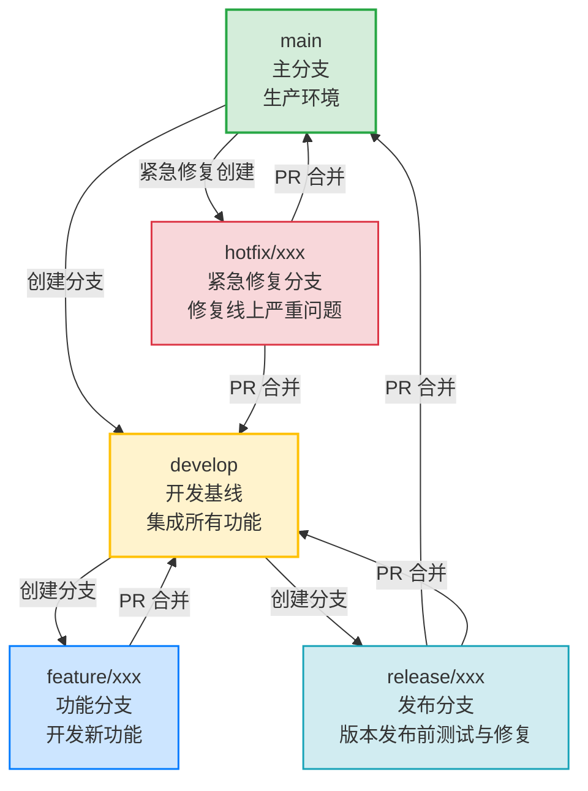
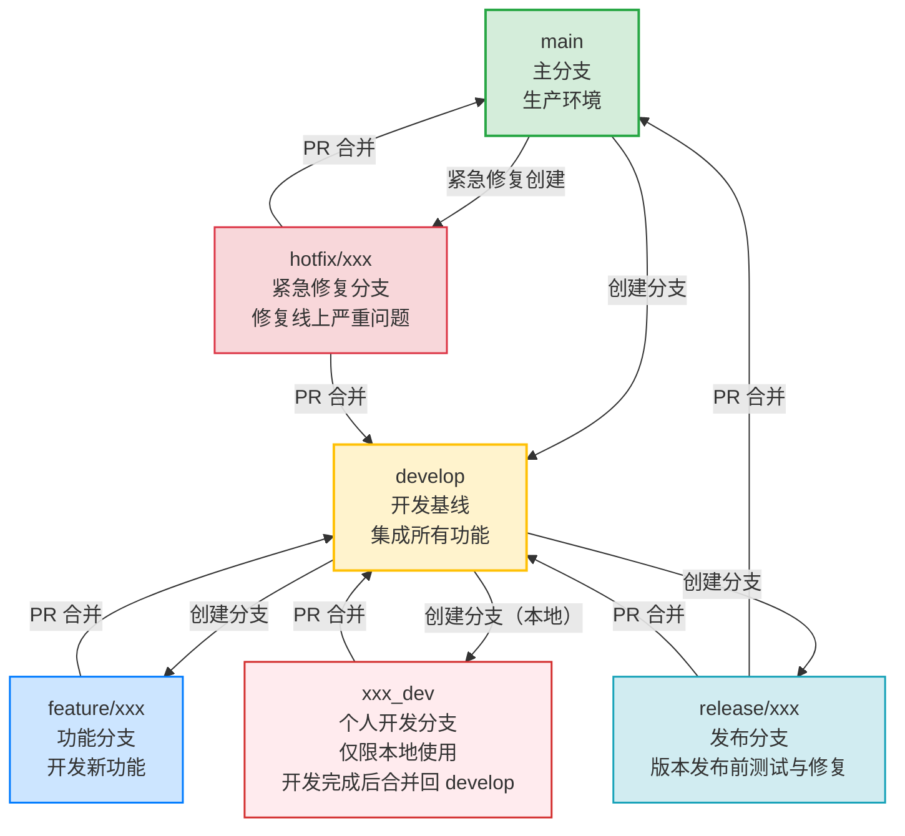
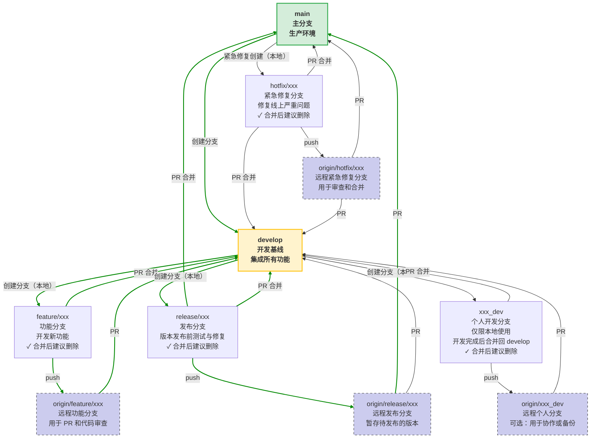

# 🌐 Git Flow 架构图（中文标注版）

# 🌐 优化后的git flow架构图（增加个人开发分支）

# 🌐 详细版 git flow架构图

**解释说明**  
> 💡 图中，本地直接提PR/MR 属于 本地git MR方式（单仓模式），不用将本地分支推送到远端，即可直接创建从本地分支到远端的主库的MR。

# ✅ 总结
1. ✅ 使用 标准 Git Flow 工作流图 作为参考（如 Atlassian 官方图）。
2. ✅ 所有合并操作必须遵循 “从下往上” 的原则：feature → develop，develop → release，release → main。
3. ✅ 紧急修复（hotfix）是例外，但必须通过专用分支完成，不能直接合并 main 到 develop

# Q&A
## 🔍 为什么不能把 main 合并到 develop？
**原因一：破坏开发基线的稳定性**  
+ develop 是所有新功能的集成点。
+ 如果 main 的代码被合并到 develop，可能会引入未经测试的生产代码，污染开发环境。

**原因二：违反“单向流动”原则**  
+ Git Flow 设计为 从开发 → 发布 → 生产 的单向流程。
+ 任何“反向合并”都可能导致分支污染、版本混乱、CI/CD 失效等问题。

**原因三：紧急修复（hotfix）的处理方式已提供了“反向”通道**
+ 在 Git Flow 中，hotfix 分支是从 main 创建的，修复完成后合并回 main 和 develop。
+ 这正是 “从 main 向 develop 合并” 的唯一合法场景！
但注意：这是通过 hotfix 分支完成的，不是直接在 main 和 develop 之间建立箭头
