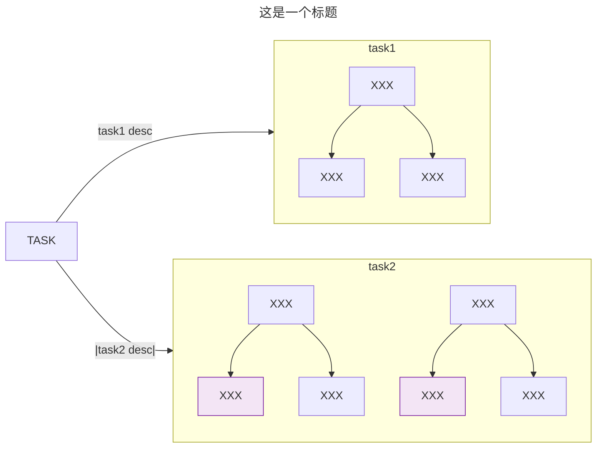
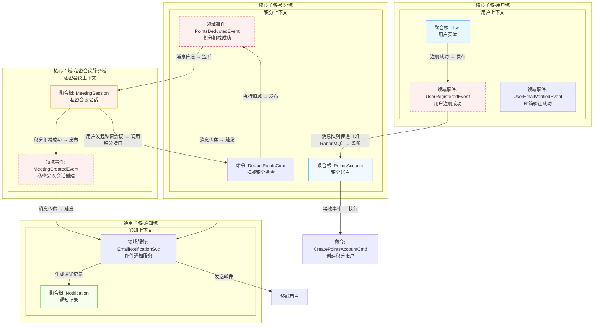

# 思维导图示例

```mermaid
---
title: 这是一个标题
---

graph LR
    
T[TASK]
subgraph task1
    A[XXX]
    A1[XXX]
    A2[XXX]
    A --> A1 & A2
end
    
subgraph task2
    B[XXX]
    B1[XXX]
    B2[XXX]
    C[XXX]
    C1[XXX]
    C2[XXX]
    B --> B1 & B2
    C --> C1 & C2
end

classDef todo fill: #f3e5f5,stroke:#7b1fa2
class B1,C1 todo

T --> |task1 desc|task1
T --|task2 desc|--> task2
```

# DDD领域图示例
私密APP的DDD领域图例
用户在线注册-->获得积分-->发起私密会议-->积分扣减

```mermaid
graph TD
    %% 1. 定义子域（大模块划分）
    subgraph 核心子域-用户域
        subgraph 用户上下文
            U_AGG[聚合根: User<br/>用户实体]
            U_EVT1[领域事件: UserRegisteredEvent<br/>用户注册成功]
            U_EVT2[领域事件: UserEmailVerifiedEvent<br/>邮箱验证成功]
        end
    end

    subgraph 核心子域-积分域
        subgraph 积分上下文
            P_AGG[聚合根: PointsAccount<br/>积分账户]
            P_EVT[领域事件: PointsDeductedEvent<br/>积分扣减成功]
            P_CMD[命令: DeductPointsCmd<br/>扣减积分指令]
        end
    end

    subgraph 核心子域-私密会议服务域
        subgraph 私密会议上下文
            I_AGG[聚合根: MeetingSession<br/>私密会议会话]
            I_EVT[领域事件: MeetingCreatedEvent<br/>私密会议会话创建]
        end
    end

    subgraph 通用子域-通知域
        subgraph 通知上下文
            N_AGG[聚合根: Notification<br/>通知记录]
            N_SVC[领域服务: EmailNotificationSvc<br/>邮件通知服务]
        end
    end

    %% 2. 交互链路（消息传递+事件触发）
    %% 链路1：用户注册 → 自动创建积分账户
    U_AGG -- "注册成功 → 发布" --> U_EVT1
    U_EVT1 -- "消息队列传递（如RabbitMQ）→ 监听" --> P_AGG
    P_AGG -- "接收事件 → 执行" --> P_CMD1[命令: CreatePointsAccountCmd<br/>创建积分账户]

    %% 链路2：用户发起私密会议 → 扣减积分
    I_AGG -- "用户发起私密会议 → 调用积分接口" --> P_CMD
    P_CMD -- "执行扣减 → 发布" --> P_EVT
    P_EVT -- "消息传递 → 监听" --> I_AGG
    I_AGG -- "积分扣减成功 → 发布" --> I_EVT

    %% 链路3：积分变动/私密会议创建 → 发送通知
    P_EVT -- "消息传递 → 触发" --> N_SVC
    I_EVT -- "消息传递 → 触发" --> N_SVC
    N_SVC -- "生成通知记录" --> N_AGG
    N_SVC -- "发送邮件" --> USER[终端用户]

    %% 3. 补充说明（简化标注）
    style U_AGG fill:#e6f7ff,stroke:#1890ff
    style P_AGG fill:#f0f9ff,stroke:#40a9ff
    style I_AGG fill:#fff2e8,stroke:#fa8c16
    style N_AGG fill:#f6ffed,stroke:#52c41a
    style U_EVT1 fill:#fff0f0,stroke:#f5222d,stroke-dasharray:5,5
    style P_EVT fill:#fff0f0,stroke:#f5222d,stroke-dasharray:5,5
    style I_EVT fill:#fff0f0,stroke:#f5222d,stroke-dasharray:5,5
```
