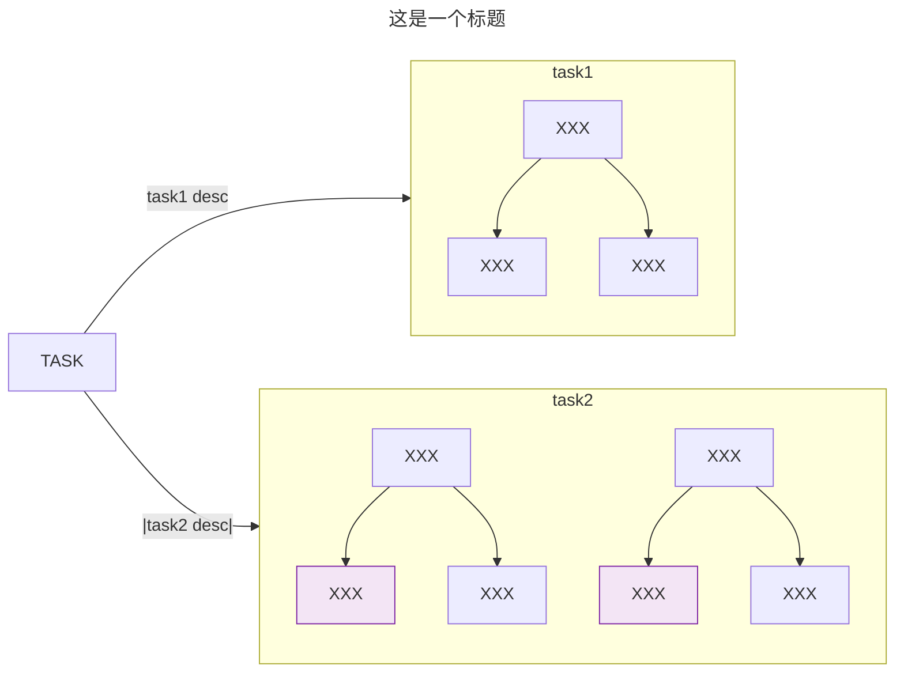

```mermaid
---
title: 这是一个标题
---

graph LR
    
T[TASK]
subgraph task1
    A[XXX]
    A1[XXX]
    A2[XXX]
    A --> A1 & A2
end
    
subgraph task2
    B[XXX]
    B1[XXX]
    B2[XXX]
    C[XXX]
    C1[XXX]
    C2[XXX]
    B --> B1 & B2
    C --> C1 & C2
end

classDef todo fill: #f3e5f5,stroke:#7b1fa2
class B1,C1 todo

T --> |task1 desc|task1
T --|task2 desc|--> task2
```
