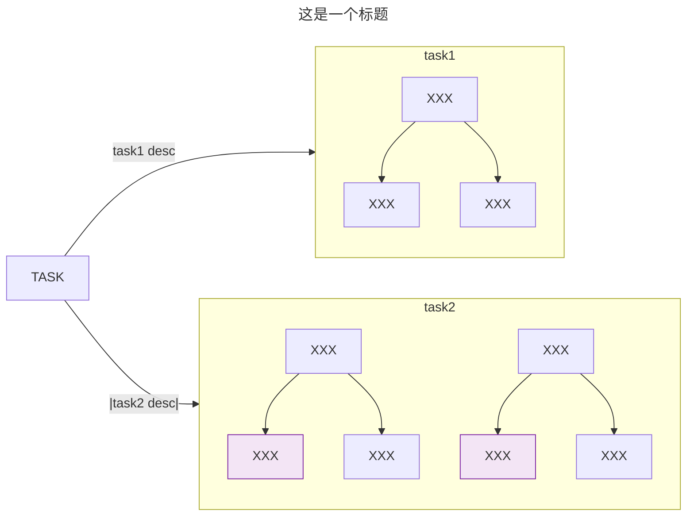
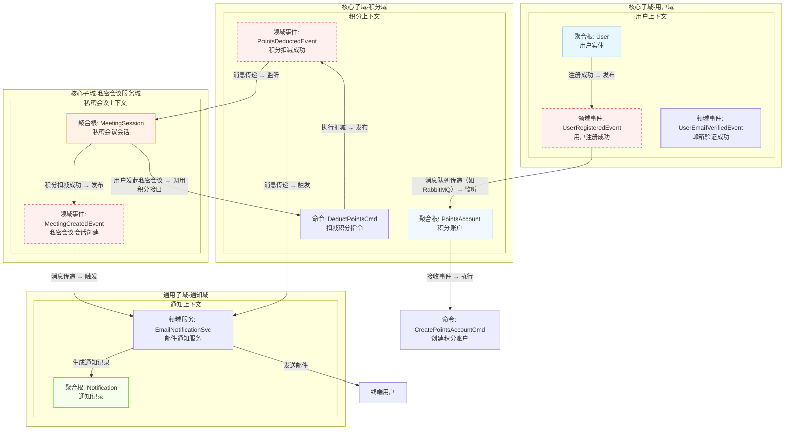
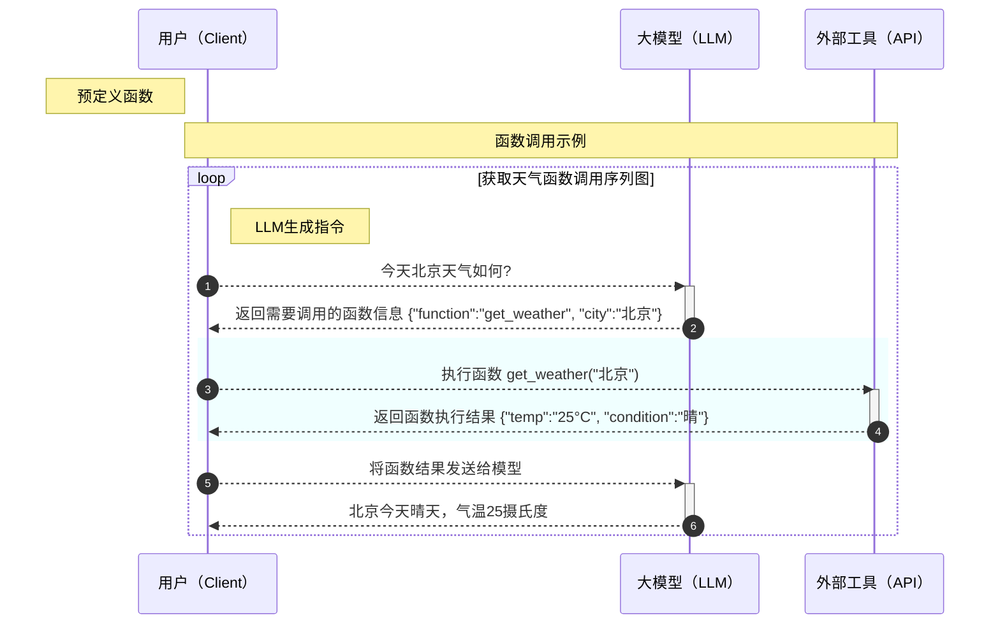
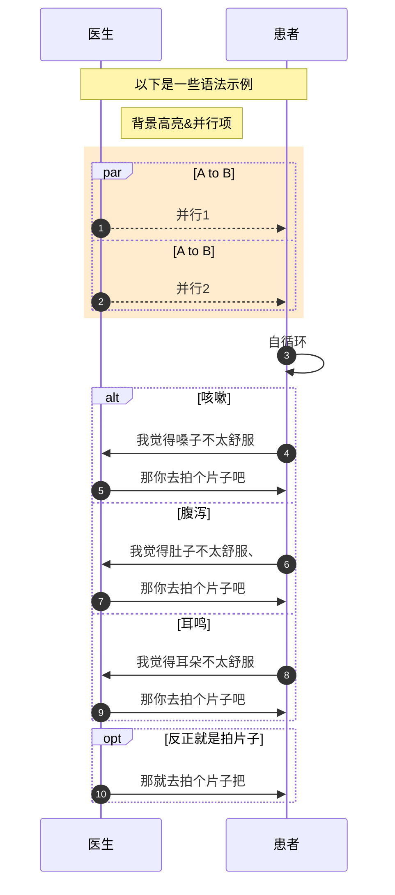
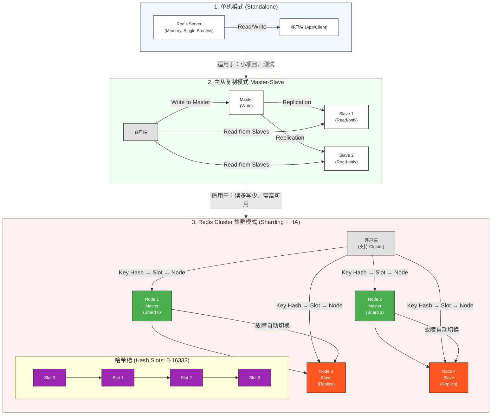

# 思维导图示例

```mermaid
---
title: 这是一个标题
---

graph LR
    
T[TASK]
subgraph task1
    A[XXX]
    A1[XXX]
    A2[XXX]
    A --> A1 & A2
end
    
subgraph task2
    B[XXX]
    B1[XXX]
    B2[XXX]
    C[XXX]
    C1[XXX]
    C2[XXX]
    B --> B1 & B2
    C --> C1 & C2
end

classDef todo fill: #f3e5f5,stroke:#7b1fa2
class B1,C1 todo

T --> |task1 desc|task1
T --|task2 desc|--> task2
```

# DDD领域图示例
私密APP的DDD领域图例
用户在线注册-->获得积分-->发起私密会议-->积分扣减

```mermaid
graph TD
    %% 1. 定义子域（大模块划分）
    subgraph 核心子域-用户域
        subgraph 用户上下文
            U_AGG[聚合根: User<br/>用户实体]
            U_EVT1[领域事件: UserRegisteredEvent<br/>用户注册成功]
            U_EVT2[领域事件: UserEmailVerifiedEvent<br/>邮箱验证成功]
        end
    end

    subgraph 核心子域-积分域
        subgraph 积分上下文
            P_AGG[聚合根: PointsAccount<br/>积分账户]
            P_EVT[领域事件: PointsDeductedEvent<br/>积分扣减成功]
            P_CMD[命令: DeductPointsCmd<br/>扣减积分指令]
        end
    end

    subgraph 核心子域-私密会议服务域
        subgraph 私密会议上下文
            I_AGG[聚合根: MeetingSession<br/>私密会议会话]
            I_EVT[领域事件: MeetingCreatedEvent<br/>私密会议会话创建]
        end
    end

    subgraph 通用子域-通知域
        subgraph 通知上下文
            N_AGG[聚合根: Notification<br/>通知记录]
            N_SVC[领域服务: EmailNotificationSvc<br/>邮件通知服务]
        end
    end

    %% 2. 交互链路（消息传递+事件触发）
    %% 链路1：用户注册 → 自动创建积分账户
    U_AGG -- "注册成功 → 发布" --> U_EVT1
    U_EVT1 -- "消息队列传递（如RabbitMQ）→ 监听" --> P_AGG
    P_AGG -- "接收事件 → 执行" --> P_CMD1[命令: CreatePointsAccountCmd<br/>创建积分账户]

    %% 链路2：用户发起私密会议 → 扣减积分
    I_AGG -- "用户发起私密会议 → 调用积分接口" --> P_CMD
    P_CMD -- "执行扣减 → 发布" --> P_EVT
    P_EVT -- "消息传递 → 监听" --> I_AGG
    I_AGG -- "积分扣减成功 → 发布" --> I_EVT

    %% 链路3：积分变动/私密会议创建 → 发送通知
    P_EVT -- "消息传递 → 触发" --> N_SVC
    I_EVT -- "消息传递 → 触发" --> N_SVC
    N_SVC -- "生成通知记录" --> N_AGG
    N_SVC -- "发送邮件" --> USER[终端用户]

    %% 3. 补充说明（简化标注）
    style U_AGG fill:#e6f7ff,stroke:#1890ff
    style P_AGG fill:#f0f9ff,stroke:#40a9ff
    style I_AGG fill:#fff2e8,stroke:#fa8c16
    style N_AGG fill:#f6ffed,stroke:#52c41a
    style U_EVT1 fill:#fff0f0,stroke:#f5222d,stroke-dasharray:5,5
    style P_EVT fill:#fff0f0,stroke:#f5222d,stroke-dasharray:5,5
    style I_EVT fill:#fff0f0,stroke:#f5222d,stroke-dasharray:5,5
```

# LLM-Function Calling调用示例

```mermaid
sequenceDiagram
    autonumber
    participant A as 用户（Client）
    participant B as 大模型（LLM）
    participant C as 外部工具（API）

    %% 可以直接用别名替代
    Note left of A: 预定义函数
    Note over A, C: 函数调用示例
    loop 获取天气函数调用序列图
        Note right of A: LLM生成指令
        A -->>+ B: 今天北京天气如何?
        B -->>- A: 返回需要调用的函数信息 {"function":"get_weather", "city":"北京"}
        rect rgb(240, 255, 255)
        A -->> C: 执行函数 get_weather("北京")
        activate C
        C -->> A: 返回函数执行结果 {"temp":"25°C", "condition":"晴"}
        deactivate C
        end
        A -->>+ B: 将函数结果发送给模型
        B -->>- A: 北京今天晴天，气温25摄氏度
    end
```

# 时序图调用示例

```mermaid
sequenceDiagram
    autonumber
    participant A as 医生
    participant B as 患者

    Note over A,B: 以下是一些语法示例
    Note right of A: 背景高亮&并行项
    rect rgb(255, 235, 205)
    par A to B
        A -->> B: 并行1 
    and A to B
        A -->> B: 并行2
    end
    end
    B ->> B: 自循环
    
    %% 替换项和可选项 alt opt
    %% 替换项 alt标识在框内选择一种可能发生的情况
    %% 可选项 opt表示一种可能发生的情况
    alt 咳嗽
	B ->> A : 我觉得嗓子不太舒服
	A ->> B: 那你去拍个片子吧
	else 腹泻
	B ->> A : 我觉得肚子不太舒服、
	A ->> B: 那你去拍个片子吧
	else 耳鸣
	B ->> A : 我觉得耳朵不太舒服
	A ->> B: 那你去拍个片子吧
	end

	%% opt的用法
	opt 反正就是拍片子
	A ->> B: 那就去拍个片子把
	end
```

# Redis三种典型架构

```mermaid
flowchart TD
    %% ================ 第一部分：单机模式 ================
    subgraph standalone["1. 单机模式 (Standalone)"]
        A["Redis Server\n(Memory, Single Process)"]
        B["客户端 (App/Client)"]
        A -->|Read/Write| B
    end

    %% ================ 第二部分：主从复制模式 ================
    subgraph master_slave["2. 主从复制模式 Master-Slave"]
        MM["Master\n(Write)"] -->|Replication| SM1["Slave 1\n(Read-only)"]
        MM -->|Replication| SM2["Slave 2\n(Read-only)"]
        C[客户端] -->|Write to Master|MM
        C -->|Read from Slaves|SM1
        C -->|Read from Slaves|SM2
    end

    %% ================ 第三部分：Redis Cluster 集群模式 ================
    subgraph cluster["3. Redis Cluster 集群模式 (Sharding + HA)"]
        direction TB

        %% 分片槽（16384 个）
        subgraph slots["哈希槽 (Hash Slots: 0-16383)"]
            S0[Slot 0] --> S1[Slot 1] --> S2[Slot 2] --> S3[Slot 3]
        end

        %% 节点组：主从结构
        N1["Node 1\nMaster\n(Shard 0)"] --> N3["Node 3\nSlave\n(Replica)"]
        N2["Node 2\nMaster\n(Shard 1)"] --> N4["Node 4\nSlave\n(Replica)"]

        %% 客户端连接
        D["客户端\n(支持 Cluster)"] -->|Key Hash → Slot → Node| N1
        D -->|Key Hash → Slot → Node|N2
        D -->|Key Hash → Slot → Node| N3
        D -->|Key Hash → Slot → Node| N4

        %% 自动故障转移提示
        N1 -->|故障自动切换| N3
        N2 -->|故障自动切换| N4
    end

    %% ================ 连接三部分 ================
    standalone -->|适用于：小项目、测试| master_slave
    master_slave -->|适用于：读多写少、需高可用| cluster

    %% ================ 图例说明 ================
    style standalone fill:#f0f8ff,stroke:#333,stroke-width:1px
    style master_slave fill:#f0fff0,stroke:#333,stroke-width:1px
    style cluster fill:#fff0f0,stroke:#333,stroke-width:1px

    classDef node fill:#ffffff,stroke:#333,stroke-width:1px,font-size:12px
    classDef client fill:#e0e0e0,stroke:#333,stroke-width:1px,font-size:12px
    classDef master fill:#4CAF50,stroke:#333,stroke-width:1px,font-size:12px,color:white
    classDef slave fill:#FF5722,stroke:#333,stroke-width:1px,font-size:12px,color:white
    classDef slot fill:#9C27B0,stroke:#333,stroke-width:1px,font-size:12px,color:white

    class A,B,C,D,N1,N2,N3,N4,S0,S1,S2,S3 node
    class C,D client
    class N1,N2 master
    class N3,N4 slave
    class S0,S1,S2,S3 slot
```
