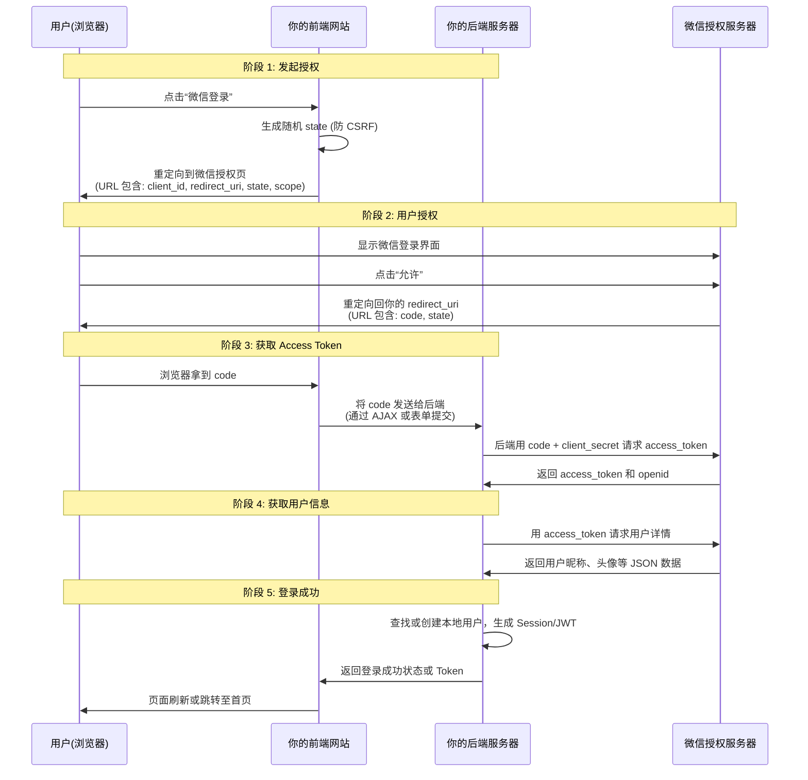

网站支持微信登录（网页授权）的核心流程，本质上是你的网站作为**第三方应用**，通过 OAuth 2.0 协议向**微信服务器**申请用户身份的过程。

可以将这个流程拆解为 **5 个关键步骤**，并详细说明每一步在“前端”和“后端”分别发生了什么。

---

### 🔄 全流程图解



---

### 📝 详细步骤解析

#### 第一步：前端发起授权请求
当用户在你的网站上点击“微信登录”按钮时，前端并不直接去获取用户信息，而是做一个**重定向（Redirect）**动作。

- **前端动作**：
  1. 生成一个随机的 `state` 参数（用于防止 CSRF 攻击，即防止别人伪造请求）。
  2. 将浏览器跳转到微信的授权页面。
  
- **跳转 URL 格式**：
  ```text
  https://open.weixin.qq.com/connect/qrconnect?
  appid=YOUR_APPID&
  redirect_uri=YOUR_REDIRECT_URI&
  response_type=code&
  scope=snsapi_login&
  state=随机生成的字符串#wechat_redirect
  ```
  - `appid`: 你在微信开放平台注册的网站应用 ID。
  - `redirect_uri`: 用户授权后，微信回调你网站的地址（必须是 URL 编码过的）。
  - `scope`: 设置为 `snsapi_login`，表示使用网页授权登录。

#### 第二步：用户在微信端授权
- **用户动作**：
  1. 微信弹出二维码或登录框。
  2. 用户使用微信扫码确认授权。
  3. 微信验证通过后，浏览器会被重定向回你指定的 `redirect_uri`。

- **回调 URL 格式**：
  ```text
  https://yourwebsite.com/callback?code=AUTHORIZATION_CODE&state=随机生成的字符串
  ```
  - `code`: **这是最关键的东西！** 它是一个一次性的临时凭证，有效期很短（通常 5 分钟），且只能使用一次。
  - `state`: 微信原样返回你在第一步生成的 `state`，用于验证请求的合法性。

#### 第三步：后端用 Code 换取 Access Token
**注意：这一步绝对不能在前端做！** 前端无法安全地存储 `client_secret`，如果前端直接请求 Token，密钥会泄露。

- **前端动作**：
  1. 从 URL 中解析出 `code` 和 `state`。
  2. 检查 `state` 是否与你之前生成的一致（验证 CSRF）。
  3. 通过 AJAX 或 POST 请求，将 `code` 发送给你的后端服务器。

- **后端动作**：
  1. 收到 `code` 后，向后端服务器发起 HTTP POST 请求。
  2. 请求地址：`https://api.weixin.qq.com/sns/oauth2/access_token`
  3. 请求参数：
     - `appid`: 你的 AppID
     - `secret`: 你的 AppSecret（**后端保密，绝不暴露**）
     - `code`: 用户传过来的授权码
     - `grant_type`: `authorization_code`

- **微信返回**：
  ```json
  {
    "access_token": "ACCESS_TOKEN_VALUE",
    "expires_in": 7200,
    "refresh_token": "REFRESH_TOKEN_VALUE",
    "openid": "OPENID_VALUE",
    "scope": "snsapi_login"
  }
  ```
  - `openid`: 该微信用户在**你这个网站**下的唯一标识（每个网站对应的 openid 不同）。
  - `access_token`: 访问令牌，用于后续调用微信接口。

#### 第四步：后端用 Token 获取用户信息
拿到 `access_token` 和 `openid` 后，后端需要知道用户的昵称和头像，以便在本地创建账号。

- **后端动作**：
  1. 发起 GET 请求：`https://api.weixin.qq.com/sns/userinfo?access_token=ACCESS_TOKEN&openid=OPENID`
  
- **微信返回**：
  ```json
  {
    "openid": "OPENID",
    "nickname": "用户昵称",
    "sex": 1,
    "province": "广东",
    "city": "广州",
    "country": "中国",
    "headimgurl": "http://thirdwx.qlogo.cn/...",
    "privilege": [],
    "unionid": "UNIONID_VALUE" // 如果有绑定开放平台账号，会有 unionid
  }
  ```

#### 第五步：本地登录处理
- **后端动作**：
  1. 检查本地数据库，看是否有 `openid` 或 `unionid` 对应的用户。
  2. **如果存在**：直接登录该用户。
  3. **如果不存在**：
     - 创建一个新用户，填入昵称、头像等信息。
     - 或者跳转到注册页，让用户补充信息后绑定。
  4. 生成一个本地的会话标识（Session ID 或 JWT Token）。
  5. 返回给前端“登录成功”的信号。

- **前端动作**：
  1. 收到成功信号后，存储本地 Token（如 localStorage）。
  2. 跳转至网站首页或用户中心。

---

### ⚠️ 关键安全点总结

1. **Code 是一次性的**：一旦换取了 Token，Code 就失效了。如果别人截获了 Code 并重放，只要你的后端已经用过了，就不会有问题。
2. **State 防 CSRF**：务必在第一步生成随机 `state`，并在回调时验证。否则，攻击者可以诱导用户点击链接，让用户在无感知的情况下授权攻击者的应用。
3. **Client Secret 保密**：`client_secret` 只能存在于后端代码中，绝不能出现在前端 JavaScript 或 HTML 里。
4. **OpenID 的唯一性**：`openid` 是用户在你网站上的唯一 ID，不要用微信昵称或 unionid 作为主键，因为昵称可改，unionid 需要绑定开放平台。

---

### 💡 常见问题

**Q: 为什么微信登录还需要用户扫码/确认？**
A: 因为 OAuth 2.0 的核心原则是“用户授权”。微信必须确保用户本人同意将身份信息分享给你的网站。

**Q: 如果用户取消了授权怎么办？**
A: 微信回调时不会带 `code`，而是带 `error` 描述。你的前端应提示用户“登录已取消”或“授权失败”。

**Q: 如何让用户下次登录免扫码？**
A: 微信网页授权默认是**静默授权**（如果 scope 是 `snsapi_base`），但那样拿不到昵称头像。如果用的是 `snsapi_login`，每次登录通常都需要扫码确认。这是微信的安全策略，无法绕过。但一旦授权成功，你的网站可以通过 `openid` 自动登录，无需用户再次输入密码。
