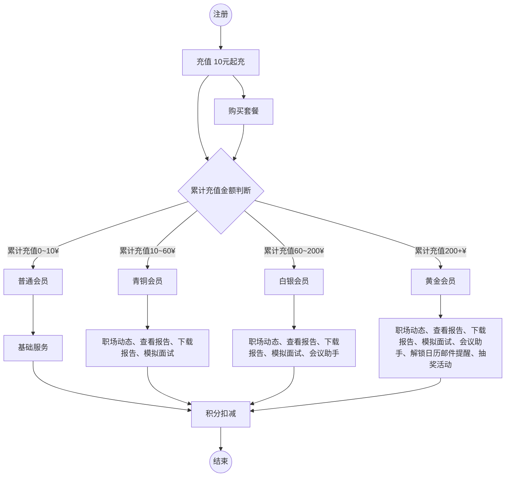

## 用户管理
### 用户认证
- [x] 用户登录
- [x] 用户注册（邮箱）
- [x] 密码找回
- [ ] 修改密码
- [x] 邮件下发
- ~~短信下发（异步、短信模板）~~

### 简历诊断（异步任务）
- [x] 简历上传（本地解析）
- [x] ocr文字提取、数据处理（公共接口）—— 本地pdfjs库已解析好
- [ ] 数据分析（诊断配置、模型、prompt-agent接口）
- [ ] 结果反馈（结果落库）
- [ ] 积分扣减
- [ ] 查看历史

### 面试押题
- 简历上传
- ocr文字提取、数据处理（公共接口）
- 数据分析（押题配置、模型、prompt-agent接口）
- 结果反馈（结果落库）
- 积分扣减

### 防异常充值-巡检任务
- 周期性巡检充值记录比对充值金额

### 消息中心
- 消息发布

## 实时任务 websocket
### 模拟面试
- 初始化（读取面试配置）
- 面试交互
- 结束面试（结果落库）
- 面试记录

### 会议助手
- 初始化（读取会议配置）
- 会议交互
- 结束会议（结果落库）

## 业务
### 仪表面板
- 找工作次数（求职次数， 有效搜索次数）
- 诊断记录
- 押题记录
- 职场动态（json定期更新）
- 模拟面试记录


### 充值升级（realtime）
- 付款吗（企业对公收款账号）
- 支付
    + 订单表（幂等）
- 支付回调，支付
- 积分调整、等级调整

### 推广


### 意见收集

### 工单
+ 建议平台新增工单机制，收集问题以及为用户解决问题【良好的售后服务】

## 领域拆分

### 通用域
#### 文件上传
+ 简历上传

#### 用户账号管理

#### 支付
+ 采用微信原生支付（Native方式），生成二维码png，用户手机扫描完成支付，支付完成后回调URL处理支付结果。

#### 推广

### 核心域
#### 简历诊断
+ 数据分析
+ 结果落库，反馈

#### 押题
+ 数据分析
+ 结果反馈

#### 模拟面试

#### 会议助手

#### 充值
**会员等级设计**  
+ 普通会员——游客（累计充值 0~10）
+ 青铜会员——基础（累计充值 10~60）
+ 白银会员——进阶（累计充值60~200）
+ 黄金会员——高级（累计充值200+）
+ 铂金会员——VIP（后续规划追加）
+ 钻石会员——超级VIP（后续规划追加）

**会员套餐设计**  
+ 周套餐（套餐价 xx）
+ 月套餐（套餐价 xx）
+ 季套餐（套餐价 xx）
+ 套餐暂不支持叠加购买， 如购买周套餐之后，过了两天再次购买周套餐，将自动追加到该周套餐截至日期后延长7天

**会员等级的升级规则**  
+ 消费金额升级
+ 用户注册时长加权（后续规划追加）

**会员权益设计**  
每个等级对应不同的权益，越高等级权益越高；要和职麦平台现有设计的会员保持一致
+ 普通会员：基础服务
+ 青铜会员：解锁查看职场动态、解锁查看报告，下载报告消耗需消耗2积分、模拟面试
+ 白银会员：解锁查看职场动态、解锁查看报告，下载报告不消耗积分、模拟面试、会议助手
+ 黄金会员：解锁查看职场动态、解锁查看报告，下载报告不消耗积分、模拟面试、会议助手、解锁日历提醒功能（邮件）、以及平台其他权益优先体验、抽奖活动等

**积分体系设计**  
+ 每消费1元获得2积分
+ 灵活充值10元起充
+ 完成特定任务获得额外积分奖励（提建议被采纳+10积分、邀请注册成功+10积分）
+ 参与平台其他活动获取积分奖励

**积分用途**  
+ 兑换虚拟商品（如 简历诊断、报告下载、模拟面试）
+ 兑换实物奖励（如礼品、周边产品）—— 后续规划

**须知**  
+ 积分不可转赠
+ 周卡、月卡、季卡用户，积分过期作废

**流程图**  


### 支撑域
#### 异常巡检

#### 消息中心

#### 意见收集

## 管理后台
### 角色管理 
- [x] 使用同一套系统按照角色管理登录用户
- [ ] 用django实现后台管理（实现中）
- [ ] ~~用其他第三方框架实现后台管理~~

### 数据聚合展示（已在后台运营管理实现）
- [x] 在线人数
- [x] 注册用户总数
- [ ] 分享注册用户数量
- [x] 每日新增用户数趋势图
- [x] 付费用户数
- [x] 付费总额
- [x] 付费趋势图
- [x] 各重点模块使用次数统计，为后续分析用户行为提供数据支持

## NFR
### 安全
+ 前后端参数校验
+ 上传简历安全检查、预处理
+ 数据库安全
+ 服务器安全
+ 监控、告警
+ CA证书

## 待办
+ [x] 注册使用短信还是邮箱，调研费用，且短信都需要企业认证【节约成本】（已改为邮箱方式注册）
  - 100w条-价格4w【腾讯】
  - 100w条-价格4.1w【网易】
  - 100w条-价格3.5w【创蓝云智】
  - 从安全角度，防止有些不良用户用脚本注册，滥发短信占用资源，这块预防成本较高，除了前端倒计时，后端也要防范，且根据同一ip来源进行限制等，会有误防，影响用户体验。
+ [ ] 删除无用的代码和文档
+ [ ] 后台管理-运营管理-数据趋势
  - 用户留存-指标规则
  - 用户活跃-平均时长
  - 转化率趋势-指标计算规则
  - 核心功能每次会话时长
     
## 设计


### 系统架构
```python
with Diagram("职麦AI", show=False, filename="context"):
    user = Person("用户")
    pay = System("支付系统", description="支付SDK", external=True)
    email = System("邮件服务", description="发送注册、通知邮件", external=True)

    with SystemBoundary("main system"):
        admin = System("管理后台")
        web = System("web服务")

    user >> Relationship("直接访问") >> web
    user >> Relationship("安全代理访问") >> admin
    web >> Relationship("发送邮件") >> email >> Relationship("投递邮件") >> user
    web >> Relationship("支付、回调") << pay
```


### 门户后端架构
```python
with Diagram("职麦门户网站架构", show=False, filename="container", direction="TB", graph_attr={"splines": "spline"}):
    user = Person("用户")
    pay = System("支付系统", description="支付SDK", external=True)
    model = System("大模型服务", description="三方模型调用服务", external=True)
    email_service = System("邮件服务", description="发送注册、通知邮件", external=True)

    with SystemBoundary("web服务"):
        web_frontend = Container("web应用", technology="React", description="职麦门户网站前端")
        # ingress = Nginx("职麦Nginx", description="反向代理与负载均衡")
        ingress = Container("职麦Nginx", technology="Nginx", description="反向代理与负载均衡")
        web_backend = Container("API应用", technology="FastAPI", description="职麦后端接口服务")
        voice_service = Container("语音服务", technology="FastAPI", description="语音识别与合成服务")
        db_master = Database("主数据库", technology="PostgreSQL", description="存储用户数据与业务数据")
        db_slave = Database("从数据库", technology="PostgreSQL", description="主数据库的只读副本")
        # redis_cache = Redis("队列、缓存热点数据，提升访问速度")
        redis_cache = Container("Redis缓存", technology="Redis", description="缓存热点数据，提升访问速度")
        face_analysis = Container("面部表情分析服务", technology="FastAPI", description="用户人脸识别与分析服务")
        job_crawler = Container("职位爬虫服务", technology="FastAPI", description="爬取各大招聘网站的职位信息")
        
    
    user >> Relationship("访问") >> web_frontend >> Relationship("展示数据") >> user
    web_frontend >> Relationship("API") >> ingress
    ingress >> Relationship("Response") >> web_frontend
    
    ingress >> Relationship("转发请求") >> web_backend
    ingress << Relationship("响应") << web_backend
    
    web_backend >> Relationship("读写") << db_master >> Relationship("复制数据") >> db_slave
    web_backend >> Relationship("读写缓存") << redis_cache

    web_backend >> Relationship("支付、回调") << pay

    web_backend >> Relationship("发送邮件") >> email_service
    email_service >> Relationship("发送邮件") >> user
    
    web_backend >> Relationship("调用模型API") << model
    web_backend >> Relationship("调用RESTAPI") >> [voice_service, face_analysis, job_crawler]
```


**后端拆分**  
```
@startuml
package "核心域" {
    [简历管理] as ResumeManager
    [积分管理] as ScoreManager
    [订单管理] as OrderManager
}

package "通用域" {
    [认证组件] as Auth
    [权限组件] as ACL
    [用户管理] as UserManager
}

package "支撑域" {
    [任务调度管理] as TaskScheduleManager
    [消息中心] as NotifyManager
    [工单管理] as WorkOrder
}

Auth --> UserManager : 查询用户
UserManager --> ACL : 鉴权

通用域 --> "核心域"
通用域 --> "支撑域"
@enduml
```
**领域重新拆分**  
```
@startuml
package "核心子域" {
    [简历管理] as ResumeManager
    [订单上下文] as OrderManager
    [支付上下文] as PayManager
}

package "通用子域" {
    [缓存上下文] as CacheContext
    [工具上下文] as ToolsManager
}

package "支撑子域" {
    [用户上下文] as UserManager
    [消息通知上下文] as NotifyManager
    [工单上下文] as WorkOrder
}


queue "redis队列" as redis_queue

'Auth .-> UserManager : 查询用户，会员等级，权限，认证，积分
@enduml
```


**当前界面**  


## 识别到的接口列表
**仪表盘**  
+ /api/v1/workplace-news/latest/list
+ /api/v1/monthly-stats
+ /api/v1/payment/subscription/
+ /api/v1/points/history/（在会议助手页面请求次数太多）
**模拟面试**  
+ /api/v1/mock-interview/upload-resume
+ /api/v1/mock-interview/generate
+ /api/v1/mock-interview/chat/stream
+ /api/v1/mock-interview/records/
+ /api/v1/tts/stream
+ /api/v1/interview/ai-reference
+ /api/v1/paraformer/clear
+ /api/v1/paraformer/start
+ /api/v1/custom-interview/upload-materials
**会议助手**
+ /api/v1/meeting-assistant/records/
+ /api/v1/paraformer/stop
+ /api/v1/points/consume-by-duration
**找工作**
+ /api/v1/search/sessions
+ /api/v1/search/jobs
**简历诊断**
+ /api/v1/resume-diagnosis/full-with-skills（阻塞接口、需优化）
**面试押题**
+ /api/v1/interview-prep/upload-resume
+ /api/v1/interview-prep/ai-generate（重点优化）
+ /api/v1/interview-prep/history
**经典题库**
+ /classic-questions
**消息通知**
+ /api/v1/referral/stats/（会调用模拟面试的接口，需要优化）
**账户设置**
+ 
**立即升级**
+
**合作推广**  
+ /api/v1/invite-code/
+ 

## 待优化点
+ 接口重复调用
+ 仪表盘-添加事件没有接口
+ 部分接口应该频闭多余信息
+ 意见反馈后端补充
+ 工单后端实现
+ 部分接口传参换种形式
+ 解决项目中的硬编码问题，考虑统一配置
+ 代码层级混乱问题，代码重构
+ 清理无用接口，减少暴露面
+ 部分重要配置文件考虑加密

## 全景架构


## 后续规划
+ [ ] 职位雷达，根据地理位置扫描周围的企业招聘信息（需购买地理信息数据库）
+ [ ] 求职广播，在地图上画圈并根据简历自动匹配合适的企业岗位，自动生成匹配列表，一键发送

## Tools
+ diagrams.net（快速草图、轻量级、原draw.io）
+ diagrams（开发者、python库、版本化管理）
+ Archi（开源企业级）
