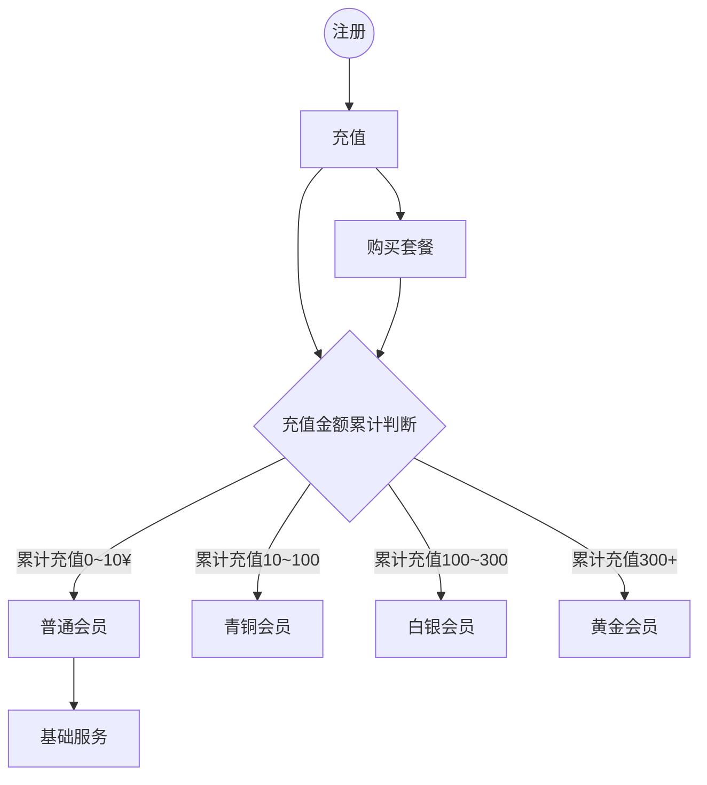

## 用户管理
### 用户认证
- [ ] 用户登录
- [x] 用户注册（邮箱）
- [ ] 密码找回
- [ ] 修改密码
- [x] 邮件下发
- ~~短信下发（异步、短信模板）~~

### 简历诊断（异步任务）
- [x] 简历上传（本地解析）
- [x] ocr文字提取、数据处理（公共接口）—— 本地pdfjs库已解析好
- [ ] 数据分析（诊断配置、模型、prompt-agent接口）
- [ ] 结果反馈（结果落库）
- [ ] 积分扣减

### 面试押题
- 简历上传
- ocr文字提取、数据处理（公共接口）
- 数据分析（押题配置、模型、prompt-agent接口）
- 结果反馈（结果落库）
- 积分扣减

### 防异常充值-巡检任务
- 周期性巡检充值记录比对充值金额

### 消息中心
- 消息发布

## 实时任务 websocket
### 模拟面试
- 初始化（读取面试配置）
- 面试交互
- 结束面试（结果落库）

### 会议助手
- 初始化（读取会议配置）
- 会议交互
- 结束会议（结果落库）

## 业务
### 仪表面板
- 找工作次数（求职次数， 有效搜索次数）
- 诊断记录
- 押题记录
- 职场动态（json定期更新）
- 模拟面试记录

### 充值升级（realtime）
- 付款吗（企业对公收款账号）
- 支付
    + 订单表（幂等）
- 支付回调，支付
- 积分调整、等级调整

### 推广

### 意见收集

### 工单
+ 建议平台新增工单机制，收集问题以及为用户解决问题【良好的售后服务】

## 领域拆分

### 通用域
#### 文件上传
+ 简历上传

#### 用户账号管理

#### 支付
+ 采用微信原生支付（Native方式），生成二维码png，用户手机扫描完成支付，支付完成后回调URL处理支付结果。

#### 推广

### 核心域
#### 简历诊断
+ 数据分析
+ 结果落库，反馈

#### 押题
+ 数据分析
+ 结果反馈

#### 模拟面试

#### 会议助手

#### 充值
**会员等级设计**  
+ 普通会员——游客（累计充值 0~10）
+ 青铜会员——基础（累计充值 10~100）
+ 白银会员——进阶（累计充值100~300）
+ 黄金会员——高级（累计充值300+）
+ 铂金会员——VIP（后续规划追加）
+ 钻石会员——超级VIP（后续规划追加）

**会员套餐设计**  
+ 周套餐（套餐价 xx）
+ 月套餐（套餐价 xx）
+ 季套餐（套餐价 xx）
+ 套餐暂不支持叠加购买， 如购买周套餐之后，过了两天再次购买周套餐，将自动追加到该周套餐截至日期后延长7天

**会员等级的升级规则**  
+ 消费金额升级
+ 用户注册时长加权（后续规划追加）

**会员权益设计**  
每个等级对应不同的权益，越高等级权益越高
+ 普通会员：基础服务
+ 青铜会员：解锁查看职场动态、解锁查看报告，下载报告消耗需消耗2积分、模拟面试
+ 白银会员：解锁查看职场动态、解锁查看报告，下载报告不消耗积分、模拟面试
+ 黄金会员：解锁查看职场动态、解锁查看报告，下载报告不消耗积分、模拟面试、解锁日历提醒功能（邮件）、以及平台其他权益优先体验、抽奖活动等

**积分体系设计**  
+ 每消费1元获得2积分
+ 灵活充值10元起充
+ 完成特定任务获得额外积分奖励（提建议被采纳+10积分、邀请注册成功+10积分）
+ 参与平台其他活动获取积分奖励

**积分用途**  
+ 兑换虚拟商品（如 简历诊断、报告下载、模拟面试）
+ 兑换实物奖励（如礼品、周边产品）—— 后续规划

**须知**  
+ 积分不可转赠
+ 周卡、月卡、季卡用户，积分过期作废

**流程图**  

### 支撑域
#### 异常巡检

#### 消息中心

#### 意见收集

## 管理后台
### 角色管理 
- [x] 使用同一套系统按照角色管理登录用户
- [ ] 用django实现后台管理（实现中）
- [ ] ~~用其他第三方框架实现后台管理~~

### 数据聚合展示（已在后台运营管理实现）
- [x] 在线人数
- [x] 注册用户总数
- [ ] 分享注册用户数量
- [x] 每日新增用户数趋势图
- [x] 付费用户数
- [x] 付费总额
- [x] 付费趋势图
- [x] 各重点模块使用次数统计，为后续分析用户行为提供数据支持

## NFR
### 安全
+ 前后端参数校验
+ 上传简历安全检查、预处理
+ 数据库安全
+ 服务器安全
+ 监控、告警
+ CA证书

## 待办
+ [x] 注册使用短信还是邮箱，调研费用，且短信都需要企业认证【节约成本】（已改为邮箱方式注册）
  - 100w条-价格4w【腾讯】
  - 100w条-价格4.1w【网易】
  - 100w条-价格3.5w【创蓝云智】
  - 从安全角度，防止有些不良用户用脚本注册，滥发短信占用资源，这块预防成本较高，除了前端倒计时，后端也要防范，且根据同一ip来源进行限制等，会有误防，影响用户体验。
+ [ ] 删除无用的代码和文档
+ [ ] 后台管理-运营管理-数据趋势
  - 用户留存-指标规则
  - 用户活跃-平均时长
  - 转化率趋势-指标计算规则
  - 核心功能每次会话时长
     
## 设计

## 后续规划
+ [ ] 职位雷达，根据地理位置扫描周围的企业招聘信息（需购买地理信息数据库）
+ [ ] 求职广播，在地图上画圈并根据简历自动匹配合适的企业岗位，自动生成匹配列表，一键发送

## Tools
+ diagrams.net（快速草图、轻量级、原draw.io）
+ diagrams（开发者、python库、版本化管理）
+ Archi（开源企业级）
