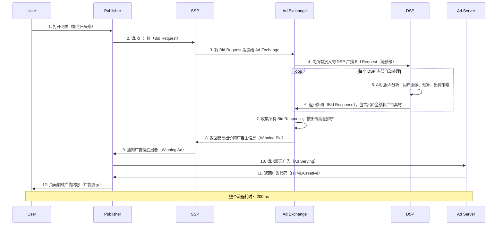

```mermaid
sequenceDiagram
    participant User
    participant Publisher
    participant SSP
    participant Ad Exchange
    participant DSP
    participant Ad Server

    User->>Publisher: 1. 打开网页（如今日头条）
    Publisher->>SSP: 2. 请求广告位（Bid Request）
    SSP->>Ad Exchange: 3. 将 Bid Request 发送给 Ad Exchange
    Ad Exchange->>DSP: 4. 向所有接入的 DSP 广播 Bid Request（毫秒级）
    
    loop 每个 DSP 内部自动处理
        DSP->>DSP: 5. AI机器人分析：用户画像、预算、出价策略
        DSP->>Ad Exchange: 6. 返回出价（Bid Response），包含出价金额和广告素材
    end

    Ad Exchange->>Ad Exchange: 7. 收集所有 Bid Response，按出价高低排序
    Ad Exchange->>SSP: 8. 返回最高出价的广告主信息（Winning Bid）
    SSP->>Publisher: 9. 通知广告位胜出者（Winning Ad）
    Publisher->>Ad Server: 10. 请求展示广告（Ad Serving）
    Ad Server->>Publisher: 11. 返回广告代码（HTML/Creative）
    Publisher->>User: 12. 页面加载广告内容（广告展示）
    
    Note over User,Ad Server: 整个流程耗时 < 200ms

```
