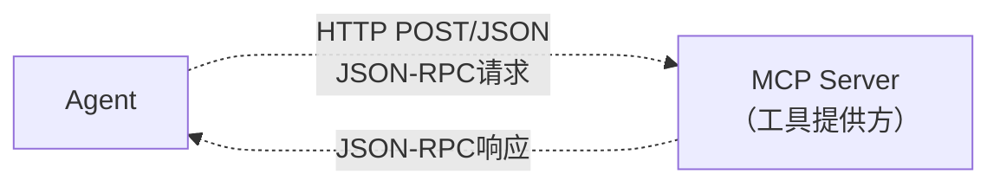
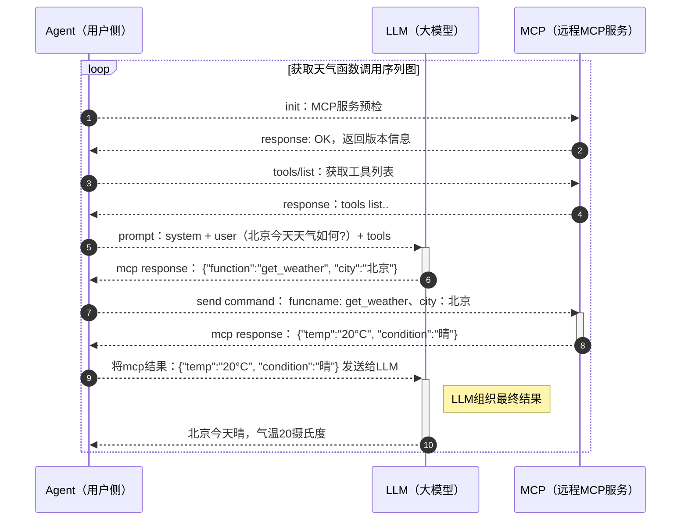

# MCP如何和Agent交互



**MCP Server**：是一个独立的HTTP服务方，暴露一组工具。它不关心LLM的存在。它主要只干两件事，告诉调用方它有哪些工具、调用方调用它提供的工具返给结果。

**Agent端**：除了内置的基本的工具意以外，可以从MCP Server动态获取工具。

# MCP Server端的实现
```python

import json

from http.server import HTTPServer, BaseHTTPRequestHandler

TOOLS = {
    "weather": {
        "description": "通过城市名称获取当地天气预报",
        "schema": {
            "type": "object",
            "properties": {
                "city": {
                    "type": "string"
                }
            },
            "required": ["city"]
        },
        "func": lambda city: f"{city}: 晴，20度"
    }
}


class MCPHandler(BaseHTTPRequestHandler):

    @staticmethod
    def _handler_request(tool_name, parameters):
        if tool_name == "init":
            return {"protocolVersion": "2026-03-27", "capabilities": {"tools": {}}}
        elif tool_name == "tools/list":
            return {"tools": [
                {"name": n, "description": t["description"], "inputSchema": t["schema"]} for n, t in TOOLS.items()
            ]}
        elif tool_name == "tools/call":
            result = {"result": TOOLS[parameters["name"]]["func"](**parameters["arguments"])}
            return {"content": [{"type": "text", "text": str(result)}]}

    def do_POST(self):
        message = json.loads(self.rfile.read(int(self.headers['Content-Length'])))
        result = self._handler_request(message["method"], message.get("arguments"))
        body = json.dumps({"jsonrpc": "2.0", "id": message["id"], "result": result}).encode()
        self.send_response(200)
        self.send_header('Content-Type', 'application/json')
        self.end_headers()
        self.wfile.write(body)


if __name__ == "__main__":
    server = HTTPServer(('localhost', 6666), MCPHandler)
    print("MCP Server running on http://localhost:6666")
    server.serve_forever()
```
这就是最小的MCP服务的实现代码

其中支持三个方法

| 方法         | 作用           | 描述        |
|------------|--------------|-----------|
| init       | 握手，告知客户端协议版本 | 类比TCP三次握手 |
| tools/list | 返回工具列表       | 类比软件商店    |
| tools/call | 调用指定工具       | 函数调用      |

# Agent端的改造，使其支持MCP Server
```python
import json
import os
import sys

import requests
from openai import OpenAI

SERVER_URL = os.environ.get("MCP_SERVER_URL", "http://localhost:6666/mcp")

_id = 0


def mcp_send(method, params=None):
    if params is None:
        params = {}
    global _id
    _id += 1
    resp = requests.post(SERVER_URL, json={
        "jsonrpc": "2.0", "id": _id, "method": method, "params": params})
    return resp.json()["result"]


def run_agent(task):
    mcp_send("init", {"protocolVersion": "2026-03-27"})

    # 动态获取远程MCP服务工具列表
    tools = [{
        "type": "function",
        "function": {
            "name": t["name"],
            "description": t["description"],
            "parameters": t["inputSchema"]
        }
    } for t in mcp_send("tools/list")["tools"]]

    llm = OpenAI(api_key=os.environ.get("OPENAI_API_KEY"),
                 base_url=os.environ.get("OPENAI_BASE_URL"))

    messages = [
        {"role": "system", "content": "You are a helpful assistant."},
        {"role": "user", "content": task}
    ]
    for _ in range(5):
        msg = llm.chat.completions.create(
            model=os.environ.get("OPENAI_MODEL", "gpt-4o-mini"),
            messages=messages, tools=tools).choices[0].message
        messages.append(msg)
        if not msg.tool_calls:
            return msg.content
        for fn in msg.tool_calls:
            args = json.loads(fn.function.arguments)
            result = mcp_send("tools/call",
                              {"name": fn.function.name, "arguments": args})["content"][0]["text"]
            messages.append({"role": "tool", "tool_call_id": fn.id, "content": result})
    return "Max iterations reached"


if __name__ == "__main__":
    print(run_agent(" ".join(sys.argv[1:]) if len(sys.argv) > 1 else "今天北京的天气如何?"))
```

这里要说明一点是从MCP Server获取工具列表这段代码
**获取工具列表/格式转换**：Agent 调用 tools/list 从 mcp server 获取工具列表，转换成 OpenAI 的 tools 格式。MCP 工具格式和 OpenAI 工具格式略有不同，需要适配下，没其他特殊含义。

# Agent、LLM、MCP Service的交互流程


# MCP三种传输协议

|        | stdio          | SSE                 | Streamable HTTP |
|--------|----------------|---------------------|-----------------|
| 通信方式   | stdin/stdout管道 | HTTP POST + SSE流式响应 | 普通HTTP请求/响应     |
| 是否需要网络 | 否/本地           | 是                   | 是               | 
| 适用场景   | 本地工具           | 远程+流式响应             | 远程+简单请求响应       |
| 描述     | 产用于本地          | 过渡方案                | MCP规范推荐方案       |


