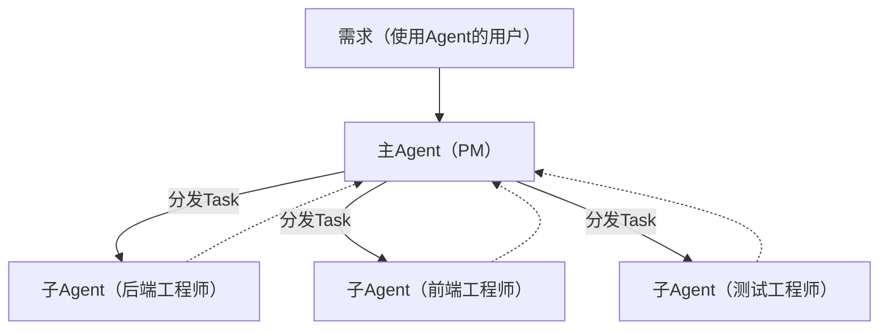

# Agent + SubAgent
如果只有一个agent干活，随着活干的越来越多，上下文越来越长，后面干活的时候容易忘记前面的细节。 这种情况下，需要找个帮手分工协作，这就是subagent（子智能体）的核心思想。主agent当pm，作为统筹角色把子任务分发给不同的subagent，各管各的，互不干扰。


但要注意的一点是，它是一次性的，是个临时工，主agent第一次派出的"后端工程师"和第二次派出的"后端工程师"是两个完全不同的"人"，他们之间没有任何关联是两个完全独立的个体。
这种 子任务的设计给你的是一个干净的上下文语义环境和专注的角色，是找多个临时工来干活而不是构建一个持久稳固的团队。

## 如何实现子Agent？
 和之前文章中新增的plan一样，subagent也同理，那就是写一个 "工具使用说明书"，告诉LLM，有一个叫 subagent的工具，你可以给它指定角色和子任务来协助干活。
 
**实现subagent函数**  

```python

def subagent(role, task):
    """启动一个独立的 Agent 循环，拥有专属角色和独立上下文"""
    print(f"\n[SubAgent:{role}] 开始: {task}")
    # 关键 1：独立的 messages，独立的 system prompt
    sub_messages = [
        {"role": "system", "content": f"You are a {role}. Be concise and focused. Only do what is asked."},
        {"role": "user", "content": task}
    ]
    # 关键 2：排除 subagent 自身，防止无限递归
    sub_tools = [t for t in tools if t["function"]["name"] != "subagent"]
    # 关键 3：一个完整的 Agent 循环（和第一篇的核心循环一模一样）
    for _ in range(10):
        response = client.chat.completions.create(
            model=MODEL, messages=sub_messages, tools=sub_tools
        )
        message = response.choices[0].message
        sub_messages.append(message)
        if not message.tool_calls:
            print(f"[SubAgent:{role}] 完成")
            return message.content
        for tc in message.tool_calls:
            fn = tc.function.name
            args = json.loads(tc.function.arguments)
            print(f"  [SubAgent:{role}] {fn}({args})")
            result = available_functions[fn](**args)
            sub_messages.append({"role": "tool", "tool_call_id": tc.id, "content": result})
    return "SubAgent: max iterations reached"

# 注册subagent
available_functions["subagent"] = subagent
```

**hold on hold on，代码中没看到调用subagent？**  
如果看了之前的文档中的 plan的调用方式，就能理解这块为什么没有显式调用subagent，因为这里的subagent和其他工具在LLM眼里没什么区别，控制流程在LLM手里，是LLM驱动，而不是代码驱动，代码只提供能力，LLM决定何时调用。

**subagent的三个关键设计**  
+ 独立message：如果共享主agent的messages，subagent可能会被主agent的messages干扰，上下文越来越长，token（词元）开销越来越大，是不可接受的。独立的messages可以让subagent知道自己的角色和使命，保持专注干活，并且活干完之后其messages就被垃圾回收了。
+ subagent有自己的system prompt：通过不同的角色描述，让同一个LLM展现出不同的专业行为。
+ 代码中排除subagent函数：防止无限递归，不允许subagent派生出自己的subagent
