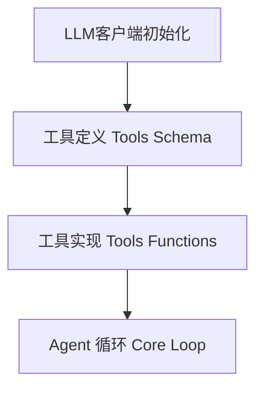
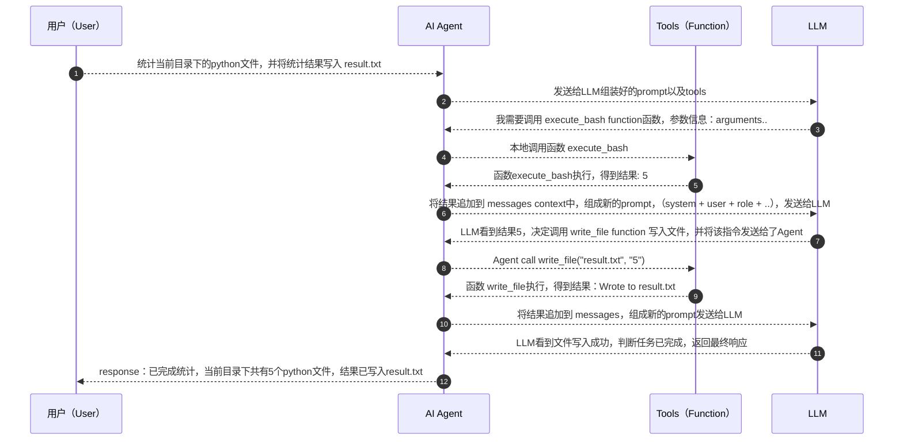
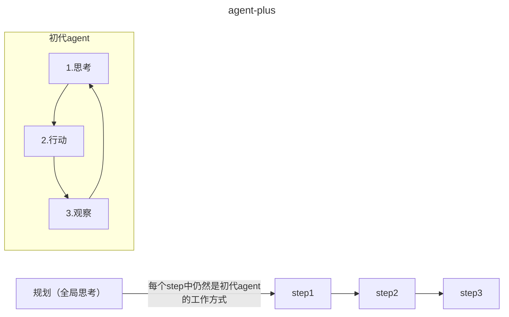

可以从只有百行的极简agent入门，理解什么是agent

[nanoAgent](https://github.com/sanbuphy/nanoAgent)

# Agent和普通对话的区别（核心）
|维度|普通对话|Agent|
|---|---|---|
|交互模式|一问一答，用户驱动|自主循环、目标驱动|
|能力边界|只能生成文本|可以调用工具/工具链，作用于真实场景|
|执行流程|用户提问->模型回答| 用户提问->模型思考->调用工具->观察输出->继续思考->..->返回答案|
|状态管理|每轮独立（或简单上下文拼接）|维护完成的对话历史，包含工具调用与返回结果|
|自主性|无|模型自主决定下一步做什么，用哪个工具，何时停止|

> 总结：Agent= LLM + 工具 + 循环，三个要素缺一不可，没有LLM就没有思考能力；没有工具就无法作用于真实世界；没有循环，就做不了多步或复杂任务
> 普通对话是：一问一答
> Agent是 给我一个目标，自己想办法完成任务

# nanoAgent架构解剖



# agent源码解读
我们先从这个项目的初始版本[nanoAgent-agent](https://github.com/sanbuphy/nanoAgent/blob/main/agent.py)看起

## LLM客户端初始化
```python
from openai import OpenAI

client = OpenAI(
    api_key=os.environ.get("OPENAI_API_KEY"),
    base_url=os.environ.get("OPENAI_BASE_URL")
)
```
可以看到，使用了openai的python SDK，通过base_url环境变量，可以指向任何一个兼容openai api格式的服务，agent框架不应该绑定具体模型。 api_key则是对应服务的访问密钥。

## 工具定义：告诉LLM它有哪些能力
```python
tools = [
    {
        "type": "function",
        "function": {
            "name": "execute_bash",
            "description": "Execute a bash command",
            "parameters": {
                "type": "object",
                "properties": {"command": {"type": "string"}},
                "required": ["command"],
            },
        },
    },
    read_file..
    write_file..
]
```
这是 OpenAI Function Calling 的标准格式。这段 json Schema 本质上是一份工具说明书，它会随着每次 API 请求一起发送给 LLM。LLM 读到这份说明书后，就"知道"agent可以执行 bash 命令、读文件、写文件等等。 每个工具要管控好安全风险。
> LLM 本身不会执行任何代码。它只是根据工具说明书，输出一段结构化的 JSON，表达"我想调用 execute_bash，参数是 rm -rf *"。真正的执行发生在我们的 Python 代码里。这个"LLM 输出意图、代码执行动作"的分工，是理解所有 Agent 系统的关键。

## 工具实现：给LLM装上外挂
```python
def execute_bash(command):
    result = subprocess.run(command, shell=True, capture_output=True, text=True)
    return result.stdout + result.stderr


def read_file(path):
    with open(path, "r") as f:
        return f.read()


def write_file(path, content):
    with open(path, "w") as f:
        f.write(content)
    return f"Wrote to {path}"

# 把工具名映射到实际函数，方便 Agent根据LLM的指令找到相应的工具并调用
functions = {"execute_bash": execute_bash, "read_file": read_file, "write_file": write_file}
```

**错误处理**：工具执行出错，可将错误信息返回给大模型，LLM根据报错可以自行修正策略

**路由表**： 把工具名映射到实际函数，方便 Agent根据LLM的指令找到相应的工具并调用。

## Agent核心循环

```python
def run_agent(user_message, max_iterations=5):
    messages = [
        {"role": "system", "content": "You are a helpful assistant. Be concise."},
        {"role": "user", "content": user_message},
    ]
    for _ in range(max_iterations):
        response = client.chat.completions.create(
            model=os.environ.get("OPENAI_MODEL", "gpt-4o-mini"),
            messages=messages,
            tools=tools,
        )
        message = response.choices[0].message
        messages.append(message)
        if not message.tool_calls:
            return message.content
        for tool_call in message.tool_calls:
            name = tool_call.function.name
            args = json.loads(tool_call.function.arguments)
            print(f"[Tool] {name}({args})")
            if name not in functions:
                result = f"Error: Unknown tool '{name}'"
            else:
                result = functions[name](**args)
            messages.append({"role": "tool", "tool_call_id": tool_call.id, "content": result})
    return "Max iterations reached"
```

这20多行代码是整个Agent的核心。

## Agent运行时序
接下看可以看看这个 Agent是怎么执行的。



也可用一张流程图来表示：
```
    用户任务
      │
      ▼
    ┌──────────────────────────────────────────────────┐
    │                  Agent Loop                       │
    │                                                   │
    │  ┌─────────┐    ┌──────────┐    ┌──────────────┐ │
    │  │ 发送给   │───▶│ LLM 决策  │───▶│ 有tool_call? │ │
    │  │ LLM     │    │          │    └──────┬───────┘ │
    │  └─────────┘    └──────────┘           │         │
    │       ▲                          Yes   │   No    │
    │       │                          ┌─────┴─────┐   │
    │       │                          ▼           ▼   │
    │  ┌────┴────────┐          ┌──────────┐  返回文本  │
    │  │ 结果追加到   │◀─────────│ 执行工具  │  ──────▶  │
    │  │ messages    │          └──────────┘   结束    │
    │  └─────────────┘                                 │
    └──────────────────────────────────────────────────┘
```

# 深入理解几个关键设计

## 为什么需要 max_iterations
这是一个安全阀。如果 LLM 陷入死循环（比如反复执行同一个失败的命令），max_iterations 确保程序最终会停下来。在生产级 Agent 中，这个值通常更大（比如 Claude Code 可以连续执行数十步），同时会配合更复杂的终止策略

## messages 列表为什么如此重要
messages 是 Agent 的短期记忆。每一轮循环，它都会累积 LLM 的回复（包括它想调用什么工具）以及工具的执行结果。

当这个列表在下一轮发送给 LLM 时，LLM 能看到完整的"行动-观察"历史，从而做出更合理的下一步决策。这就是 Agent 和简单对话的本质区别——Agent 维护了一条包含行动轨迹的上下文链。

但请注意，这里的 messages 只在单次运行中存在。程序退出后，一切归零。Agent 下次运行时完全不记得上次做过什么。这个agent会“失忆”

## LLM 是怎么"决定"调用工具的

LLM 并没有真的在"执行代码"或"调用函数"。实际发生的是：

1. 我们在 API 请求中传入了 tools 参数（工具说明书）
2. LLM 经过训练，学会了在适当的时候输出一种特殊的结构化格式（tool_calls）
3. 这个格式本质上就是一段 JSON，描述"我想调用哪个函数、传什么参数"
4. 我们的代码解析这段 JSON，执行真正的函数，再把结果喂回给 LLM

所以整个过程可以理解为一种协作协议：
> 1. LLM 的职责：思考、决策、生成工具调用指令
> 2. 代码的职责：解析指令、执行工具、返回结果

LLM 是"大脑"，代码是"手脚"。

## tool_call_id 的作用
tool_call_id 是 OpenAI API 的要求，用于将工具返回结果与对应的调用请求关联起来。当 LLM 在一次回复中同时调用多个工具时（并行调用），这个 ID 确保每个结果能正确匹配到对应的调用。

# <a name="redirect1">这个Agent还缺什么</a>
nanoAgent 的极简设计让核心概念一目了然，但如果仔细想想，会发现它有几个根本性的缺陷：

+ *没有记忆*  每次运行都是一张白纸。昨天让它创建的文件，今天问它"你昨天干了什么"，它一脸茫然
+ *没有规划* 面对"重构整个项目"这样的复杂任务，它只能走一步看一步，容易迷失在细节中
+ *工具是硬编码的* 只有 3 个工具，想加新工具必须改代码。没有任何扩展机制
+ *没有行为约束* 它可以执行 rm -rf /，没有任何规则告诉它什么该做、什么不该做

这些缺陷，恰好对应了 Agent 架构中更高层次的需求。nanoAgent 的作者也意识到了这一点，所以写了进化版本，ahent-plus来逐一解决这些问题。

# 从nanoAgent看Agent本质
 Agent 的三个本质要素：

+ 1. 感知（Perception）—— 通过工具获取外部信息（read_file、execute_bash 的输出）
+ 2. 决策（Reasoning）—— LLM 根据任务目标和已有观察，决定下一步行动
+ 3. 行动（Action）—— 通过工具作用于外部环境（write_file、execute_bash）

这三者在一个循环中不断迭代，直到 LLM 判断任务完成（不再调用工具）。这就是 Agent 最朴素、最本质的运行方式——**"思考 → 行动 → 观察"（ReAct）**范式。

无论是 OpenClaw、Claude Code、Cursor 还是 Devin，底层都遵循这个范式。当你在 OpenClaw 中看到它自动 grep 搜索代码、edit 修改文件、bash 跑测试时，背后就是这样一个循环在驱动。nanoAgent 用最少的代码，把这个范式展现得淋漓尽致。


# nanoAgent进化版：agent-plus
之前说过这个精简版的agent还缺少了几样功能：[缺少的功能](#redirect1)
作者也认识到了这个问题，于是就有了 nanoAgent第二个版本：[agent-plus.py](https://github.com/sanbuphy/nanoAgent/blob/main/agent-plus.py)，它多了几十行代码，却解决了两个根本问题：1. agent有了记忆，2. 让agent能够规划

看看多了什么？
|能力|agent|agent-plus|是否变化|
|---|---|---|---|
|工具调用|3个工具|3个工具|❌无变化|
|单任务执行|是|是|❌无变化|
|跨会话记忆|每次运行都失忆|记忆文件|✔️有变化|
|任务规划|无规划|先拆解再执行|✔️有变化|
|多步串联|无|任务步骤间共享messages context|✔️有变化|

## 记忆系统：最朴素的实现方案

### 记忆的存储：使用markdown文件
```python
MEMORY_FILE = "agent_memory.md"

def save_memory(task, result):
    timestamp = datetime.now().strftime("%Y-%m-%d %H:%M:%S")
    entry = f"\n## {timestamp}\n**Task:** {task}\n**Result:** {result}\n"
    try:
        with open(MEMORY_FILE, 'a') as f:
            f.write(entry)
    except:
        pass
```

agent-plus使用了最简单朴素的方案：把历史任务和结果追加写入到一个markdown文件中。没有存入数据库，也没有使用向量索引，就是纯文本。每次任务执行完成，agent就把 "何时、做了什么、得到的结果" 追加到文件尾端。

### 记忆的恢复：滑动窗口机制
```python
def load_memory():
    if not os.path.exists(MEMORY_FILE):
        return ""
    try:
        with open(MEMORY_FILE, 'r') as f:
            content = f.read()
            lines = content.split('\n')
            return '\n'.join(lines[-50:]) if len(lines) > 50 else content
    except:
        return ""
```

agent-plus 只取最近50条历史记录。这是一个简单的滑动窗口策略，因为记忆是无限增长的，但LLM的上下文窗口是有限制的，所以获取最近的N条记忆。

### 记忆的延申：将其注入 system prompt
```python
def run_agent_plus(task, use_plan=False):
    memory = load_memory()
    system_prompt = "You are a helpful assistant that can interact with the system. Be concise."
    if memory:
        system_prompt += f"\n\nPrevious context:\n{memory}"
    messages = [{"role": "system", "content": system_prompt}]
```

恢复出来的记忆被拼接到 system prompt末尾，以 Previous context形式注入到新的prompt，这样LLM在处理新任务时就能"感知"到之前发生了什么。

### 记忆的本质
这个方案看起来原始粗糙，但揭示了一个根本性问题：LLM本身没有持久记忆，所有“记忆”是通过在prompt中注入历史消息来实现的。 目前的大模型都遵从这种模式，只是在 存在哪、怎么找、找多少上有不同的实现方式。

## 规划系统：让agent先think再do

### 为什么需要规划？
想象如果把整个任务丢给 LLM，让它在循环中自行摸索。简单任务没问题，但面对复杂任务（比如"重构整个项目"），LLM 容易迷失在细节中，忘记全局目标。

agent-plus引入了一个可选项-规划
```python

def create_plan(task):
    print("[Planning] Breaking down task...")
    response = client.chat.completions.create(
        model=os.environ.get("OPENAI_MODEL", "gpt-4o-mini"),
        messages=[
            {"role": "system", "content": "Break down the task into 3-5 simple, actionable steps. Return as JSON array of strings."},
            {"role": "user", "content": f"Task: {task}"}
        ],
        response_format={"type": "json_object"}
    )
    try:
        plan_data = json.loads(response.choices[0].message.content)
        if isinstance(plan_data, dict):
            steps = plan_data.get("steps", [task])
        elif isinstance(plan_data, list):
            steps = plan_data
        else:
            steps = [task]
        print(f"[Plan] {len(steps)} steps created")
        for i, step in enumerate(steps, 1):
            print(f"  {i}. {step}")
        return steps
    except:
        return [task]
```

### 规划的设计细节
+ 使用LLM做规划：让LLM把任务拆解为 3~5个可执行的步骤，以json array的形式返回
+ 结构化输出：response_format={"type": "json_object"} 强制LLM返回json格式
+ 优雅降级：如果json解析失败，则将整个任务作为一个步骤执行，这里使用了防御性编程，这在agent开发中很重要。

### agent和agent-plus两种执行范式对比



## 多步执行：步骤之间上下文传递
```python
def run_agent_step(task, messages, max_iterations=5):
    messages.append({"role": "user", "content": task})
    actions = []
    for _ in range(max_iterations):
        response = client.chat.completions.create(
            model=os.environ.get("OPENAI_MODEL", "gpt-4o-mini"),
            messages=messages,
            tools=tools
        )
        message = response.choices[0].message
        messages.append(message)
        if not message.tool_calls:
            return message.content, actions, messages
        for tool_call in message.tool_calls:
            function_payload = getattr(tool_call, "function", None)
            if function_payload is None:
                continue
            function_name = str(getattr(function_payload, "name", ""))
            raw_arguments = str(getattr(function_payload, "arguments", ""))
            function_args = parse_tool_arguments(raw_arguments)
            print(f"[Tool] {function_name}({function_args})")
            function_impl = available_functions.get(function_name)
            if function_impl is None:
                function_response = f"Error: Unknown tool '{function_name}'"
            elif "_argument_error" in function_args:
                function_response = f"Error: {function_args['_argument_error']}"
            else:
                function_response = function_impl(**function_args)
                actions.append({"tool": function_name, "args": function_args})
            messages.append({"role": "tool", "tool_call_id": tool_call.id, "content": function_response})
    return "Max iterations reached", actions, messages
```

+ 变化1：messages从内部创建变为外部传入，这样多个步骤间就可以共享同一个对话历史。
+ 变化2：返回值中包含messages；函数把更新后的消息列表返回给调用方供下一步使用

**编排： 把步骤串联起来**  
```python
all_results = []
for i, step in enumerate(steps, 1):
    if len(steps) > 1:
        print(f"\n[Step {i}/{len(steps)}] {step}")
    result, actions, messages = run_agent_step(step, messages)
    all_results.append(result)
    print(f"\n{result}")
final_result = "\n".join(all_results)
save_memory(task, final_result)
```
可以看到，前一个步骤的输出作为下一个步骤的输入，每个步骤只完成一件事最后输出最终结果。

其中每个步骤内的 messages是短期记忆列表，而 agent_memory.md保存了长期记忆。
|记忆类型|载体|生命周期|实现|
|---|---|---|---|
|短期记忆|messages列表|单次运行内|步骤之间共享的对话历史|
|长期记忆|agent_memory.md|跨任务|save_memory函数|

## 记忆方案的局限性和优化方向

nanoAgent的记忆方案简单粗暴可成为“最小可行性记忆”，但还是不够智能，可以继续优化；
+ 记忆无差别截断-->*向量数据库+语义检索*： 如果只保留最近N行信息可能会丢失重要的早期信息，更好的方案是把记忆存入向量数据库，每次加载记忆时只检索与当前语义相关的记忆。这是RAG的核心思路
+ 无记忆压缩-->记忆蒸馏：当记忆超过阈值时，用LLM自动压缩旧记忆——提取关键信息，丢弃细节。
+ 全量注入prompt-->记忆作为工具：不把记忆强塞进 system prompt，可提供一个 search_memory工具，agent按需查询，agent决定什么时候需要回忆以及回忆什么。
+ 单层记忆-->多层记忆：将记忆细分为 工作记忆（当前任务）、短期记忆（最近几次对话的摘要内容）、长期记忆（压缩后的关键事实）；每层的信息密度和保留时间不同。

## agent-plus总结
plus版本的agent有了记忆和规划能力，但是还有一些问题需要解决
+ 工具是硬编码的：无法接入外部服务，tools market
+ 没有行为约束：不同项目，不同团队对 agent要求不同，无法定制agent
+ 规划是被动触发的：用户通过 --plan 参数来激活规划功能，agent不知道什么时候该规划

这三个问题，引出了agent架构中最精彩的三个概念：MCP（工具协议）、Skills（技能）、Rules（行为规则）

# OpenClaw/Trae/Claude Code的Rules、Skills与MCP机制
经过前两个版本的迭代后，agent-plus继续进化成像 OpenClaw等一样的agent——[agent-claudecode](https://github.com/sanbuphy/nanoAgent/blob/main/agent-claudecode.py)，新增了80行左右的代码，为了解决 agent-plus遗留的问题。

先回顾下 agent-plus未解决的问题以及新的解决方式

|未解问题|解决方案|新概念|
|---|---|---|
|工具是硬编码的|外部配置文件动态加载工具 |MCP（Model Context Protocol）|
|没有行为约束|声明式规则文件注入prompt|Rules|
|规划是被动的 |把规划注册为 Agent 可自主调用的工具 	“规划即工具 Plan as Tool”|

## 工具集的扩充
agent-claudecode 在之前的基础工具上扩充了一些更常用的工具，成自己的核心工具集；这些新增的工具也不是随意选取的，它能让自己的能力大增。
```python
base_tools = [
    {"type": "function", "function": {"name": "read", "description": "Read file with line numbers", "parameters": {"type": "object", "properties": {"path": {"type": "string"}, "offset": {"type": "integer"}, "limit": {"type": "integer"}}, "required": ["path"]}}},
    {"type": "function", "function": {"name": "write", "description": "Write content to file", "parameters": {"type": "object", "properties": {"path": {"type": "string"}, "content": {"type": "string"}}, "required": ["path", "content"]}}},
    {"type": "function", "function": {"name": "edit", "description": "Replace string in file", "parameters": {"type": "object", "properties": {"path": {"type": "string"}, "old_string": {"type": "string"}, "new_string": {"type": "string"}}, "required": ["path", "old_string", "new_string"]}}},
    {"type": "function", "function": {"name": "glob", "description": "Find files by pattern", "parameters": {"type": "object", "properties": {"pattern": {"type": "string"}}, "required": ["pattern"]}}},
    {"type": "function", "function": {"name": "grep", "description": "Search files for pattern", "parameters": {"type": "object", "properties": {"pattern": {"type": "string"}, "path": {"type": "string"}}, "required": ["pattern"]}}},
    {"type": "function", "function": {"name": "bash", "description": "Run shell command", "parameters": {"type": "object", "properties": {"command": {"type": "string"}}, "required": ["command"]}}},
    {"type": "function", "function": {"name": "plan", "description": "Break down complex task into steps and execute sequentially", "parameters": {"type": "object", "properties": {"task": {"type": "string"}}, "required": ["task"]}}}
]
```

其中重点说下 edit和改进后的read 。

**edit：用约束引导LLM行为**  
```python
def edit(path, old_string, new_string):
    try:
        with open(path, 'r') as f:
            content = f.read()
        if content.count(old_string) != 1:
            return f"Error: old_string must appear exactly once"
        new_content = content.replace(old_string, new_string)
        with open(path, 'w') as f:
            f.write(new_content)
        return f"Successfully edited {path}"
    except Exception as e:
        return f"Error: {str(e)}"
```

在替换字符串时，old_string 必须在文件中仅出现一次，因为出现多次不知道应该替换哪一处。使用这种防御性编程防止LLM替换了不该替换的子串，大大降低了误编辑的概率。
> 设计工具的启示：用工具的约束来引导 LLM 的行为，比在 prompt 中告诫"小心编辑"可靠得多。约束是硬性的，prompt 是软性的。

**read：行号+分页**  
```python
def read(path, offset=None, limit=None):
    try:
        with open(path, 'r') as f:
            lines = f.readlines()
        start = offset if offset else 0
        end = start + limit if limit else len(lines)
        numbered = [f"{i+1:4d} {line}" for i, line in enumerate(lines[start:end], start)]
        return ''.join(numbered)
    except Exception as e:
        return f"Error: {str(e)}"
```

该版本升级了read函数，这个版本支持offset和limit分页读取，并且每行加上了行号，行号可以让LLM更靳准的定位。

## Rules：给agent立人设、规矩

Rules放在 .agent/rules/目录下，agent启动初始化时加载并注入到 system prompt中。

```python
RULES_DIR = ".agent/rules"

def load_rules():
    rules = []
    if not os.path.exists(RULES_DIR):
        return ""
    try:
        for rule_file in Path(RULES_DIR).glob("*.md"):
            with open(rule_file, 'r') as f:
                rules.append(f"# {rule_file.stem}\n{f.read()}")
        return "\n\n".join(rules) if rules else ""
    except:
        return ""

# agent启动时加载
rules = load_rules()
if rules:
    context_parts.append(f"\n# Rules\n{rules}")
    print(f"[Rules] Loaded {len(rules.split('# '))-1} rule files")
```

**rules的本质**  

roles是项目级的 system prompt扩展。它解决了一个关键问题：不同项目、不同团队、不同场景对 Agent 的要求不同。与其每次在对话中反复叮嘱"记得遵守 pep8规范"，不如写一次规则文件，永久生效。用声明式文件定制 Agent 的行为边界。
所以现在的 agent-claudecode 由之前的 agent-plus只有 基础指令+记忆 的两层 system prompt拼接 升级到了四层拼接。
> agent-claudecode system prompt = 基础指令 + Rules（项目规则） + Skills（技能描述） + Memory（历史记忆）

## Skills：可插拔的技能注册
