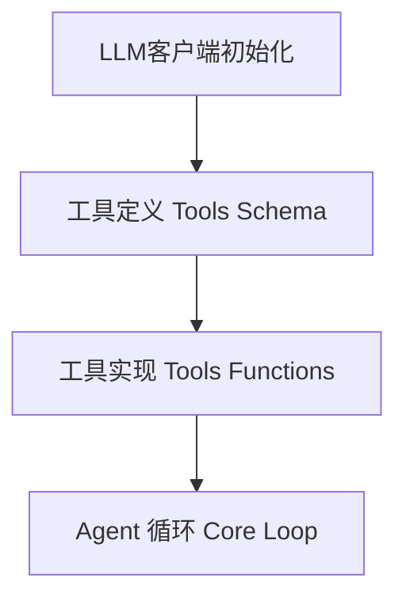
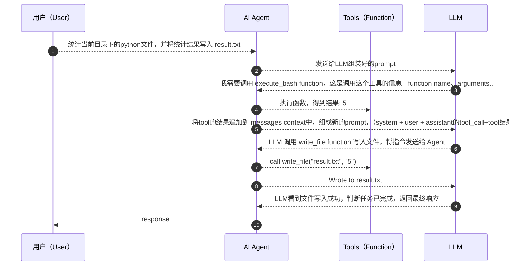

可以从只有百行的极简agent入门，理解什么是agent

[nanoAgent](https://github.com/sanbuphy/nanoAgent)

# Agent和普通对话的区别（核心）
|维度|普通对话|Agent|
|---|---|---|
|交互模式|一问一答，用户驱动|自主循环、目标驱动|
|能力边界|只能生成文本|可以调用工具/工具链，作用于真实场景|
|执行流程|用户提问->模型回答| 用户提问->模型思考->调用工具->观察输出->继续思考->..->返回答案|
|状态管理|每轮独立（或简单上下文拼接）|维护完成的对话历史，包含工具调用与返回结果|
|自主性|无|模型自主决定下一步做什么，用哪个工具，何时停止|

> 总结：Agent= LLM + 工具 + 循环，三个要素缺一不可，没有LLM就没有思考能力；没有工具就无法作用于真实世界；没有循环，就做不了多步或复杂任务
> 普通对话是：一问一答
> Agent是 给我一个目标，自己想办法完成任务

# nanoAgent架构解剖



# 源码解读

## LLM客户端初始化
```python
from openai import OpenAI

client = OpenAI(
    api_key=os.environ.get("OPENAI_API_KEY"),
    base_url=os.environ.get("OPENAI_BASE_URL")
)
```
可以看到，使用了openai的python SDK，通过base_url环境变量，可以指向任何一个兼容openai api格式的服务，agent框架不应该绑定具体模型。 api_key则是对应服务的访问密钥。

## 工具定义：告诉LLM有哪些能力
```python
tools = [
    {
        "type": "function",
        "function": {
            "name": "execute_bash",
            "description": "Execute a bash command",
            "parameters": {
                "type": "object",
                "properties": {"command": {"type": "string"}},
                "required": ["command"],
            },
        },
    },
    read_file..
    write_file..
]
```
这是 OpenAI Function Calling 的标准格式。这段 json Schema 本质上是一份工具说明书，它会随着每次 API 请求一起发送给 LLM。LLM 读到这份说明书后，就"知道"agent可以执行 bash 命令、读文件、写文件等等。 每个工具要管控好安全风险。
> LLM 本身不会执行任何代码。它只是根据工具说明书，输出一段结构化的 JSON，表达"我想调用 execute_bash，参数是 rm -rf *"。真正的执行发生在我们的 Python 代码里。这个"LLM 输出意图、代码执行动作"的分工，是理解所有 Agent 系统的关键。

## 工具实现：给LLM装上外挂
```python
def execute_bash(command):
    result = subprocess.run(command, shell=True, capture_output=True, text=True)
    return result.stdout + result.stderr


def read_file(path):
    with open(path, "r") as f:
        return f.read()


def write_file(path, content):
    with open(path, "w") as f:
        f.write(content)
    return f"Wrote to {path}"


functions = {"execute_bash": execute_bash, "read_file": read_file, "write_file": write_file}
```

**错误处理**：工具执行出错，可将错误信息返回给大模型，LLM根据报错可以自行修正策略

**路由表**： 把工具名映射到实际函数，方便 Agent根据LLM的指令找到相应的工具并调用。

## Agent核心循环

```python
def run_agent(user_message, max_iterations=5):
    messages = [
        {"role": "system", "content": "You are a helpful assistant. Be concise."},
        {"role": "user", "content": user_message},
    ]
    for _ in range(max_iterations):
        response = client.chat.completions.create(
            model=os.environ.get("OPENAI_MODEL", "gpt-4o-mini"),
            messages=messages,
            tools=tools,
        )
        message = response.choices[0].message
        messages.append(message)
        if not message.tool_calls:
            return message.content
        for tool_call in message.tool_calls:
            name = tool_call.function.name
            args = json.loads(tool_call.function.arguments)
            print(f"[Tool] {name}({args})")
            if name not in functions:
                result = f"Error: Unknown tool '{name}'"
            else:
                result = functions[name](**args)
            messages.append({"role": "tool", "tool_call_id": tool_call.id, "content": result})
    return "Max iterations reached"
```

这20多行代码是整个Agent的核心。

# Agent运行时序
接下看可以看看这个 Agent是怎么执行的。



也可用一张图来表示：
```
    用户任务
      │
      ▼
    ┌──────────────────────────────────────────────────┐
    │                  Agent Loop                       │
    │                                                   │
    │  ┌─────────┐    ┌──────────┐    ┌──────────────┐ │
    │  │ 发送给   │───▶│ LLM 决策  │───▶│ 有tool_call? │ │
    │  │ LLM     │    │          │    └──────┬───────┘ │
    │  └─────────┘    └──────────┘           │         │
    │       ▲                          Yes   │   No    │
    │       │                          ┌─────┴─────┐   │
    │       │                          ▼           ▼   │
    │  ┌────┴────────┐          ┌──────────┐  返回文本  │
    │  │ 结果追加到   │◀─────────│ 执行工具  │  ──────▶  │
    │  │ messages    │          └──────────┘   结束    │
    │  └─────────────┘                                 │
    └──────────────────────────────────────────────────┘
```

# 深入理解几个关键设计

## 为什么需要 max_iterations
这是一个安全阀。如果 LLM 陷入死循环（比如反复执行同一个失败的命令），max_iterations 确保程序最终会停下来。在生产级 Agent 中，这个值通常更大（比如 Claude Code 可以连续执行数十步），同时会配合更复杂的终止策略

## messages 列表为什么如此重要
messages 是 Agent 的短期记忆。每一轮循环，它都会累积 LLM 的回复（包括它想调用什么工具）以及工具的执行结果。

当这个列表在下一轮发送给 LLM 时，LLM 能看到完整的"行动-观察"历史，从而做出更合理的下一步决策。这就是 Agent 和简单对话的本质区别——Agent 维护了一条包含行动轨迹的上下文链。

但请注意，这里的 messages 只在单次运行中存在。程序退出后，一切归零。Agent 下次运行时完全不记得上次做过什么。这个agent会“失忆”

## LLM 是怎么"决定"调用工具的

LLM 并没有真的在"执行代码"或"调用函数"。实际发生的是：

1. 我们在 API 请求中传入了 tools 参数（工具说明书）
2. LLM 经过训练，学会了在适当的时候输出一种特殊的结构化格式（tool_calls）
3. 这个格式本质上就是一段 JSON，描述"我想调用哪个函数、传什么参数"
4. 我们的代码解析这段 JSON，执行真正的函数，再把结果喂回给 LLM

所以整个过程可以理解为一种协作协议：
> 1. LLM 的职责：思考、决策、生成工具调用指令
> 2. 代码的职责：解析指令、执行工具、返回结果

LLM 是"大脑"，代码是"手脚"。

## tool_call_id 的作用
tool_call_id 是 OpenAI API 的要求，用于将工具返回结果与对应的调用请求关联起来。当 LLM 在一次回复中同时调用多个工具时（并行调用），这个 ID 确保每个结果能正确匹配到对应的调用。

# 这个Agent还缺什么
nanoAgent 的极简设计让核心概念一目了然，但如果你仔细想想，会发现它有几个根本性的缺陷：

+ *没有记忆*  每次运行都是一张白纸。昨天让它创建的文件，今天问它"你昨天干了什么"，它一脸茫然
+ *没有规划* 面对"重构整个项目"这样的复杂任务，它只能走一步看一步，容易迷失在细节中
+ *工具是硬编码的* 只有 3 个工具，想加新工具必须改代码。没有任何扩展机制
+ *没有行为约束* 它可以执行 rm -rf /，没有任何规则告诉它什么该做、什么不该做

这些缺陷，恰好对应了 Agent 架构中更高层次的需求。nanoAgent 的作者也意识到了这一点，所以写了进化版本，ahent-plus来逐一解决这些问题。

# 从nanoAgent看Agent本质
 Agent 的三个本质要素：

+ 1. 感知（Perception）—— 通过工具获取外部信息（read_file、execute_bash 的输出）
+ 2. 决策（Reasoning）—— LLM 根据任务目标和已有观察，决定下一步行动
+ 3. 行动（Action）—— 通过工具作用于外部环境（write_file、execute_bash）

这三者在一个循环中不断迭代，直到 LLM 判断任务完成（不再调用工具）。这就是 Agent 最朴素、最本质的运行方式——**"思考 → 行动 → 观察"（ReAct）**范式。

无论是 OpenClaw、Claude Code、Cursor 还是 Devin，底层都遵循这个范式。当你在 OpenClaw 中看到它自动 grep 搜索代码、edit 修改文件、bash 跑测试时，背后就是这样一个循环在驱动。nanoAgent 用最少的代码，把这个范式展现得淋漓尽致。

