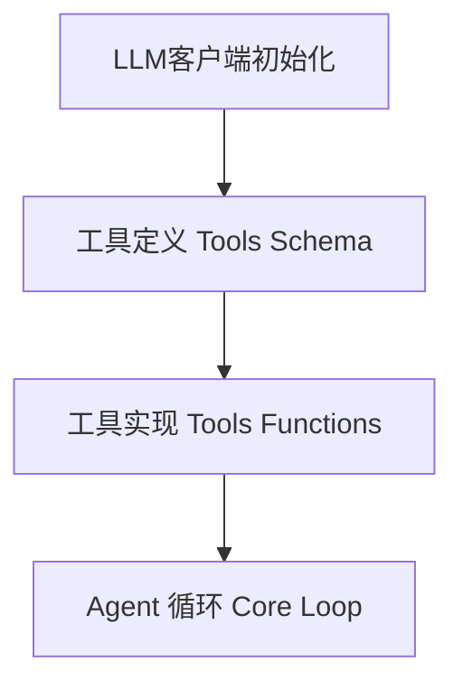

可以从只有百行的极简agent入门，理解什么是agent

[nanoAgent](https://github.com/sanbuphy/nanoAgent)

# Agent和普通对话的区别（核心）
|维度|普通对话|Agent|
|---|---|---|
|交互模式|一问一答，用户驱动|自主循环、目标驱动|
|能力边界|只能生成文本|可以调用工具/工具链，作用于真实场景|
|执行流程|用户提问->模型回答| 用户提问->模型思考->调用工具->观察输出->继续思考->..->返回答案|
|状态管理|每轮独立（或简单上下文拼接）|维护完成的对话历史，包含工具调用与返回结果|
|自主性|无|模型自主决定下一步做什么，用哪个工具，何时停止|

> 总结：Agent= LLM + 工具 + 循环，三个要素缺一不可，没有LLM就没有思考能力；没有工具就无法作用于真实世界；没有循环，就做不了多步或复杂任务
> 普通对话是：一问一答
> Agent是 给我一个目标，自己想办法完成任务

# nanoAgent架构解剖



# 源码解读

## LLM客户端初始化
```python
from openai import OpenAI

client = OpenAI(
    api_key=os.environ.get("OPENAI_API_KEY"),
    base_url=os.environ.get("OPENAI_BASE_URL")
)
```
可以看到，使用了openai的python SDK，通过base_url环境变量，可以指向任何一个兼容openai api格式的服务，agent框架不应该绑定具体模型。 api_key则是对应服务的访问密钥。

## 工具定义：告诉LLM有哪些能力
```python
tools = [
    {
        "type": "function",
        "function": {
            "name": "execute_bash",
            "description": "Execute a bash command",
            "parameters": {
                "type": "object",
                "properties": {"command": {"type": "string"}},
                "required": ["command"],
            },
        },
    },
    read_file..
    write_file..
]
```
这是 OpenAI Function Calling 的标准格式。这段 json Schema 本质上是一份工具说明书，它会随着每次 API 请求一起发送给 LLM。LLM 读到这份说明书后，就"知道"agent可以执行 bash 命令、读文件、写文件等等。 每个工具要管控好安全风险。
> LLM 本身不会执行任何代码。它只是根据工具说明书，输出一段结构化的 JSON，表达"我想调用 execute_bash，参数是 rm -rf *"。真正的执行发生在我们的 Python 代码里。这个"LLM 输出意图、代码执行动作"的分工，是理解所有 Agent 系统的关键。

## 工具实现：给LLM装上外挂
```python
def execute_bash(command):
    result = subprocess.run(command, shell=True, capture_output=True, text=True)
    return result.stdout + result.stderr


def read_file(path):
    with open(path, "r") as f:
        return f.read()


def write_file(path, content):
    with open(path, "w") as f:
        f.write(content)
    return f"Wrote to {path}"


functions = {"execute_bash": execute_bash, "read_file": read_file, "write_file": write_file}
```

**错误处理**：工具执行出错，可将错误信息返回给大模型，LLM根据报错可以自行修正策略

**路由表**： 把工具名映射到实际函数，方便 Agent根据LLM的指令找到相应的工具并调用。

## Agent核心循环

```python
def run_agent(user_message, max_iterations=5):
    messages = [
        {"role": "system", "content": "You are a helpful assistant. Be concise."},
        {"role": "user", "content": user_message},
    ]
    for _ in range(max_iterations):
        response = client.chat.completions.create(
            model=os.environ.get("OPENAI_MODEL", "gpt-4o-mini"),
            messages=messages,
            tools=tools,
        )
        message = response.choices[0].message
        messages.append(message)
        if not message.tool_calls:
            return message.content
        for tool_call in message.tool_calls:
            name = tool_call.function.name
            args = json.loads(tool_call.function.arguments)
            print(f"[Tool] {name}({args})")
            if name not in functions:
                result = f"Error: Unknown tool '{name}'"
            else:
                result = functions[name](**args)
            messages.append({"role": "tool", "tool_call_id": tool_call.id, "content": result})
    return "Max iterations reached"
```

这20多行代码是整个Agent的核心。

# Agent运行时序
接下看可以看看这个 Agent是怎么执行的。


