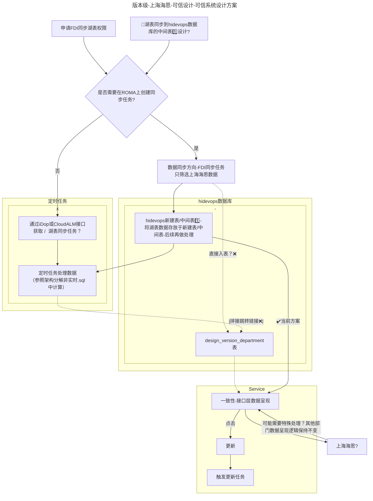

# 大模型

# hidevops
是一种 devops 数据和指标展示的看板平台，汇集了软件生命周期以及项目管理过程中产生的数据、各项指标。 帮助各个部门及时发现和度量软件开发过程中的各种问题，以优化和改进开发流程，规范开发行为。

主体采用 django + redis + mysql 框架，python（3.10.2）版本
四个代码仓：
+ 前端仓：vue，本地以服务形式运行、线上是编译打包后的静态文件
+ 后端服务仓：django驱动
+ 后端定时任务仓：调用外部接口同步数据的服务，以celery服务运行
+ 后端数据接口服务仓（建议改为fastapi）: 对外提供数据接口服务，包含外部向hidevops上报数据接口、从hidevops查询数据。

**环境**  
+ alpha为开发环境（开发自测、上线风险高的代码必须在alpha环境自测）
+ lambda、gamma 为测试环境，作为结项时进行功能测试、压力测试环境
+ beta 为生产环境的异地容灾环境，prod是生产环境

其中 alpha、beta环境部署不需要 流程号；beta和prod连接的生产数据库，有UEM埋码，alpha、gamma、lambda连接的测试库

**权限**  
多个部门租户之间数据、权限隔离，每个部门租户权限根据模块分类，每个分类均包含本模块的管理权限，有此权限的用户才能编辑本模块的权限。但除管理员用户、群组外不能赋予其他用户模块的管理权限。

## 版本级
以软件版本维度，度量各种数据。

### 集成运营

#### 部门级运营

#### 版本级运营

#### 规则库配置
包含： 

### 过程可信
#### 生命周期

#### E2E完整性验收

#### 漏洞管理（重点）

#### 端到端可追溯

#### 开源三方管理

#### 可信设计（重点）
##### 可信系统设计




##### 全量设计

##### 可信架构设计一致性

#### 可信编码

#### 可信测试（可选）

### 结果可信

## 组织级
以整个大部门或者组织结构维度，度量各种数据。

### 漏洞管理

### 过程可追溯

### 生命周期

### 开源三方管理

### 可信构建

### 可信编码

### 可信测试

### 系统设计

### 运营报告（重点）

```mermaid

graph LR

S[work]
A[大模型]
B[hidevops]
