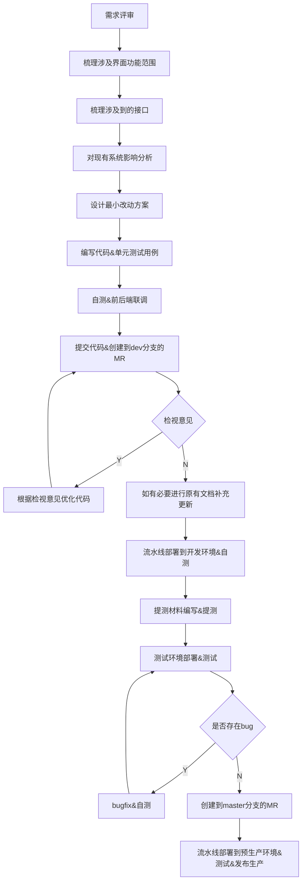

# 开发流程【功能改动】

```mermaid
graph TD
START[需求评审]
A[梳理涉及界面功能范围]
B[梳理涉及到的接口]
C[对现有系统影响分析]
D[设计最小改动方案]
E[编写代码&单元测试用例]
F[自测&前后端联调]
G[提交代码&创建到dev分支的MR]
G1{检视意见}
H[根据检视意见优化代码]
I[如有必要进行原有文档补充更新]
J[流水线部署到开发环境&自测]
K[提测材料编写&提测]
K1[测试环境部署&测试]
L{是否存在bug}
M[bugfix&自测]
N[创建到master分支的MR]
O[流水线部署到预生产环境&测试&发布生产]

START-->A-->B-->C-->D-->E-->F-->G-->G1-->|Y|H-->G
G1-->|N|I-->J-->K-->K1-->L-->|N|N-->O
L-->|Y|M-->K1
```
