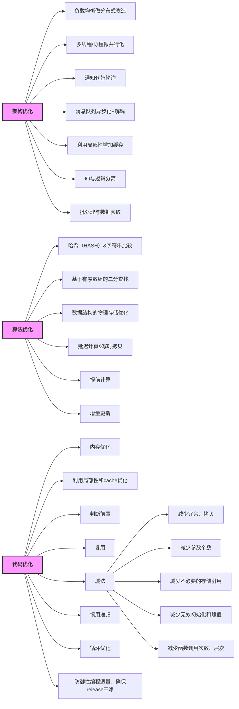

# 架构优化
## 负载均衡做分布式改造

## 多线程/协程做并行化

## 通知代替轮询

## 消息队列异步化+解耦

## 利用局部性增加缓存

## IO与逻辑分离

## 批处理与数据预取

# 算法优化
## 哈希（HASH）&字符串比较

## 基于有序数组的二分查找

## 数据结构的物理存储优化

## 延迟计算&写时拷贝

## 提前计算

## 增量更新

# 代码优化
## 内存优化

## 利用局部性和cache优化

## 判断前置

## 复用

## 减法
### 减少冗余、拷贝
### 减少参数个数
### 减少不必要的存储引用
### 减少无效初始化和赋值
### 减少函数调用次数、层次

## 慎用递归
## 循环优化
## 防御性编程适量、确保release干净

