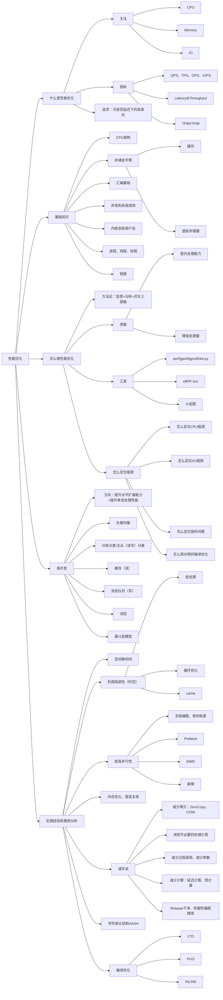

# 思维导图

```mermaid

graph LR

S[性能优化]

A[什么是性能优化]
A1[关注]
A11[CPU]
A12[Memory]
A13[IO]

A2[指标]
A21[QPS、TPS、OPS、IOPS]
A22[Latency&Throughput]
A23[TP90/TP99]

A3[追求：可容忍延迟下的高吞吐]

B[基础知识]
B1[CPU架构]

B2[存储金字塔]
B21[缓存]
B22[虚拟存储器]

B3[汇编基础]
B4[异常和系统调用]
B5[内核态和用户态]
B6[进程、线程、协程]
B7[链接]

C[怎么做性能优化]
C1[方法论：监控+分析+优化三部曲]
C2[思路]
C21[提升处理能力]
C22[降低处理量]

C3[工具]
C31[perf/gprof/gprof2dot.py]
C32[eBPF bcc]
C33[火焰图]

C4[怎么定位瓶颈]
C41[怎么定位CPU瓶颈]
C42[怎么定位I/O瓶颈]
C43[怎么定位锁的问题]
C44[怎么用对用好编译优化]

D[高并发]
D1[方向：提升水平扩展能力+提升单击处理性能]
D2[负载均衡]
D3[分库分表/主从（读写）分离]
D4[缓存（读）]
D5[消息队列（写）]
D6[流控]
D7[漏斗型模型]

E[实践经验和案例分析]
E1[空间换时间]

E2[利用局部性（时空）]
E21[批处理]
E22[循环优化]
E23[cache]

E3[提高并行性]
E31[无锁编程、锁的粒度]
E32[Prefetch]
E33[SIMD]
E34[屏障]

E4[内存优化、提高复用]

E5[减字诀]
E51[减少拷贝：ZeroCopy、COW]
E52[消除不必要的存储引用]
E53[减少过程调用、减少参数]
E54[减少计算：延迟计算、预计算]
E55[Release干净、防御性编程精简]

E6[字符串比较和HASH]

E7[编译优化]
E71[LTO]
E72[PGO]
E73[INLINE]

S-->A & B & C & D & E

A --> A1 & A2 & A3
A1 --> A11 & A12 & A13
A2 --> A21 & A22 & A23

B --> B1 & B2 & B3 & B4 & B5 & B6 & B7
B2 --> B21 & B22

C --> C1 & C2 & C3 & C4
C2 --> C21 & C22
C3 --> C31 & C32 & C33
C4 --> C41 & C42 & C43 & C44

D --> D1 & D2 & D3 & D4 & D5 & D6 & D7

E --> E1 & E2 & E3 & E4 & E5 & E6 & E7
E2 --> E21 & E22 & E23
E3 --> E31 & E32 & E33 & E34
E5 --> E51 & E52 & E53 & E54 & E55
E7 --> E71 & E72 & E73
```
