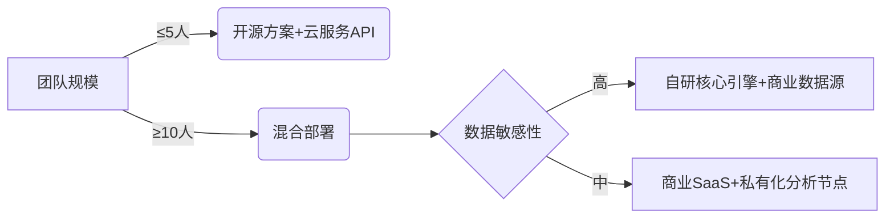
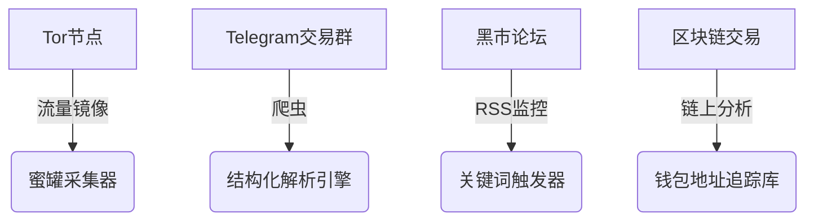
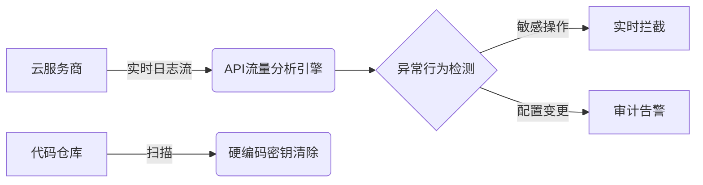

以下是EASM系统的**深度解析**及**功能实现指南**，结合攻防实战需求设计：

---

### 一、EASM核心定义
> **External Attack Surface Management = 持续测绘 + 风险狩猎**  
> 区别于传统漏洞扫描：  
> - ✅ **覆盖未知资产**（影子IT/离职员工遗留系统）  
> - ✅ **动态关联威胁情报**（如GitHub新增密钥泄露）  
> - ✅ **量化业务风险**（被攻击后可能造成的财报影响）

---

### 二、EASM系统必选功能模块
#### 🔍 **1. 资产发现引擎**（核心）
| 技术实现                      | 关键挑战解决                 |
|-------------------------------|------------------------------|
| **被动DNS监控**               | 发现子域名接管风险（`*.dev.example.com`） |
| **SSL证书指纹追踪**           | 识别过期证书/伪造证书         |
| **云服务API扫描**（AWS/Azure）| 检测公开的存储桶/Kubernetes   |
| **暗网数据爬虫**              | 监控员工账户/客户数据贩卖      |

#### 🎯 **2. 暴露面分析层**
```python
# 伪代码示例：风险评分算法
def calculate_risk(asset):
    # 要素1：资产关键性 (0-10分)
    criticality = get_business_value(asset) 
    
    # 要素2：漏洞可利用性 (CVSS≥7.0得5分)
    exploit_score = 5 if cve_info.cvss >= 7.0 else 2 
    
    # 要素3：威胁活动热度 (近30天攻击次数)
    threat_heat = min(log(attacks_last_month + 1), 10) 
    
    return 0.6*criticality + 0.3*exploit_score + 0.1*threat_heat
```

#### 🚨 **3. 自动化响应枢纽**
- **紧急场景**：检测到GitHub泄露数据库密码 → 自动提交工单+短信告警  
- **常规场景**：发现过期SSL证书 → 邮件通知负责人+自动续签API调用  
- **战略场景**：识别子公司高危系统 → 生成隔离方案并推送防火墙策略  

---

### 三、进阶能力（企业级）
| 模块                | 实现方案举例                     | 业务价值                     |
|---------------------|----------------------------------|------------------------------|
| **攻击面可视化**    | 用D3.js绘制资产关联图谱          | 直观展示“入侵路径”（如：公网API→数据库） |
| **TTPs映射**        | 对接MITRE ATT&CK框架             | 识别攻击者战术（如：TA0001初始访问） |
| **合规驱动修复**    | 自动生成GDPR/等保报告            | 减少80%合规审计工作量         |
| **红蓝对抗模式**    | 模拟APT组织攻击链                | 验证防御体系有效性            |

---

### 四、自研vs采购决策框架


#### ⚠️ 自研陷阱警示
1. **IP被封风险**：激进扫描可能触发Cloudflare防护  
2. **误报黑洞**：需投入30%研发资源优化误判（如CDN节点 vs 真实服务器）  
3. **情报成本**：商业威胁情报API年费可达￥50万+  

---

### 五、开源工具链速配方案
```bash
# 资产发现
amass enum -d example.com -passive

# 端口服务识别
nmap -sV --script vulners -iL targets.txt

# 敏感信息监控
git-hound --api-key $GITHUB_TOKEN --regex 'AKIA[0-9A-Z]{16}'
```

> 💡 **投产路径建议**：  
> 1. 先用**SpiderFoot+Shodan**搭建MVP（1周内上线）  
> 2. 关键业务接入**商业漏洞情报**（如RiskIQ或Recorded Future）  
> 3. 逐步构建**自动化修复流水线**（Terraform重建高危资产）  
### 🔦 六、暗网监控架构（深度威胁狩猎）
#### 数据采集层

- **核心挑战**：暗网数据噪音占比超90%，需三级过滤：
  1. **初始过滤**：正则匹配企业域名/员工邮箱（`*@company.com`）
  2. **语义分析**：BERT模型识别「数据贩卖」「漏洞交易」类会话
  3. **可信度评分**：结合卖家历史成交记录+数据样本验证

#### 情报处理层
- **自动化验证流程**：
  ```python
  def validate_leak(data):
      if data.type == "数据库":
          return test_db_connection(data.sample) # 尝试连接泄露的数据库地址
      elif data.type == "API密钥":
          return check_cloud_key_active(data.key) # 调用云厂商密钥验证接口
      else:
          return False
  ```
- **溯源能力**：  
  通过比特币交易链关联攻击者钱包 → 标记到威胁情报平台（如AlienVault）

#### 成本控制技巧
- 优先监控**5个核心暗网市场**（如Genesis、RussianMarket）
- 使用开源指纹库**STH（Super Tor Honeypot）** 减少蜜罐部署成本
- 接入**免费区块链数据集**（如Blockchain.com API）

---

### ☁️ 七、云API安全防护体系（防御云原生威胁）
#### 架构设计

#### 关键防御点
| 攻击场景                | 防御方案                                     | 工具示例                     |
|-------------------------|----------------------------------------------|------------------------------|
| **越权访问AWS S3桶**    | 实时监控Bucket ACL变更                       | AWS CloudTrail + Lambda自动回滚 |
| **Azure密钥硬编码泄露** | GitHub提交前扫描`*.tf`文件                   | TruffleHog + Git Hooks       |
| **GCP未授权Cloud SQL**  | 自动生成最小权限策略                         | GCP IAM Recommender API      |
| **K8s API未鉴权**       | 定时扫描6443端口暴露情况                     | Kube-hunter + CronJob        |

#### 自动化加固流程
1. **发现阶段**：  
   `cloudsploit scan` → 输出暴露的API端点列表
2. **修复阶段**：  
   ```bash
   # 自动下架高危资源
   aws ec2 delete-security-group --group-id $高危ID
   ```
3. **验证阶段**：  
   通过**Terraform Plan差分对比**确认风险消除

---

### 💥 八、模块联动实战案例
**事件**：暗网发现AWS密钥出售 → 云API模块响应  
**自动化过程**：
1. 暗网监控识别到`AKIA***`密钥在论坛出售
2. 调用AWS IAM检查密钥有效性（`aws iam get-access-key-last-used`）
3. 若确认有效：
   - **立即吊销密钥**并通知安全团队
   - 启动CloudTrail回溯分析（近7天操作记录）
   - 自动创建快照保留被入侵实例证据
4. 生成事件报告同步至SIEM系统

---

### ⚠️ 成本陷阱规避指南
| 模块         | 烧钱点                      | 优化方案                          |
|--------------|----------------------------|-----------------------------------|
| **暗网监控** | 区块链数据分析API调用       | 使用本地部署的**BlockSci**解析工具 |
| **云API安全**| 跨云日志存储费用            | 用**OpenObserve**替代Splunk       |
| **自动化响应**| 云厂商API请求次数           | 批量操作合并+缓存策略             |

> 💡 **部署建议**：  
> - 暗网监控优先覆盖**销售/高管邮箱**（社工库高频目标）  
> - 云API安全从**权限清单**入手：限制`Delete*`类高危操作  
> - 关键服务账户启用**双因素认证**（如GitHub SSO集成）
