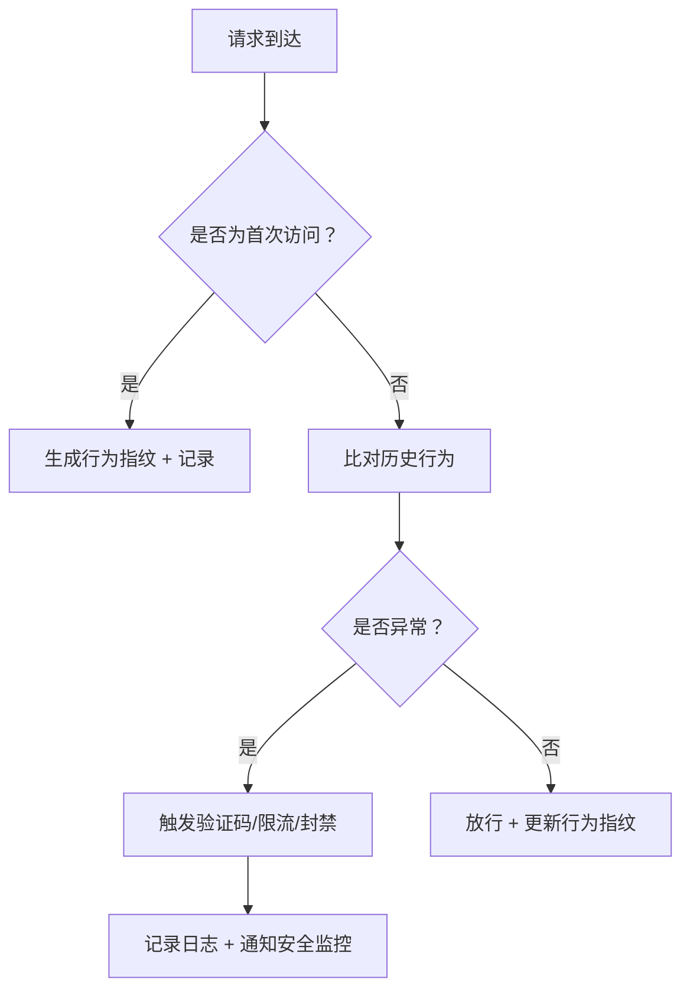

爬虫的滥用对系统造成严重威胁：高频请求导致服务器负载激增，引发服务响应延迟甚至瘫痪；恶意爬虫可批量窃取敏感数据，造成隐私泄露与商业机密外泄；部分爬虫通过伪造用户行为绕过访问控制，破坏系统公平性与数据完整性。为应对此类风险，近年来，爬虫防御技术从单一IP限流向多维协同检测演进。现代主流反爬体系采用分层防御策略识别爬虫等自动化程序行为并进行自动化处理，实现高效、低误伤的反爬体系以保障系统安全与稳定。下面从 **识别手段** 和 **自动化应对策略** 多方面介绍如何防范：

---

## 一、如何识别爬虫/自动化程序行为？

### 1. **行为特征识别（核心）**
自动化程序的行为往往与真实用户有明显差异，可通过以下特征判断：

| 特征 | 说明 |
|------|------|
| 请求频率过高 | 单位时间（如1秒内）请求超过正常用户水平（如 >10次/秒） |
| 请求模式高度一致 | 所有请求的路径、参数、User-Agent、请求头几乎完全相同 |
| 缺少用户交互行为 | 没有鼠标移动、滚动、点击等事件（可通过前端埋点检测） |
| 固定IP/代理池集中访问 | 多个请求来自同一IP或代理池，且无跳转行为 |
| 无Cookie或Cookie异常 | 爬虫通常不携带或携带无效的Cookie |

> ✅ 建议：使用 **行为指纹（Behavioral Fingerprinting）**，结合请求时间、请求顺序、访问路径等构建用户“行为画像”。

---

### 2. **工具/技术手段识别**

| 技术 | 说明 |
|------|------|
| **WAF（Web应用防火墙）** | 如 Cloudflare、AWS WAF、阿里云WAF，可配置规则识别高频请求、异常User-Agent等 |
| **Rate Limiting（限流）** | 使用 `Redis` + `token bucket` 或 `sliding window` 算法实现按IP/用户/请求路径限流，防暴力请求 |
| **Headless Browser 检测** | 检查 `navigator.webdriver`、`window.chrome`、`navigator.plugins` 是否异常，判断是否为自动化浏览器（如 Selenium、Puppeteer） |
| **JavaScript Challenge（人机验证）** | 如 Google reCAPTCHA v3、hCaptcha、阿里云滑块验证，对疑似机器人进行行为验证 |
| **前端埋点：鼠标移动轨迹、点击间隔、滚动行为** | 使用 JS收集用户行为，上传后端做AI判断|
| **User-Agent+请求头指纹分析**| 过滤已知爬虫UA、异常请求头组合；爬虫通常会使用特定的 User-Agent 字符串，例如 Googlebot、Baiduspider、Python-urllib、Scrapy 等，爬虫可能缺少浏览器常见的请求头，例如 Accept-Language、Referer、Accept-Encoding 等|
| **IP信誉库 + Tor/代理检测** | 对接已知恶意IP池（如 AbuseIPDB）或者 也可以维护一个爬虫 IP 黑名单，拦截已知的爬虫 IP|
| **日志分析 + AI建模** | 使用 ELK（Elasticsearch + Logstash + Kibana）收集日志，结合机器学习模型（如 Isolation Forest、LSTM 行为序列分析）识别异常行为 |

---

## 二、针对识别结果的自动化处理策略

一旦识别出疑似爬虫行为，可自动触发以下处理流程：

### 1. **动态响应机制（示例）**
```python
import time
from typing import Dict, Any

class AntiCrawlerHandler:
    def __init__(self, redis_client):
        self.redis = redis_client

    def is_bot(self, request_ip: str, user_agent: str) -> bool:
        # 1. 检查请求频率（每分钟）
        key = f"req_count:{request_ip}"
        count = self.redis.incr(key)
        self.redis.expire(key, 60)  # 60秒过期
        if count > 100:  # 超过100次/分钟
            return True

        # 2. 检查User-Agent是否为常见爬虫
        bot_keywords = ["bot", "crawler", "spider", "scraper", "python-requests"]
        if any(kw in user_agent.lower() for kw in bot_keywords):
            return True

        return False

    def handle_bot_request(self, request):
        # 自动化处理：返回验证码、限流、拦截
        if self.is_bot(request.remote_addr, request.headers.get("User-Agent", ""))):
            # 1. 返回验证码挑战（reCAPTCHA）
            return {"error": "captcha_required", "captcha_url": "https://www.google.com/recaptcha/api2/anchor?ar=1&k=1234567890&co=aHR0cHM6Ly93d3cuZ29vZ2xlLmNvbTo0NDM=&hl=zh-CN&v=r20231201123456&size=normal&cb=abc123"}

            # 2. 或者直接返回403 + 限流提示
            # return {"error": "too_many_requests", "retry_after": 60}, 429

        return None  # 正常请求
```

### 2. **自动化流程设计**



### 3. **Redis滑动窗口限流（示例）**
```python
from fastapi import Request, HTTPException
from fastapi.responses import JSONResponse
import redis
import time

class RateLimiter:
    def __init__(self, redis_client: redis.Redis, window_seconds=60, max_requests=100):
        self.redis = redis_client
        self.window = window_seconds
        self.max = max_requests

    def is_allowed(self, key: str) -> bool:
        now = time.time()
        # 使用 ZSET 存储时间戳，滑动窗口
        self.redis.zadd(key, {now: now})
        # 移除窗口外的旧记录
        self.redis.zremrangebyscore(key, 0, now - self.window)
        # 获取当前窗口内请求数
        count = self.redis.zcard(key)
        return count <= self.max

# 使用示例：FastAPI 路由中间件
limiter = RateLimiter(redis_client=redis.from_url("redis://localhost:6379/0")))

@app.middleware("http")
async def limit_requests(request: Request, call_next):
    client_ip = request.client.host
    endpoint = request.url.path
    key = f"rate_limit:{client_ip}:{endpoint}"

    if not limiter.is_allowed(key):
        return JSONResponse(
            {"error": "Too many requests. Please try again later."},
            status_code=429
        )

    response = await call_next(request)
    return response
```
> + [x] 每分钟最多N个请求，超出则返回429

---

### 4. **JS行为指纹检测（前后端联动）**

**前端JS注入到页面**
```javascript
<script>
// 检测是否是 headless 浏览器
function isHeadless() {
    return navigator.webdriver || 
           window.chrome || 
           navigator.plugins.length === 0;
}

// 收集用户行为（鼠标移动、点击间隔）
const behaviorData = {
    mouseMovements: [],
    clicks: [],
    scrollPositions: [],
    timestamp: Date.now()
};

// 监听鼠标移动
document.addEventListener('mousemove', (e) => {
    behaviorData.mouseMovements.push([e.clientX, e.clientY, Date.now()]);
});

// 监听点击
document.addEventListener('click', (e) => {
    behaviorData.clicks.push([e.clientX, e.clientY, Date.now()]);
});

// 监听滚动
window.addEventListener('scroll', () => {
    behaviorData.scrollPositions.push(window.pageYOffset);
});

// 上报行为数据到后端
function sendBehaviorData() {
    fetch('/api/behavior', {
        method: 'POST',
        headers: { 'Content-Type': 'application/json' },
        body: JSON.stringify(behaviorData)
    }).catch(err => console.warn("Behavior data send failed:", err));
}

// 页面加载完成后上报
window.addEventListener('load', sendBehaviorData);
</script>
```

**后端接收并分析**
```python
@app.post("/api/behavior")
async def analyze_behavior(data: dict):
    # 简单规则：点击间隔过短、鼠标移动路径太直线、无滚动
    clicks = data.get("clicks", [])
    mouse_movements = data.get("mouseMovements", [])
    scroll_positions = data.get("scrollPositions", [])

    # 规则1：点击间隔 < 100ms 的次数过多（可能是脚本）
    fast_clicks = 0
    for i in range(1, len(clicks)):
        if clicks[i][2] - clicks[i-1][2] < 100:
            fast_clicks += 1
    if fast_clicks > 5:
        return {"risk": "high", "action": "captcha_required"}

    # 规则2：鼠标移动路径过于“直线”（非人类）
    if len(mouse_movements) > 10:
        # 简化判断：如果所有点都在一条直线上（近似）
        x = [m[0] for m in mouse_movements]
        y = [m[1] for m in mouse_movements]
        # 这里可用线性回归拟合斜率，判断是否为直线
        # 为简化，假设超过80%的点在直线附近即为可疑
        # 实际可用 sklearn.linear_model.LinearRegression
        return {"risk": "high", "action": "captcha_required"}

    return {"risk": "low", "action": "allow"}
```
> + [x] 可精准识别自动化脚本（如 selenlum、puppeteer等）

---

### 5. **基于Flask完整示例**
```python
from flask import Flask, request, session
from flask_limiter import Limiter
from flask_limiter.util import get_remote_address
import logging

app = Flask(__name__)
app.secret_key = 'your_secret_key'

# 初始化日志
logging.basicConfig(filename='bot_activity.log', level=logging.INFO)

# 初始化限流器
limiter = Limiter(app=app, key_func=get_remote_address, default_limits=["200 per day", "50 per hour"])

# 识别爬虫 User-Agent
def is_bot_request():
    user_agent = request.headers.get('User-Agent', '').lower()
    bot_keywords = ['bot', 'crawl', 'scraper', 'python', 'urllib', 'scrapy', 'wget', 'curl']
    return any(keyword in user_agent for keyword in bot_keywords)

# 识别缺失浏览器请求头
def is_missing_browser_headers():
    headers = request.headers
    missing_headers = [
        'Accept-Language' not in headers,
        'Referer' not in headers,
        'Accept-Encoding' not in headers
    ]
    return any(missing_headers)

# 识别已知爬虫 IP
def is_known_bot_ip(ip):
    bot_ip_list = ['192.168.1.100', '10.0.0.1']  # 示例 IP 列表
    return ip in bot_ip_list

# 拦截爬虫请求
@app.before_request
def check_for_bot():
    if is_bot_request() or is_missing_browser_headers() or is_known_bot_ip(request.remote_addr):
        logging.info(f"疑似爬虫行为: {request.remote_addr} - {request.headers.get('User-Agent')}")
        return "请求被拦截，疑似爬虫行为", 403

# 示例接口
@app.route('/api/data')
@limiter.limit("10/minute")
def get_data():
    return "数据返回成功", 200

if __name__ == '__main__':
    app.run(debug=False)
```
---

## 三、最佳实践建议

1. **不要“一刀切”拦截**：避免误伤正常用户（如使用代理的用户）。
2. **分层防御**：
   - 第一层（基础防御）：限流 + IP信誉评分（可落地性高）
   - 第二层（行为识别、人机验证）：行为分析 + JS挑战（可落地性中高）
   - 第三层（异常检测）：IP信誉库 + UA黑名单（可落地性中）
   - 第四层（人工审核、可视化监控）：人工审核 + 日志归档
3. **结合前端埋点**：在前端收集用户行为数据（如鼠标移动轨迹、点击间隔），上传至后端进行分析。
4. **使用成熟的开源项目辅助**：
   - [Google reCAPTCHA](https://www.google.com/recaptcha/)
   - [hCaptcha](https://www.hcaptcha.com/)
   - [Tor2web](https://github.com/tor2web/tor2web)（识别Tor流量）
   - [fail2ban](https://www.fail2ban.org/)（可与Python服务结合）

---

## 总结

| 问题 | 解决方案 |
|------|-----------|
| 如何识别爬虫？ | 通过请求频率、行为模式、User-Agent、JS环境等特征识别 |
| 如何自动化处理？ | 构建“识别 → 响应”闭环，使用限流、验证码、封禁等策略自动执行 |
| 如何避免误伤？ | 采用分层防御 + 行为指纹 + 前端埋点，提升判断精度 |

---

## 附录（可落地工具链推荐）
|工具	|用途|	推荐指数|
|---|---|---|
|Redis + Lua 脚本|	滑动窗口限流|	⭐⭐⭐⭐⭐|
|Google reCAPTCHA v3|	无感人机验证|	⭐⭐⭐⭐⭐|
|hCaptcha|	国内可用替代方案|	⭐⭐⭐⭐☆|
|AbuseIPDB / MaxMind GeoIP|	IP信誉查询|	⭐⭐⭐⭐|
|Apache Superset / Grafana|	行为日志可视化监控|	⭐⭐⭐⭐|
---

> 🛠️ Tips：真正的“反爬虫”不是“锁死”接口，而是构建一个 **让爬虫成本>收益**的防御体系，这才是可持续的安全策略。
