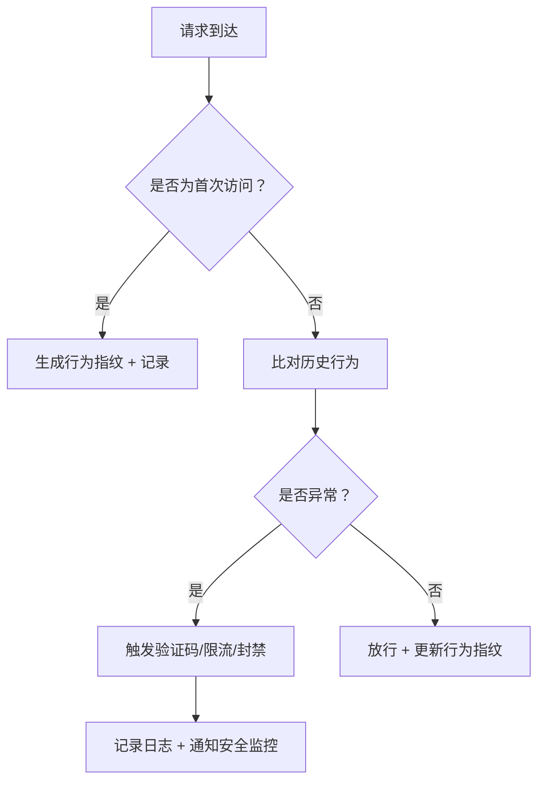

识别爬虫等自动化程序行为并进行自动化处理，是保障系统安全与稳定的重要环节。下面从 **识别手段** 和 **自动化应对策略** 两个方面为你梳理如何防范：

---

## 一、如何识别爬虫/自动化程序行为？

### 1. **行为特征识别（核心）**
自动化程序的行为往往与真实用户有明显差异，可通过以下特征判断：

| 特征 | 说明 |
|------|------|
| 请求频率过高 | 单位时间（如1秒内）请求超过正常用户水平（如 >10次/秒） |
| 请求模式高度一致 | 所有请求的路径、参数、User-Agent、请求头几乎完全相同 |
| 缺少用户交互行为 | 没有鼠标移动、滚动、点击等事件（可通过前端埋点检测） |
| 固定IP/代理池集中访问 | 多个请求来自同一IP或代理池，且无跳转行为 |
| 无Cookie或Cookie异常 | 爬虫通常不携带或携带无效的Cookie |

> ✅ 建议：使用 **行为指纹（Behavioral Fingerprinting）**，结合请求时间、请求顺序、访问路径等构建用户“行为画像”。

---

### 2. **工具/技术手段支持识别**

| 技术 | 说明 |
|------|------|
| **WAF（Web应用防火墙）** | 如 Cloudflare、AWS WAF、阿里云WAF，可配置规则识别高频请求、异常User-Agent等 |
| **Rate Limiting（限流）** | 使用 `Redis` + `token bucket` 或 `sliding window` 算法实现按IP/用户/请求路径限流，防暴力请求 |
| **Headless Browser 检测** | 检查 `navigator.webdriver`、`window.chrome`、`navigator.plugins` 是否异常，判断是否为自动化浏览器（如 Selenium、Puppeteer） |
| **JavaScript Challenge（人机验证）** | 如 Google reCAPTCHA v3、hCaptcha、阿里云滑块验证，对疑似机器人进行行为验证 |
| **前端埋点：鼠标移动轨迹、点击间隔、滚动行为** | 使用 JS收集用户行为，上传后端做AI判断|
| **User-Agent+请求头指纹分析**| 过滤已知爬虫UA、异常请求头组合；爬虫通常会使用特定的 User-Agent 字符串，例如 Googlebot、Baiduspider、Python-urllib、Scrapy 等，爬虫可能缺少浏览器常见的请求头，例如 Accept-Language、Referer、Accept-Encoding 等|
| **IP信誉库 + Tor/代理检测** | 对接已知恶意IP池（如 AbuseIPDB）或者 也可以维护一个爬虫 IP 黑名单，拦截已知的爬虫 IP|
| **日志分析 + AI建模** | 使用 ELK（Elasticsearch + Logstash + Kibana）收集日志，结合机器学习模型（如 Isolation Forest、LSTM 行为序列分析）识别异常行为 |

---

## 二、自动化处理策略（应对识别结果）

一旦识别出疑似爬虫行为，可自动触发以下处理流程：

### 1. **动态响应机制（推荐）**
```python
import time
from typing import Dict, Any

class AntiCrawlerHandler:
    def __init__(self, redis_client):
        self.redis = redis_client

    def is_bot(self, request_ip: str, user_agent: str) -> bool:
        # 1. 检查请求频率（每分钟）
        key = f"req_count:{request_ip}"
        count = self.redis.incr(key)
        self.redis.expire(key, 60)  # 60秒过期
        if count > 100:  # 超过100次/分钟
            return True

        # 2. 检查User-Agent是否为常见爬虫
        bot_keywords = ["bot", "crawler", "spider", "scraper", "python-requests"]
        if any(kw in user_agent.lower() for kw in bot_keywords):
            return True

        return False

    def handle_bot_request(self, request):
        # 自动化处理：返回验证码、限流、拦截
        if self.is_bot(request.remote_addr, request.headers.get("User-Agent", ""))):
            # 1. 返回验证码挑战（reCAPTCHA）
            return {"error": "captcha_required", "captcha_url": "https://www.google.com/recaptcha/api2/anchor?ar=1&k=1234567890&co=aHR0cHM6Ly93d3cuZ29vZ2xlLmNvbTo0NDM=&hl=zh-CN&v=r20231201123456&size=normal&cb=abc123"}

            # 2. 或者直接返回403 + 限流提示
            # return {"error": "too_many_requests", "retry_after": 60}, 429

        return None  # 正常请求
```

### 2. **自动化流程设计（建议）**



---

## 三、最佳实践建议

1. **不要“一刀切”拦截**：避免误伤正常用户（如使用代理的用户）。
2. **分层防御**：
   - 第一层：限流 + IP信誉评分
   - 第二层：行为分析 + JS挑战
   - 第三层：人工审核 + 日志归档
3. **结合前端埋点**：在前端收集用户行为数据（如鼠标移动轨迹、点击间隔），上传至后端进行分析。
4. **使用成熟的开源项目辅助**：
   - [Google reCAPTCHA](https://www.google.com/recaptcha/)
   - [hCaptcha](https://www.hcaptcha.com/)
   - [Tor2web](https://github.com/tor2web/tor2web)（识别Tor流量）
   - [fail2ban](https://www.fail2ban.org/)（可与Python服务结合）

---

## 总结

| 问题 | 解决方案 |
|------|-----------|
| 如何识别爬虫？ | 通过请求频率、行为模式、User-Agent、JS环境等特征识别 |
| 如何自动化处理？ | 构建“识别 → 响应”闭环，使用限流、验证码、封禁等策略自动执行 |
| 如何避免误伤？ | 采用分层防御 + 行为指纹 + 前端埋点，提升判断精度 |

---

> 🛠️ 小贴士：真正的“反爬虫”不是“锁死”接口，而是 **让机器人“成本高到不值得”**，这才是可持续的安全策略。
