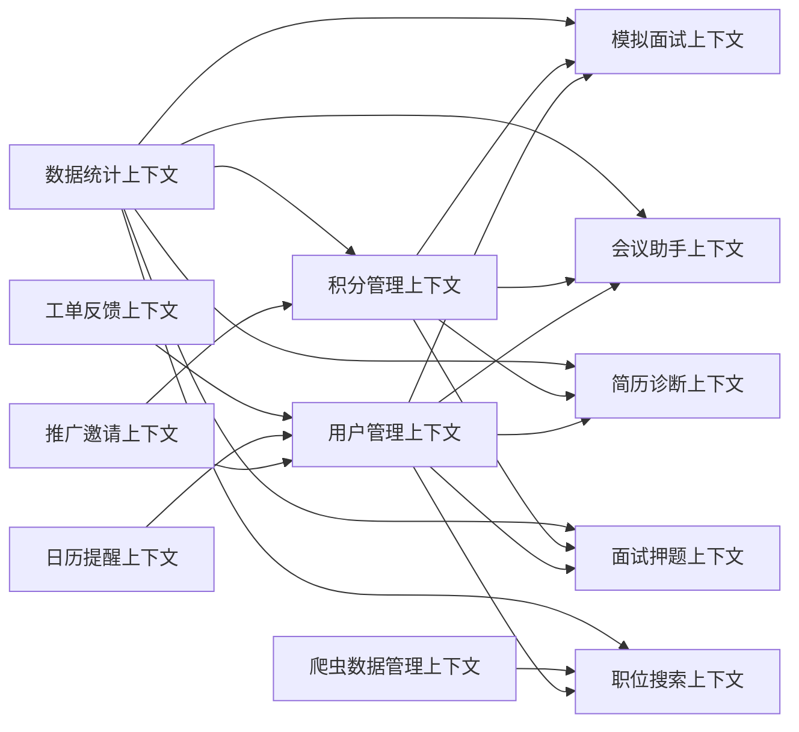
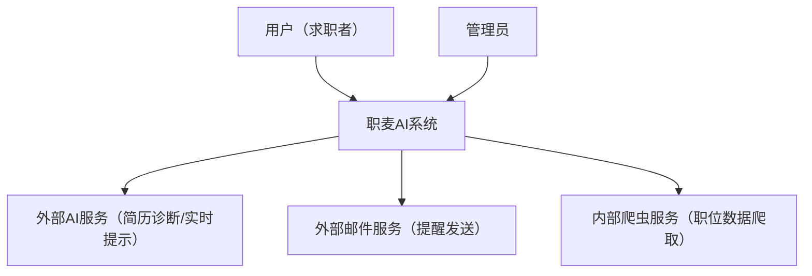
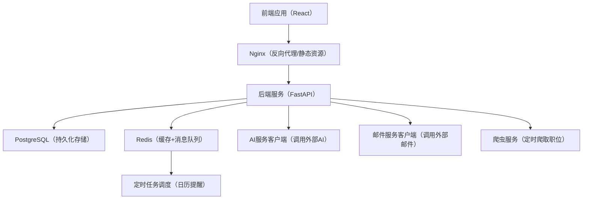
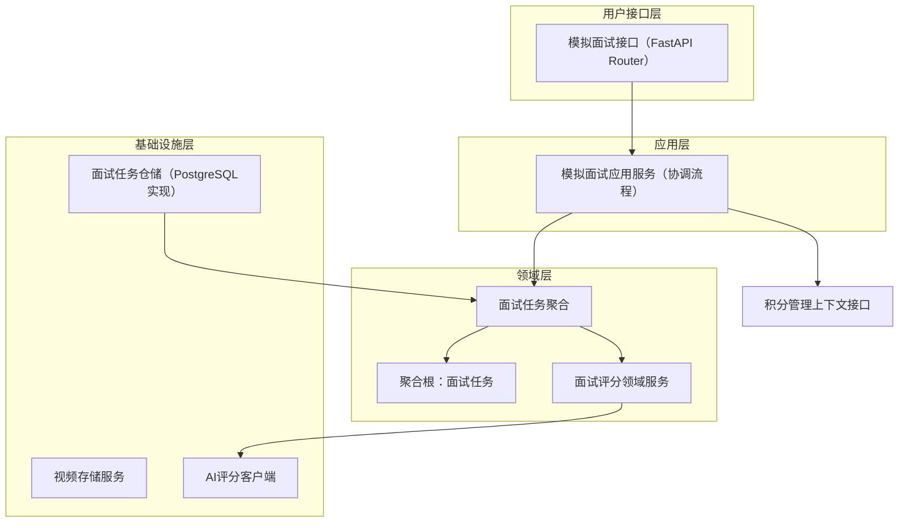

# 职麦 AI 系统 DDD 架构设计

核心结论：基于 DDD 思想，将 “职麦 AI 系统” 定位为「求职面试服务领域」，通过 “战略设计划清业务边界、战术设计落地内部结构”，结合 C4 图可视化架构，最终实现 “核心业务聚焦、模块松耦合、可扩展” 的设计目标，完全适配指定技术栈。

## 一、战略设计：划清业务边界（DDD 核心前提）

战略设计的核心是 “识别子域、定义限界上下文”，避免业务混乱和语义冲突，同时明确核心价值方向。

### 1. 领域与子域划分（按 “核心 - 支撑 - 通用” 分类）

| 子域类型 | 子域名称     | 核心职责                      | 划分原因                               |
| ---- | -------- | ------------------------- | ---------------------------------- |
| 核心子域 | 模拟面试子域   | 视频 + AI 辅助模拟线上面试、AI 评价反馈  | 系统核心价值，直接解决用户 “实战演练面试” 的核心需求       |
| 核心子域 | 会议助手子域   | AI 实时提示问题答案、会议话术辅助        | 核心差异化功能，满足用户 “真实会议 / 面试实时支持” 需求    |
| 核心子域 | 简历诊断子域   | 简历上传、AI 分析问题、优化建议         | 求职全流程核心环节，承接用户 “简历优化” 刚需           |
| 核心子域 | 面试押题子域   | 模拟面试官出题、题库管理、针对性出题        | 辅助面试准备，与模拟面试子域形成 “出题 - 演练” 闭环      |
| 核心子域 | 职位搜索子域   | 爬虫数据同步、职位搜索接口、数据筛选        | 解决用户 “找工作” 核心需求，为其他核心子域提供应用场景      |
| 支撑子域 | 积分管理子域   | 积分充值、积分消费、余额统计            | 支撑核心功能使用（如模拟面试扣积分），是系统商业化和激励机制的核心  |
| 支撑子域 | 推广邀请子域   | 邀请链接生成、新用户注册绑定、积分奖励发放     | 辅助积分获取，提升用户增长，依赖积分子域和用户子域          |
| 支撑子域 | 数据统计子域   | 核心功能使用数据、用户行为数据、仪表盘展示数据计算 | 支撑仪表盘模块，为用户和运营提供数据参考，依赖其他所有子域的业务数据 |
| 支撑子域 | 日历提醒子域   | 提醒规则配置、定时任务调度、邮件提醒发送      | 辅助用户使用，提升系统实用性，属于通用支撑功能            |
| 通用子域 | 用户管理子域   | 用户注册、登录、身份认证、个人信息管理       | 所有模块的基础，提供统一的用户身份标识和权限控制           |
| 通用子域 | 工单反馈子域   | 工单提交、意见反馈、处理状态跟踪          | 系统通用售后功能，不依赖核心业务逻辑                 |
| 通用子域 | 爬虫数据管理子域 | 爬虫任务调度、数据清洗、存储、更新         | 为职位搜索子域提供数据支撑，属于通用数据服务             |

### 2. 限界上下文映射（子域→上下文，1:1 对应）

每个子域对应一个独立的**限界上下文**，上下文内术语统一、逻辑自治，外部通过 “上下文映射” 交互，避免跨边界直接操作。

#### 核心上下文映射关系（关键交互）：

* 用户管理上下文：所有上下文的基础，提供 “用户 ID” 作为全局关联标识

* 积分管理上下文：向核心子域（模拟面试、会议助手等）提供 “积分扣减 / 查询” 接口

* 职位搜索上下文：依赖爬虫数据管理上下文获取数据源

* 数据统计上下文：依赖所有核心 / 支撑子域的业务数据，进行聚合计算

#### 限界上下文关系图（UML 类图风格）：

### 3. 战略设计核心原则说明：

* 核心子域优先保障：所有设计围绕 “面试演练、简历优化、职位搜索” 等核心功能，避免非核心功能占用资源

* 上下文边界清晰：比如 “积分” 仅在积分管理上下文内定义 “余额、交易记录”，其他上下文不能直接修改积分数据，只能通过接口调用

* 通用子域复用：用户管理、工单反馈等通用功能抽离，避免各模块重复开发

***

## 二、战术设计：落地内部结构（聚焦实现细节）

战术设计针对每个限界上下文，设计 “聚合、聚合根、分层架构”，确保内部逻辑清晰、数据一致。

### 1. 核心限界上下文・聚合 / 聚合根设计（高内聚低耦合）

| 限界上下文   | 聚合名称   | 聚合根  | 聚合包含的实体 / 值对象             | 核心领域服务         |
| ------- | ------ | ---- | ------------------------- | -------------- |
| 用户管理上下文 | 用户聚合   | 用户   | 个人信息、登录凭证、权限配置            | 用户认证服务、信息更新服务  |
| 积分管理上下文 | 积分账户聚合 | 积分账户 | 账户余额、积分交易记录（充值 / 消费 / 奖励） | 积分扣减服务、积分充值服务  |
| 模拟面试上下文 | 面试任务聚合 | 面试任务 | 任务配置（岗位、时长）、视频记录、AI 评价    | 面试创建服务、AI 评分服务 |
| 简历诊断上下文 | 简历诊断聚合 | 诊断报告 | 简历文件、诊断结果、优化建议            | 简历解析服务、AI 诊断服务 |
| 职位搜索上下文 | 职位数据聚合 | 职位   | 职位基本信息、企业信息、薪资范围          | 职位搜索服务、数据筛选服务  |
| 日历提醒上下文 | 提醒任务聚合 | 提醒任务 | 提醒时间、内容、接收方式、状态           | 提醒创建服务、定时触发服务  |

#### 聚合设计原则说明：

* 聚合内实体强关联：比如 “积分账户” 和 “交易记录” 强绑定，扣减余额必须生成交易记录，保证数据一致性

* 聚合根唯一入口：外部只能通过聚合根操作聚合内数据，比如扣积分必须调用 “积分账户。扣减积分 ()”，不能直接修改余额

* 避免大聚合：每个聚合仅包含核心关联对象，比如 “面试任务” 不包含用户信息，仅通过 “用户 ID” 关联

### 2. 全局分层架构（DDD 经典四层，适配技术栈）

所有限界上下文统一遵循 “四层架构”，职责分离，便于维护和扩展：

| 架构分层  | 核心职责                                  | 技术栈落地                                                 |
| ----- | ------------------------------------- | ----------------------------------------------------- |
| 用户接口层 | 接收前端请求、参数校验、返回响应；对外暴露 RESTful 接口      | FastAPI（提供接口）、Nginx（反向代理、负载均衡）                        |
| 应用层   | 协调领域对象完成业务流程，不包含核心业务逻辑；处理跨聚合 / 跨上下文交互 | FastAPI 接口实现层（协调领域服务调用）                               |
| 领域层   | 核心业务逻辑载体：聚合、聚合根、实体、值对象、领域服务；封装业务规则    | Python 业务类（纯逻辑，不依赖技术组件）                               |
| 基础设施层 | 提供技术支撑：数据库访问、缓存、消息队列、外部服务调用（AI、邮件、爬虫） | PostgreSQL（持久化存储）、Redis（缓存 + 消息队列）、AI 接口客户端、邮件服务、爬虫框架 |

#### 分层架构原则说明：

* 领域层独立：核心业务规则（如 “积分扣减规则”“简历诊断标准”）不依赖任何技术组件，换数据库 / 缓存不影响业务逻辑

* 依赖倒置：应用层依赖领域层，基础设施层实现领域层定义的接口（如领域层定义 “数据存储接口”，基础设施层用 PostgreSQL 实现）

* 接口隔离：用户接口层仅暴露必要接口，隐藏内部实现细节

### 3. 跨上下文交互方式

* 同步交互：核心业务流程（如使用模拟面试扣积分），通过 RESTful 接口同步调用（应用层协调）

* 异步交互：非核心流程（如日历提醒、积分奖励发放），通过 Redis 消息队列异步处理，提升系统响应速度

* 数据一致性：跨上下文事务采用 “最终一致性”，比如推广邀请新用户注册，异步发放积分，通过交易记录对账

***

## 三、C4 可视化架构（从宏观到微观）

采用 C4 模型分层级展示架构，适配不同角色理解需求：

### 1. Level 1：系统上下文图（宏观视角，面向业务 / 产品）

展示系统与外部用户、外部服务的关系：

**说明**：清晰界定系统边界，外部依赖仅 AI 和邮件服务，内部包含爬虫服务，用户和管理员是核心交互方。

### 2. Level 2：容器图（技术视角，面向架构师 / 运维）

展示系统的技术组件及交互：

**说明**：

* 前端通过 Nginx 访问后端，提升稳定性和性能

* PostgreSQL 存储结构化数据（用户、积分、面试记录等）

* Redis 承担双重角色：缓存热点数据（职位搜索结果、用户会话）、消息队列（异步任务）

* 爬虫服务独立部署，定时爬取数据存入数据库，不影响核心业务

### 3. Level 3：核心组件图（开发视角，面向后端开发）

以 “模拟面试上下文” 为例，展示组件结构：

**说明**：每个组件职责明确，应用层调用积分上下文接口实现扣减逻辑，领域层通过基础设施层的 AI 客户端获取评分结果，完全遵循分层原则。

***

## 四、技术栈落地说明（适配指定技术栈）

### 1. 技术组件分工

* **FastAPI**：核心后端框架，实现用户接口层和应用层；支持异步，适配高并发场景（如多人同时进行模拟面试）

* **PostgreSQL**：存储所有结构化数据，支持复杂查询（如职位多条件筛选）和事务（如积分扣减 + 交易记录生成）

* **Redis**：1）缓存：职位搜索结果、用户会话、仪表盘统计数据；2）消息队列：异步处理日历提醒、积分奖励、爬虫数据同步；3）分布式锁：避免并发问题（如重复扣积分）

* **Nginx**：1）反向代理：转发前端请求到 FastAPI；2）负载均衡：后端多实例部署时分发请求；3）静态资源服务：部署 React 前端打包文件

* **React**：前端框架，组件化开发，适配仪表盘、模拟面试、简历上传等多模块 UI 需求

* **外部依赖**：AI 服务（调用 API 实现简历诊断、实时提示）、邮件服务（如 SMTP 客户端，发送提醒邮件）

### 2. 关键技术方案

* 数据持久化：每个聚合对应一个仓储接口，基础设施层用 SQLAlchemy 实现 PostgreSQL 数据访问

* 缓存策略：热点数据（职位、用户信息）缓存到 Redis，过期时间按需配置（如职位数据 1 小时更新一次）

* 异步任务：Redis 作为消息队列，FastAPI 结合 Celery 实现定时任务（日历提醒）和异步处理（邮件发送）

* 视频存储：模拟面试的视频文件存储到对象存储（如 MinIO），PostgreSQL 仅存储文件地址和元数据

***

## 结尾交付物提议

要不要我帮你生成一份**完整的 DDD 架构设计文档**（包含所有子域的聚合设计、接口定义、C4 图源码），或者针对核心模块（如模拟面试、积分管理）输出**详细的组件交互时序图**，方便开发团队直接落地？

> （注：文档部分内容可能由 AI 生成）