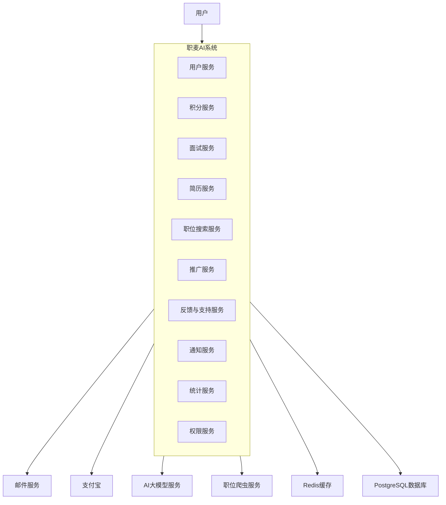
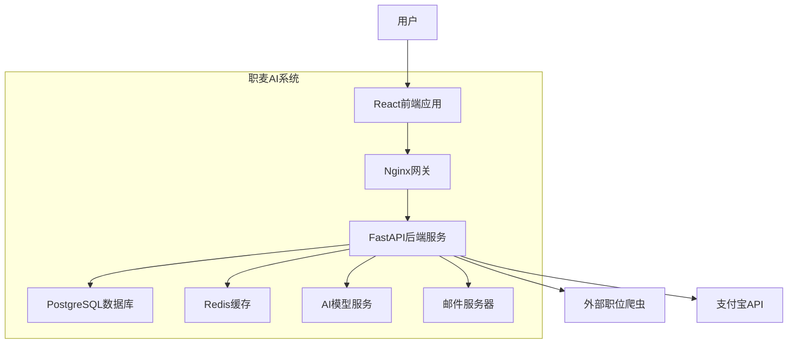
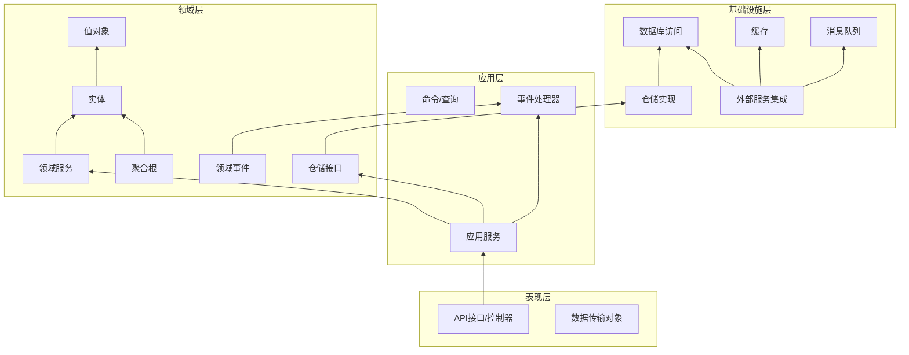
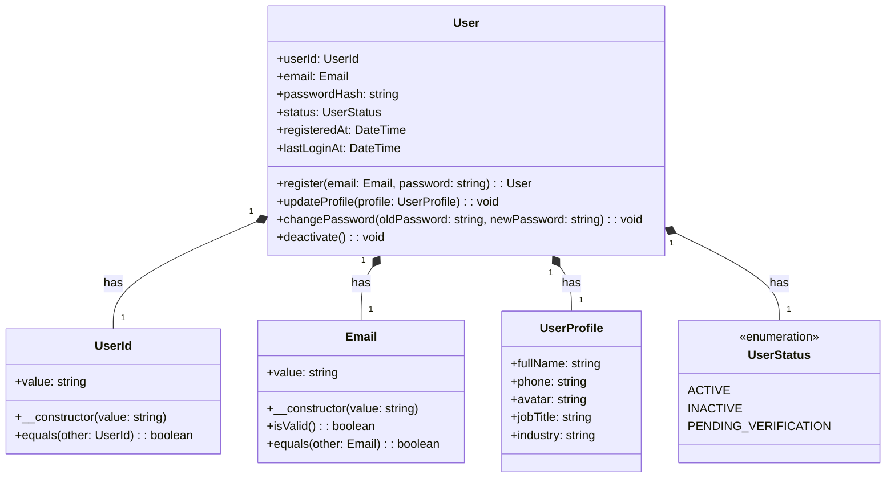
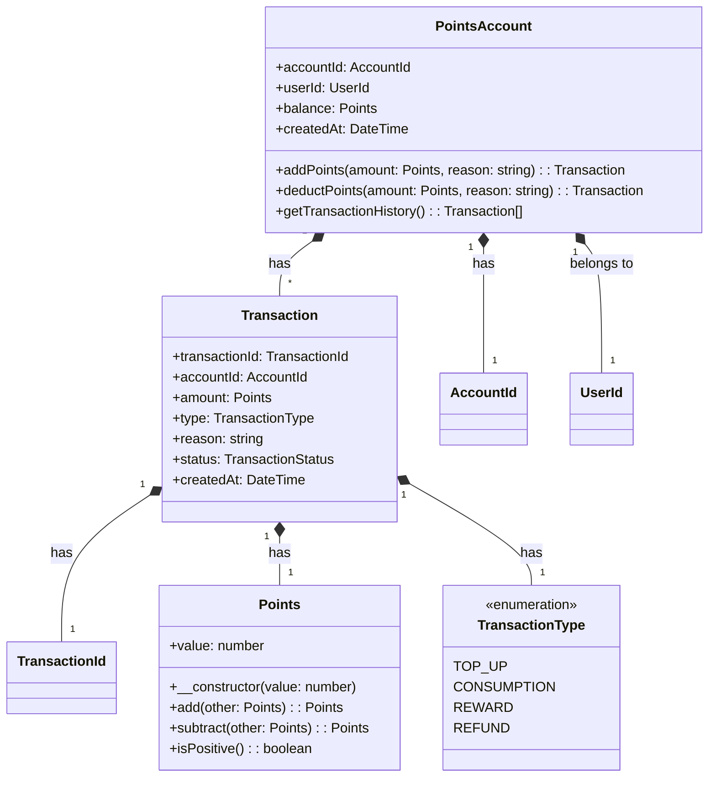
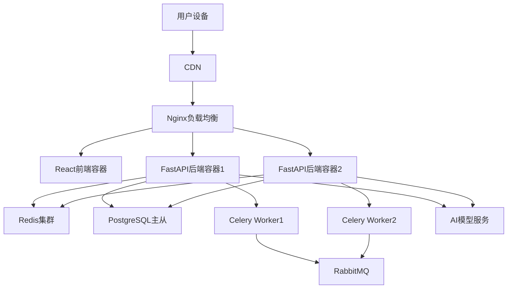

# 职麦 AI 系统 - DDD 架构设计文档

## 1. 领域划分与限界上下文

### 1.1 领域划分

根据系统功能和业务边界，将职麦 AI 系统划分为以下领域：

#### 核心子域


* **用户域**：用户注册、认证、信息管理

* **积分域**：积分管理、充值、消费

* **面试服务域**：模拟面试、会议助手、面试押题等 AI 服务

* **简历服务域**：简历处理、诊断分析

#### 支撑子域


* **职位搜索域**：职位信息检索功能

* **推广域**：合作推广与奖励机制

* **反馈与支持域**：意见收集与问题处理

#### 通用子域


* **通知域**：邮件通知、系统通知

* **统计分析域**：数据统计与仪表盘展示

* **权限域**：权限控制与接口安全

### 1.2 限界上下文定义


| 限界上下文   | 核心功能       | 主要实体           | 外部依赖        |
| ------- | ---------- | -------------- | ----------- |
| 用户上下文   | 注册、登录、信息管理 | 用户、用户资料、认证信息   | 通知上下文       |
| 积分上下文   | 积分管理、充值、消费 | 积分账户、交易记录      | 支付宝接口、用户上下文 |
| 模拟面试上下文 | 视频面试、职位配置  | 面试会话、面试配置、面试记录 | 积分上下文、AI 模型 |
| 会议助手上下文 | 实时问答辅助     | 会议记录、问答历史      | 积分上下文、AI 模型 |
| 简历处理上下文 | 简历解析、诊断    | 简历、诊断报告        | 积分上下文、AI 模型 |
| 面试押题上下文 | 生成面试题      | 押题记录、试题        | 积分上下文、AI 模型 |
| 职位搜索上下文 | 职位信息检索     | 职位信息、搜索记录      | 外部爬虫接口      |
| 推广上下文   | 推广链接、奖励    | 推广记录、奖励        | 用户上下文、积分上下文 |
| 反馈上下文   | 意见收集       | 反馈记录           | 用户上下文       |
| 工单上下文   | 问题处理       | 工单、处理记录        | 用户上下文、通知上下文 |
| 通知上下文   | 邮件、系统通知    | 通知记录           | 邮件服务        |
| 统计上下文   | 数据统计       | 统计指标、图表数据      | 各业务上下文      |
| 权限上下文   | 权限控制、限流    | 权限规则、限流配置      | 用户上下文       |

## 2. 系统架构设计

### 2.1 系统上下文图




### 2.2 容器图




### 2.3 DDD 分层架构图




## 3. 核心领域模型设计

### 3.1 用户领域




### 3.2 积分领域




## 4. 系统技术架构

### 4.1 技术栈选择


* 前端：React + Redux

* 后端：FastAPI + Pydantic

* 数据库：PostgreSQL

* 缓存：Redis

* ORM：SQLAlchemy

* 认证：JWT

* API 文档：Swagger/OpenAPI

* 任务队列：Celery (处理异步任务如邮件发送)

* 部署：Docker + Nginx

### 4.2 部署架构




## 5. 代码示例

### 5.1 项目目录结构


```
jobmai\_ai/

├── app/

│   ├── api/                     # 表现层

│   │   ├── v1/

│   │   │   ├── endpoints/       # 各模块API端点

│   │   │   ├── dependencies.py  # 依赖注入

│   │   │   └── router.py        # 路由汇总

│   │   └── dto/                 # 数据传输对象

│   ├── application/             # 应用层

│   │   ├── commands/            # 命令

│   │   ├── queries/             # 查询

│   │   ├── services/            # 应用服务

│   │   └── event\_handlers/      # 事件处理器

│   ├── domain/                  # 领域层

│   │   ├── user/                # 用户域

│   │   ├── points/              # 积分域

│   │   ├── interview/           # 面试服务域

│   │   ├── resume/              # 简历服务域

│   │   └── ...

│   ├── infrastructure/          # 基础设施层

│   │   ├── repositories/        # 仓储实现

│   │   ├── services/            # 外部服务集成

│   │   ├── database/            # 数据库配置

│   │   └── cache/               # 缓存配置

│   └── core/                    # 核心配置

│       ├── config.py            # 配置

│       ├── exceptions.py        # 异常

│       └── security.py          # 安全相关

├── tests/                       # 测试

├── alembic/                     # 数据库迁移

├── docker/                      # Docker配置

├── main.py                      # 应用入口

└── requirements.txt             # 依赖
```

### 5.2 领域层示例（用户实体）


```
\# app/domain/user/entities.py

from dataclasses import dataclass

from datetime import datetime

from typing import Optional

from uuid import uuid4

from app.domain.user.value\_objects import UserId, Email, UserProfile

from app.domain.user.enums import UserStatus

@dataclass(frozen=True)

class User:

&#x20;   user\_id: UserId

&#x20;   email: Email

&#x20;   password\_hash: str

&#x20;   status: UserStatus

&#x20;   profile: UserProfile

&#x20;   registered\_at: datetime

&#x20;   last\_login\_at: Optional\[datetime] = None

&#x20;   @classmethod

&#x20;   def register(

&#x20;       cls,&#x20;

&#x20;       email: Email,&#x20;

&#x20;       password\_hash: str,&#x20;

&#x20;       profile: UserProfile

&#x20;   ) -> "User":

&#x20;       """注册新用户"""

&#x20;       return cls(

&#x20;           user\_id=UserId(str(uuid4())),

&#x20;           email=email,

&#x20;           password\_hash=password\_hash,

&#x20;           status=UserStatus.PENDING\_VERIFICATION,

&#x20;           profile=profile,

&#x20;           registered\_at=datetime.utcnow()

&#x20;       )

&#x20;   def update\_profile(self, new\_profile: UserProfile) -> "User":

&#x20;       """更新用户资料"""

&#x20;       return self.\_\_class\_\_(

&#x20;           user\_id=self.user\_id,

&#x20;           email=self.email,

&#x20;           password\_hash=self.password\_hash,

&#x20;           status=self.status,

&#x20;           profile=new\_profile,

&#x20;           registered\_at=self.registered\_at,

&#x20;           last\_login\_at=self.last\_login\_at

&#x20;       )

&#x20;   def verify\_email(self) -> "User":

&#x20;       """验证邮箱"""

&#x20;       if self.status != UserStatus.PENDING\_VERIFICATION:

&#x20;           raise ValueError("User is already verified")

&#x20;          &#x20;

&#x20;       return self.\_\_class\_\_(

&#x20;           user\_id=self.user\_id,

&#x20;           email=self.email,

&#x20;           password\_hash=self.password\_hash,

&#x20;           status=UserStatus.ACTIVE,

&#x20;           profile=self.profile,

&#x20;           registered\_at=self.registered\_at,

&#x20;           last\_login\_at=self.last\_login\_at

&#x20;       )

&#x20;   def update\_last\_login(self) -> "User":

&#x20;       """更新最后登录时间"""

&#x20;       return self.\_\_class\_\_(

&#x20;           user\_id=self.user\_id,

&#x20;           email=self.email,

&#x20;           password\_hash=self.password\_hash,

&#x20;           status=self.status,

&#x20;           profile=self.profile,

&#x20;           registered\_at=self.registered\_at,

&#x20;           last\_login\_at=datetime.utcnow()

&#x20;       )
```

### 5.3 值对象示例


```
\# app/domain/user/value\_objects.py

from dataclasses import dataclass

import re

from typing import Optional

@dataclass(frozen=True)

class UserId:

&#x20;   value: str

&#x20;   def \_\_post\_init\_\_(self):

&#x20;       if not self.value:

&#x20;           raise ValueError("User ID cannot be empty")

@dataclass(frozen=True)

class Email:

&#x20;   value: str

&#x20;   def \_\_post\_init\_\_(self):

&#x20;       if not self.is\_valid():

&#x20;           raise ValueError(f"Invalid email address: {self.value}")

&#x20;   def is\_valid(self) -> bool:

&#x20;       """验证邮箱格式"""

&#x20;       pattern = r"^\[a-zA-Z0-9\_.+-]+@\[a-zA-Z0-9-]+\\.\[a-zA-Z0-9-.]+\$"

&#x20;       return re.match(pattern, self.value) is not None

&#x20;   def \_\_str\_\_(self) -> str:

&#x20;       return self.value

@dataclass(frozen=True)

class UserProfile:

&#x20;   full\_name: Optional\[str] = None

&#x20;   phone: Optional\[str] = None

&#x20;   avatar: Optional\[str] = None

&#x20;   job\_title: Optional\[str] = None

&#x20;   industry: Optional\[str] = None

&#x20;   def update(self, \*\*kwargs) -> "UserProfile":

&#x20;       """更新用户资料"""

&#x20;       new\_fields = {k: v for k, v in kwargs.items() if hasattr(self, k)}

&#x20;       return self.\_\_class\_\_(\*\* {\*\*self.\_\_dict\_\_,\*\* new\_fields})
```

### 5.4 仓储接口与实现


```
\# app/domain/user/repositories.py

from abc import ABC, abstractmethod

from typing import Optional, List

from app.domain.user.entities import User

from app.domain.user.value\_objects import UserId, Email

class UserRepository(ABC):

&#x20;   @abstractmethod

&#x20;   def get\_by\_id(self, user\_id: UserId) -> Optional\[User]:

&#x20;       """根据ID获取用户"""

&#x20;       raise NotImplementedError()

&#x20;   @abstractmethod

&#x20;   def get\_by\_email(self, email: Email) -> Optional\[User]:

&#x20;       """根据邮箱获取用户"""

&#x20;       raise NotImplementedError()

&#x20;   @abstractmethod

&#x20;   def add(self, user: User) -> None:

&#x20;       """添加用户"""

&#x20;       raise NotImplementedError()

&#x20;   @abstractmethod

&#x20;   def update(self, user: User) -> None:

&#x20;       """更新用户"""

&#x20;       raise NotImplementedError()

&#x20;   @abstractmethod

&#x20;   def delete(self, user\_id: UserId) -> None:

&#x20;       """删除用户"""

&#x20;       raise NotImplementedError()
```


```
\# app/infrastructure/repositories/user\_repository.py

from typing import Optional, List

from sqlalchemy.orm import Session

from app.domain.user.entities import User

from app.domain.user.repositories import UserRepository

from app.domain.user.value\_objects import UserId, Email, UserProfile

from app.domain.user.enums import UserStatus

from app.infrastructure.database.models import UserModel

class SqlAlchemyUserRepository(UserRepository):

&#x20;   def \_\_init\_\_(self, session: Session):

&#x20;       self.session = session

&#x20;   def get\_by\_id(self, user\_id: UserId) -> Optional\[User]:

&#x20;       user\_model = self.session.query(UserModel).filter(

&#x20;           UserModel.user\_id == user\_id.value

&#x20;       ).first()

&#x20;      &#x20;

&#x20;       if not user\_model:

&#x20;           return None

&#x20;          &#x20;

&#x20;       return self.\_to\_domain(user\_model)

&#x20;   def get\_by\_email(self, email: Email) -> Optional\[User]:

&#x20;       user\_model = self.session.query(UserModel).filter(

&#x20;           UserModel.email == email.value

&#x20;       ).first()

&#x20;      &#x20;

&#x20;       if not user\_model:

&#x20;           return None

&#x20;          &#x20;

&#x20;       return self.\_to\_domain(user\_model)

&#x20;   def add(self, user: User) -> None:

&#x20;       user\_model = UserModel(

&#x20;           user\_id=user.user\_id.value,

&#x20;           email=user.email.value,

&#x20;           password\_hash=user.password\_hash,

&#x20;           status=user.status.value,

&#x20;           full\_name=user.profile.full\_name,

&#x20;           phone=user.profile.phone,

&#x20;           avatar=user.profile.avatar,

&#x20;           job\_title=user.profile.job\_title,

&#x20;           industry=user.profile.industry,

&#x20;           registered\_at=user.registered\_at,

&#x20;           last\_login\_at=user.last\_login\_at

&#x20;       )

&#x20;      &#x20;

&#x20;       self.session.add(user\_model)

&#x20;       self.session.commit()

&#x20;   def update(self, user: User) -> None:

&#x20;       user\_model = self.session.query(UserModel).filter(

&#x20;           UserModel.user\_id == user.user\_id.value

&#x20;       ).first()

&#x20;      &#x20;

&#x20;       if user\_model:

&#x20;           user\_model.email = user.email.value

&#x20;           user\_model.password\_hash = user.password\_hash

&#x20;           user\_model.status = user.status.value

&#x20;           user\_model.full\_name = user.profile.full\_name

&#x20;           user\_model.phone = user.profile.phone

&#x20;           user\_model.avatar = user.profile.avatar

&#x20;           user\_model.job\_title = user.profile.job\_title

&#x20;           user\_model.industry = user.profile.industry

&#x20;           user\_model.last\_login\_at = user.last\_login\_at

&#x20;          &#x20;

&#x20;           self.session.commit()

&#x20;   def delete(self, user\_id: UserId) -> None:

&#x20;       user\_model = self.session.query(UserModel).filter(

&#x20;           UserModel.user\_id == user\_id.value

&#x20;       ).first()

&#x20;      &#x20;

&#x20;       if user\_model:

&#x20;           self.session.delete(user\_model)

&#x20;           self.session.commit()

&#x20;   def \_to\_domain(self, user\_model: UserModel) -> User:

&#x20;       return User(

&#x20;           user\_id=UserId(user\_model.user\_id),

&#x20;           email=Email(user\_model.email),

&#x20;           password\_hash=user\_model.password\_hash,

&#x20;           status=UserStatus(user\_model.status),

&#x20;           profile=UserProfile(

&#x20;               full\_name=user\_model.full\_name,

&#x20;               phone=user\_model.phone,

&#x20;               avatar=user\_model.avatar,

&#x20;               job\_title=user\_model.job\_title,

&#x20;               industry=user\_model.industry

&#x20;           ),

&#x20;           registered\_at=user\_model.registered\_at,

&#x20;           last\_login\_at=user\_model.last\_login\_at

&#x20;       )
```

### 5.5 应用服务示例


```
\# app/application/services/user\_service.py

from dataclasses import asdict

from typing import Optional

from uuid import uuid4

from app.domain.user.entities import User

from app.domain.user.repositories import UserRepository

from app.domain.user.value\_objects import Email, UserProfile

from app.domain.notification.services import NotificationService

from app.core.exceptions import UserAlreadyExistsError, InvalidCredentialsError

from app.core.security import hash\_password, verify\_password

from app.application.commands.user\_commands import RegisterUserCommand, UpdateUserCommand

class UserService:

&#x20;   def \_\_init\_\_(

&#x20;       self,&#x20;

&#x20;       user\_repository: UserRepository,

&#x20;       notification\_service: NotificationService

&#x20;   ):

&#x20;       self.user\_repository = user\_repository

&#x20;       self.notification\_service = notification\_service

&#x20;   def register\_user(self, command: RegisterUserCommand) -> User:

&#x20;       """注册新用户"""

&#x20;       email = Email(command.email)

&#x20;      &#x20;

&#x20;       # 检查用户是否已存在

&#x20;       existing\_user = self.user\_repository.get\_by\_email(email)

&#x20;       if existing\_user:

&#x20;           raise UserAlreadyExistsError(f"User with email {email} already exists")

&#x20;          &#x20;

&#x20;       # 创建用户

&#x20;       password\_hash = hash\_password(command.password)

&#x20;       profile = UserProfile(

&#x20;           full\_name=command.full\_name,

&#x20;           phone=command.phone

&#x20;       )

&#x20;      &#x20;

&#x20;       user = User.register(

&#x20;           email=email,

&#x20;           password\_hash=password\_hash,

&#x20;           profile=profile

&#x20;       )

&#x20;      &#x20;

&#x20;       # 保存用户

&#x20;       self.user\_repository.add(user)

&#x20;      &#x20;

&#x20;       # 发送验证邮件

&#x20;       verification\_code = str(uuid4())\[:6]

&#x20;       self.notification\_service.send\_email\_verification(

&#x20;           email=email.value,

&#x20;           user\_id=user.user\_id.value,

&#x20;           code=verification\_code

&#x20;       )

&#x20;      &#x20;

&#x20;       return user

&#x20;   def verify\_email(self, user\_id: str, code: str) -> User:

&#x20;       """验证邮箱"""

&#x20;       user = self.user\_repository.get\_by\_id(UserId(user\_id))

&#x20;       if not user:

&#x20;           raise ValueError(f"User with ID {user\_id} not found")

&#x20;          &#x20;

&#x20;       # 验证验证码 (实际实现中应从缓存或数据库获取预存的验证码)

&#x20;       if not self.notification\_service.verify\_verification\_code(user\_id, code):

&#x20;           raise ValueError("Invalid or expired verification code")

&#x20;          &#x20;

&#x20;       # 更新用户状态

&#x20;       verified\_user = user.verify\_email()

&#x20;       self.user\_repository.update(verified\_user)

&#x20;      &#x20;

&#x20;       return verified\_user

&#x20;   def authenticate\_user(self, email: str, password: str) -> User:

&#x20;       """用户认证"""

&#x20;       user = self.user\_repository.get\_by\_email(Email(email))

&#x20;       if not user:

&#x20;           raise InvalidCredentialsError("Invalid email or password")

&#x20;          &#x20;

&#x20;       if not verify\_password(password, user.password\_hash):

&#x20;           raise InvalidCredentialsError("Invalid email or password")

&#x20;          &#x20;

&#x20;       # 更新最后登录时间

&#x20;       updated\_user = user.update\_last\_login()

&#x20;       self.user\_repository.update(updated\_user)

&#x20;      &#x20;

&#x20;       return updated\_user

&#x20;   def update\_user\_profile(self, user\_id: str, command: UpdateUserCommand) -> User:

&#x20;       """更新用户资料"""

&#x20;       user = self.user\_repository.get\_by\_id(UserId(user\_id))

&#x20;       if not user:

&#x20;           raise ValueError(f"User with ID {user\_id} not found")

&#x20;          &#x20;

&#x20;       # 更新用户资料

&#x20;       updated\_profile = user.profile.update(\*\*asdict(command))

&#x20;       updated\_user = user.update\_profile(updated\_profile)

&#x20;       self.user\_repository.update(updated\_user)

&#x20;      &#x20;

&#x20;       return updated\_user
```

### 5.6 API 端点示例


```
\# app/api/v1/endpoints/users.py

from fastapi import APIRouter, Depends, HTTPException, status

from sqlalchemy.orm import Session

from app.api.dependencies import get\_db, get\_current\_user

from app.api.v1.dto.user\_dto import (

&#x20;   UserRegistrationRequest, UserResponse,&#x20;

&#x20;   UserLoginRequest, TokenResponse,

&#x20;   UserUpdateRequest

)

from app.application.services.user\_service import UserService

from app.domain.user.entities import User

from app.infrastructure.repositories.user\_repository import SqlAlchemyUserRepository

from app.infrastructure.services.email\_service import EmailService

from app.infrastructure.services.notification\_service import NotificationServiceImpl

router = APIRouter()

def get\_user\_service(db: Session = Depends(get\_db)) -> UserService:

&#x20;   user\_repository = SqlAlchemyUserRepository(db)

&#x20;   email\_service = EmailService()

&#x20;   notification\_service = NotificationServiceImpl(email\_service, db)

&#x20;   return UserService(user\_repository, notification\_service)

@router.post("/register", response\_model=UserResponse, status\_code=status.HTTP\_201\_CREATED)

def register\_user(

&#x20;   user\_data: UserRegistrationRequest,

&#x20;   user\_service: UserService = Depends(get\_user\_service)

):

&#x20;   try:

&#x20;       user = user\_service.register\_user(user\_data.to\_command())

&#x20;       return UserResponse.from\_domain(user)

&#x20;   except Exception as e:

&#x20;       raise HTTPException(

&#x20;           status\_code=status.HTTP\_400\_BAD\_REQUEST,

&#x20;           detail=str(e)

&#x20;       )

@router.post("/verify-email", response\_model=UserResponse)

def verify\_email(

&#x20;   user\_id: str,

&#x20;   code: str,

&#x20;   user\_service: UserService = Depends(get\_user\_service)

):

&#x20;   try:

&#x20;       user = user\_service.verify\_email(user\_id, code)

&#x20;       return UserResponse.from\_domain(user)

&#x20;   except ValueError as e:

&#x20;       raise HTTPException(

&#x20;           status\_code=status.HTTP\_400\_BAD\_REQUEST,

&#x20;           detail=str(e)

&#x20;       )

@router.post("/login", response\_model=TokenResponse)

def login(

&#x20;   login\_data: UserLoginRequest,

&#x20;   user\_service: UserService = Depends(get\_user\_service)

):

&#x20;   try:

&#x20;       user = user\_service.authenticate\_user(login\_data.email, login\_data.password)

&#x20;       # 生成JWT令牌 (实际实现中应使用安全的令牌生成逻辑)

&#x20;       token = create\_access\_token(user.user\_id.value)

&#x20;       return TokenResponse(access\_token=token, token\_type="bearer")

&#x20;   except Exception as e:

&#x20;       raise HTTPException(

&#x20;           status\_code=status.HTTP\_401\_UNAUTHORIZED,

&#x20;           detail=str(e),

&#x20;           headers={"WWW-Authenticate": "Bearer"}

&#x20;       )

@router.get("/me", response\_model=UserResponse)

def get\_current\_user\_profile(current\_user: User = Depends(get\_current\_user)):

&#x20;   return UserResponse.from\_domain(current\_user)

@router.put("/me", response\_model=UserResponse)

def update\_user\_profile(

&#x20;   update\_data: UserUpdateRequest,

&#x20;   current\_user: User = Depends(get\_current\_user),

&#x20;   user\_service: UserService = Depends(get\_user\_service)

):

&#x20;   try:

&#x20;       updated\_user = user\_service.update\_user\_profile(

&#x20;           current\_user.user\_id.value,

&#x20;           update\_data.to\_command()

&#x20;       )

&#x20;       return UserResponse.from\_domain(updated\_user)

&#x20;   except Exception as e:

&#x20;       raise HTTPException(

&#x20;           status\_code=status.HTTP\_400\_BAD\_REQUEST,

&#x20;           detail=str(e)

&#x20;       )
```

## 6. 总结与扩展建议

本设计文档基于 DDD 思想，为职麦 AI 系统提供了全面的架构设计，包括领域划分、限界上下文定义、系统架构、核心领域模型以及代码示例。该设计具有以下特点：


1. **领域驱动**：以业务领域为核心，确保系统设计贴合业务需求

2. **松耦合**：通过限界上下文和领域事件实现模块间的松耦合

3. **可扩展性**：分层架构和清晰的边界使系统易于扩展和维护

4. **可测试性**：依赖注入和接口抽象使单元测试更加便捷

### 扩展建议


1. **事件驱动**：进一步完善领域事件机制，实现更松耦合的系统集成

2. **CQRS**：对于复杂查询场景，考虑采用 CQRS 模式分离命令和查询职责

3. **事件溯源**：关键业务流程可采用事件溯源模式，提高系统可审计性

4. **微服务拆分**：随着系统增长，可根据限界上下文边界逐步拆分为独立微服务

5. **监控与可观测性**：集成完善的监控和日志系统，提高系统可观测性

通过这套架构设计，职麦 AI 系统能够更好地应对业务复杂度，同时保持良好的可扩展性和可维护性，为未来的功能迭代和业务增长奠定坚实基础。

> （注：文档部分内容可能由 AI 生成）