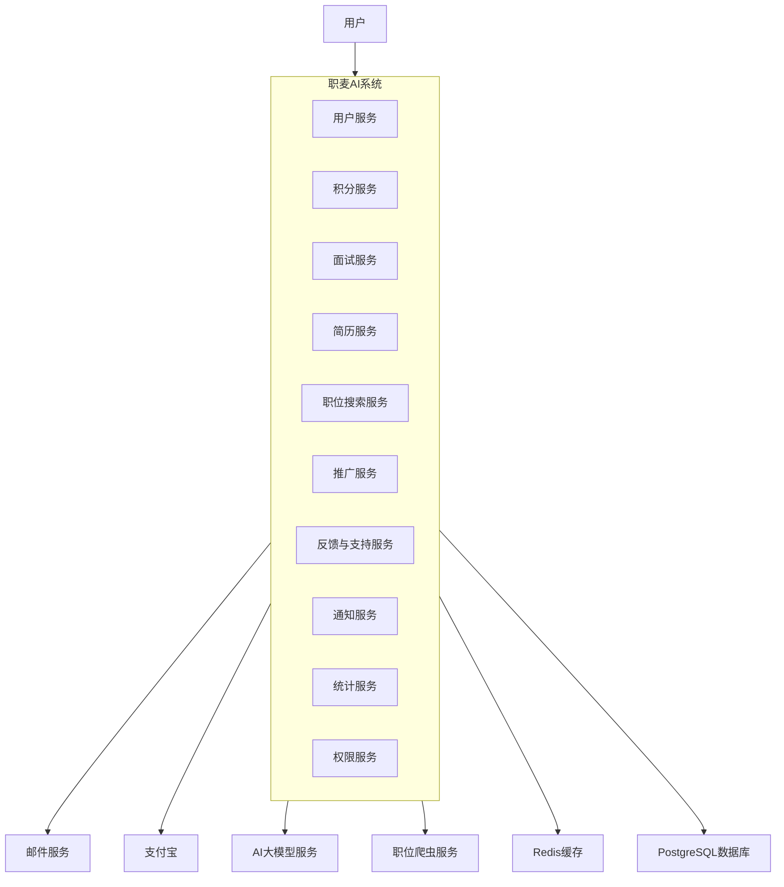
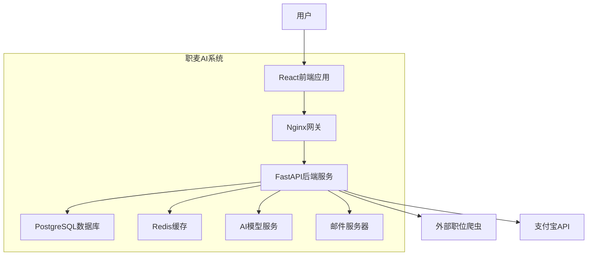
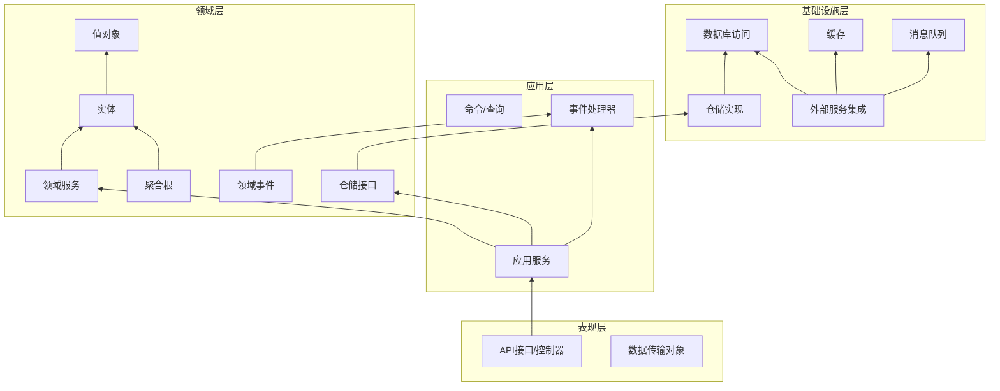
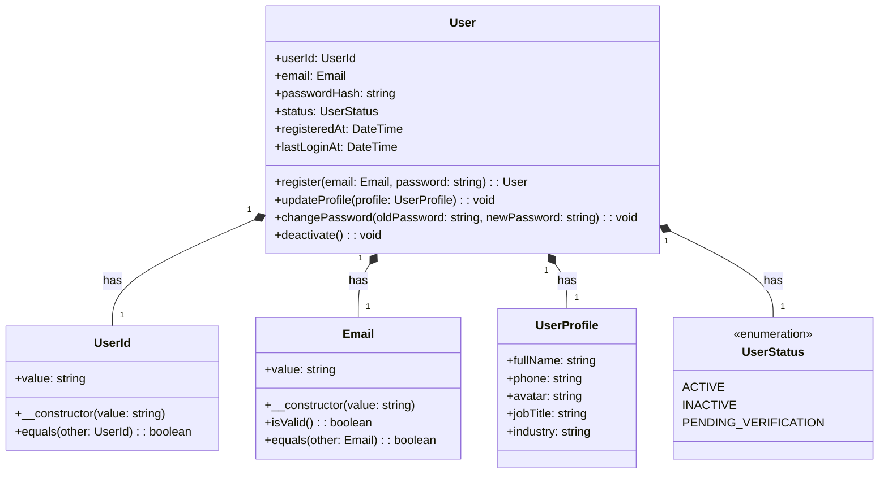
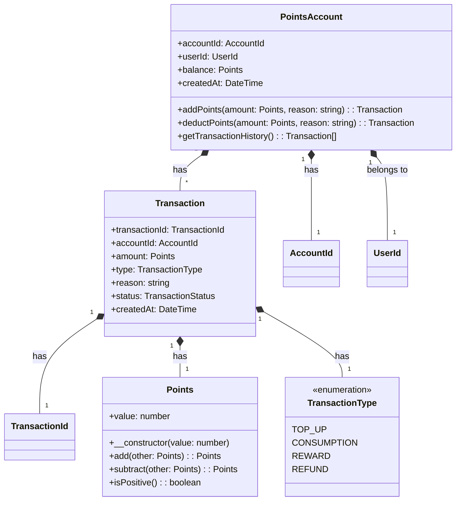
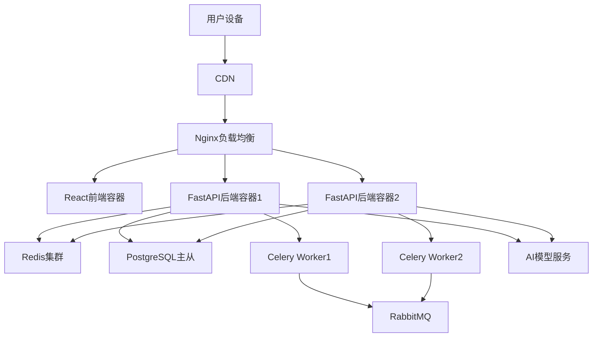

# 职麦 AI 系统 - DDD 架构设计文档

## 1. 领域划分与限界上下文

### 1.1 领域划分

根据系统功能和业务边界，将职麦 AI 系统划分为以下领域：

#### 核心子域


* **用户域**：用户注册、认证、信息管理

* **积分域**：积分管理、充值、消费

* **面试服务域**：模拟面试、会议助手、面试押题等 AI 服务

* **简历服务域**：简历处理、诊断分析

#### 支撑子域


* **职位搜索域**：职位信息检索功能

* **推广域**：合作推广与奖励机制

* **反馈与支持域**：意见收集与问题处理

#### 通用子域


* **通知域**：邮件通知、系统通知

* **统计分析域**：数据统计与仪表盘展示

* **权限域**：权限控制与接口安全

### 1.2 限界上下文定义


| 限界上下文   | 核心功能       | 主要实体           | 外部依赖        |
| ------- | ---------- | -------------- | ----------- |
| 用户上下文   | 注册、登录、信息管理 | 用户、用户资料、认证信息   | 通知上下文       |
| 积分上下文   | 积分管理、充值、消费 | 积分账户、交易记录      | 支付宝接口、用户上下文 |
| 模拟面试上下文 | 视频面试、职位配置  | 面试会话、面试配置、面试记录 | 积分上下文、AI 模型 |
| 会议助手上下文 | 实时问答辅助     | 会议记录、问答历史      | 积分上下文、AI 模型 |
| 简历处理上下文 | 简历解析、诊断    | 简历、诊断报告        | 积分上下文、AI 模型 |
| 面试押题上下文 | 生成面试题      | 押题记录、试题        | 积分上下文、AI 模型 |
| 职位搜索上下文 | 职位信息检索     | 职位信息、搜索记录      | 外部爬虫接口      |
| 推广上下文   | 推广链接、奖励    | 推广记录、奖励        | 用户上下文、积分上下文 |
| 反馈上下文   | 意见收集       | 反馈记录           | 用户上下文       |
| 工单上下文   | 问题处理       | 工单、处理记录        | 用户上下文、通知上下文 |
| 通知上下文   | 邮件、系统通知    | 通知记录           | 邮件服务        |
| 统计上下文   | 数据统计       | 统计指标、图表数据      | 各业务上下文      |
| 权限上下文   | 权限控制、限流    | 权限规则、限流配置      | 用户上下文       |

## 2. 系统架构设计

### 2.1 系统上下文图




### 2.2 容器图




### 2.3 DDD 分层架构图




## 3. 核心领域模型设计

### 3.1 用户领域




### 3.2 积分领域




## 4. 系统技术架构

### 4.1 技术栈选择


* 前端：React + Redux

* 后端：FastAPI + Pydantic

* 数据库：PostgreSQL

* 缓存：Redis

* ORM：SQLAlchemy

* 认证：JWT

* API 文档：Swagger/OpenAPI

* 任务队列：Celery (处理异步任务如邮件发送)

* 部署：Docker + Nginx

### 4.2 部署架构




## 5. 代码示例

### 5.1 项目目录结构


```
jobmai\_ai/

├── app/

│   ├── api/                     # 表现层

│   │   ├── v1/

│   │   │   ├── endpoints/       # 各模块API端点

│   │   │   ├── dependencies.py  # 依赖注入

│   │   │   └── router.py        # 路由汇总

│   │   └── dto/                 # 数据传输对象

│   ├── application/             # 应用层

│   │   ├── commands/            # 命令

│   │   ├── queries/             # 查询

│   │   ├── services/            # 应用服务

│   │   └── event\_handlers/      # 事件处理器

│   ├── domain/                  # 领域层

│   │   ├── user/                # 用户域

│   │   ├── points/              # 积分域

│   │   ├── interview/           # 面试服务域

│   │   ├── resume/              # 简历服务域

│   │   └── ...

│   ├── infrastructure/          # 基础设施层

│   │   ├── repositories/        # 仓储实现

│   │   ├── services/            # 外部服务集成

│   │   ├── database/            # 数据库配置

│   │   └── cache/               # 缓存配置

│   └── core/                    # 核心配置

│       ├── config.py            # 配置

│       ├── exceptions.py        # 异常

│       └── security.py          # 安全相关

├── tests/                       # 测试

├── alembic/                     # 数据库迁移

├── docker/                      # Docker配置

├── main.py                      # 应用入口

└── requirements.txt             # 依赖
```

### 5.2 领域层示例（用户实体）
```python
# app/domain/user/entities.py
from dataclasses import dataclass
from datetime import datetime
from typing import Optional
from uuid import uuid4

from app.domain.user.value_objects import UserId, Email, UserProfile
from app.domain.user.enums import UserStatus


@dataclass(frozen=True)
class User:
    user_id: UserId
    email: Email
    password_hash: str
    status: UserStatus
    profile: UserProfile
    registered_at: datetime
    last_login_at: Optional[datetime] = None

    @classmethod
    def register(
        cls, 
        email: Email, 
        password_hash: str, 
        profile: UserProfile
    ) -> "User":
        """注册新用户"""
        return cls(
            user_id=UserId(str(uuid4())),
            email=email,
            password_hash=password_hash,
            status=UserStatus.PENDING_VERIFICATION,
            profile=profile,
            registered_at=datetime.utcnow()
        )

    def update_profile(self, new_profile: UserProfile) -> "User":
        """更新用户资料"""
        return self.__class__(
            user_id=self.user_id,
            email=self.email,
            password_hash=self.password_hash,
            status=self.status,
            profile=new_profile,
            registered_at=self.registered_at,
            last_login_at=self.last_login_at
        )

    def verify_email(self) -> "User":
        """验证邮箱"""
        if self.status != UserStatus.PENDING_VERIFICATION:
            raise ValueError("User is already verified")
            
        return self.__class__(
            user_id=self.user_id,
            email=self.email,
            password_hash=self.password_hash,
            status=UserStatus.ACTIVE,
            profile=self.profile,
            registered_at=self.registered_at,
            last_login_at=self.last_login_at
        )

    def update_last_login(self) -> "User":
        """更新最后登录时间"""
        return self.__class__(
            user_id=self.user_id,
            email=self.email,
            password_hash=self.password_hash,
            status=self.status,
            profile=self.profile,
            registered_at=self.registered_at,
            last_login_at=datetime.utcnow()
        )
```

### 5.3 值对象示例

```python
# app/domain/user/value_objects.py
from dataclasses import dataclass
import re
from typing import Optional


@dataclass(frozen=True)
class UserId:
    value: str

    def __post_init__(self):
        if not self.value:
            raise ValueError("User ID cannot be empty")


@dataclass(frozen=True)
class Email:
    value: str

    def __post_init__(self):
        if not self.is_valid():
            raise ValueError(f"Invalid email address: {self.value}")

    def is_valid(self) -> bool:
        """验证邮箱格式"""
        pattern = r"^[a-zA-Z0-9_.+-]+@[a-zA-Z0-9-]+\.[a-zA-Z0-9-.]+$"
        return re.match(pattern, self.value) is not None

    def __str__(self) -> str:
        return self.value


@dataclass(frozen=True)
class UserProfile:
    full_name: Optional[str] = None
    phone: Optional[str] = None
    avatar: Optional[str] = None
    job_title: Optional[str] = None
    industry: Optional[str] = None

    def update(self, **kwargs) -> "UserProfile":
        """更新用户资料"""
        new_fields = {k: v for k, v in kwargs.items() if hasattr(self, k)}
        return self.__class__(** {**self.__dict__,** new_fields})
```

### 5.4 仓储接口与实现
```python
# app/domain/user/repositories.py
from abc import ABC, abstractmethod
from typing import Optional, List

from app.domain.user.entities import User
from app.domain.user.value_objects import UserId, Email


class UserRepository(ABC):
    @abstractmethod
    def get_by_id(self, user_id: UserId) -> Optional[User]:
        """根据ID获取用户"""
        raise NotImplementedError()

    @abstractmethod
    def get_by_email(self, email: Email) -> Optional[User]:
        """根据邮箱获取用户"""
        raise NotImplementedError()

    @abstractmethod
    def add(self, user: User) -> None:
        """添加用户"""
        raise NotImplementedError()

    @abstractmethod
    def update(self, user: User) -> None:
        """更新用户"""
        raise NotImplementedError()

    @abstractmethod
    def delete(self, user_id: UserId) -> None:
        """删除用户"""
        raise NotImplementedError()
```


```python
# app/infrastructure/repositories/user_repository.py
from typing import Optional, List
from sqlalchemy.orm import Session

from app.domain.user.entities import User
from app.domain.user.repositories import UserRepository
from app.domain.user.value_objects import UserId, Email, UserProfile
from app.domain.user.enums import UserStatus
from app.infrastructure.database.models import UserModel


class SqlAlchemyUserRepository(UserRepository):
    def __init__(self, session: Session):
        self.session = session

    def get_by_id(self, user_id: UserId) -> Optional[User]:
        user_model = self.session.query(UserModel).filter(
            UserModel.user_id == user_id.value
        ).first()
        
        if not user_model:
            return None
            
        return self._to_domain(user_model)

    def get_by_email(self, email: Email) -> Optional[User]:
        user_model = self.session.query(UserModel).filter(
            UserModel.email == email.value
        ).first()
        
        if not user_model:
            return None
            
        return self._to_domain(user_model)

    def add(self, user: User) -> None:
        user_model = UserModel(
            user_id=user.user_id.value,
            email=user.email.value,
            password_hash=user.password_hash,
            status=user.status.value,
            full_name=user.profile.full_name,
            phone=user.profile.phone,
            avatar=user.profile.avatar,
            job_title=user.profile.job_title,
            industry=user.profile.industry,
            registered_at=user.registered_at,
            last_login_at=user.last_login_at
        )
        
        self.session.add(user_model)
        self.session.commit()

    def update(self, user: User) -> None:
        user_model = self.session.query(UserModel).filter(
            UserModel.user_id == user.user_id.value
        ).first()
        
        if user_model:
            user_model.email = user.email.value
            user_model.password_hash = user.password_hash
            user_model.status = user.status.value
            user_model.full_name = user.profile.full_name
            user_model.phone = user.profile.phone
            user_model.avatar = user.profile.avatar
            user_model.job_title = user.profile.job_title
            user_model.industry = user.profile.industry
            user_model.last_login_at = user.last_login_at
            
            self.session.commit()

    def delete(self, user_id: UserId) -> None:
        user_model = self.session.query(UserModel).filter(
            UserModel.user_id == user_id.value
        ).first()
        
        if user_model:
            self.session.delete(user_model)
            self.session.commit()

    def _to_domain(self, user_model: UserModel) -> User:
        return User(
            user_id=UserId(user_model.user_id),
            email=Email(user_model.email),
            password_hash=user_model.password_hash,
            status=UserStatus(user_model.status),
            profile=UserProfile(
                full_name=user_model.full_name,
                phone=user_model.phone,
                avatar=user_model.avatar,
                job_title=user_model.job_title,
                industry=user_model.industry
            ),
            registered_at=user_model.registered_at,
            last_login_at=user_model.last_login_at
        )
```

### 5.5 应用服务示例

```python
# app/application/services/user_service.py
from dataclasses import asdict
from typing import Optional
from uuid import uuid4

from app.domain.user.entities import User
from app.domain.user.repositories import UserRepository
from app.domain.user.value_objects import Email, UserProfile
from app.domain.notification.services import NotificationService
from app.core.exceptions import UserAlreadyExistsError, InvalidCredentialsError
from app.core.security import hash_password, verify_password
from app.application.commands.user_commands import RegisterUserCommand, UpdateUserCommand


class UserService:
    def __init__(
        self, 
        user_repository: UserRepository,
        notification_service: NotificationService
    ):
        self.user_repository = user_repository
        self.notification_service = notification_service

    def register_user(self, command: RegisterUserCommand) -> User:
        """注册新用户"""
        email = Email(command.email)
        
        # 检查用户是否已存在
        existing_user = self.user_repository.get_by_email(email)
        if existing_user:
            raise UserAlreadyExistsError(f"User with email {email} already exists")
            
        # 创建用户
        password_hash = hash_password(command.password)
        profile = UserProfile(
            full_name=command.full_name,
            phone=command.phone
        )
        
        user = User.register(
            email=email,
            password_hash=password_hash,
            profile=profile
        )
        
        # 保存用户
        self.user_repository.add(user)
        
        # 发送验证邮件
        verification_code = str(uuid4())[:6]
        self.notification_service.send_email_verification(
            email=email.value,
            user_id=user.user_id.value,
            code=verification_code
        )
        
        return user

    def verify_email(self, user_id: str, code: str) -> User:
        """验证邮箱"""
        user = self.user_repository.get_by_id(UserId(user_id))
        if not user:
            raise ValueError(f"User with ID {user_id} not found")
            
        # 验证验证码 (实际实现中应从缓存或数据库获取预存的验证码)
        if not self.notification_service.verify_verification_code(user_id, code):
            raise ValueError("Invalid or expired verification code")
            
        # 更新用户状态
        verified_user = user.verify_email()
        self.user_repository.update(verified_user)
        
        return verified_user

    def authenticate_user(self, email: str, password: str) -> User:
        """用户认证"""
        user = self.user_repository.get_by_email(Email(email))
        if not user:
            raise InvalidCredentialsError("Invalid email or password")
            
        if not verify_password(password, user.password_hash):
            raise InvalidCredentialsError("Invalid email or password")
            
        # 更新最后登录时间
        updated_user = user.update_last_login()
        self.user_repository.update(updated_user)
        
        return updated_user

    def update_user_profile(self, user_id: str, command: UpdateUserCommand) -> User:
        """更新用户资料"""
        user = self.user_repository.get_by_id(UserId(user_id))
        if not user:
            raise ValueError(f"User with ID {user_id} not found")
            
        # 更新用户资料
        updated_profile = user.profile.update(**asdict(command))
        updated_user = user.update_profile(updated_profile)
        self.user_repository.update(updated_user)
        
        return updated_user
```

### 5.6 API 端点示例
```python
# app/api/v1/endpoints/users.py
from fastapi import APIRouter, Depends, HTTPException, status
from sqlalchemy.orm import Session

from app.api.dependencies import get_db, get_current_user
from app.api.v1.dto.user_dto import (
    UserRegistrationRequest, UserResponse, 
    UserLoginRequest, TokenResponse,
    UserUpdateRequest
)
from app.application.services.user_service import UserService
from app.domain.user.entities import User
from app.infrastructure.repositories.user_repository import SqlAlchemyUserRepository
from app.infrastructure.services.email_service import EmailService
from app.infrastructure.services.notification_service import NotificationServiceImpl

router = APIRouter()

def get_user_service(db: Session = Depends(get_db)) -> UserService:
    user_repository = SqlAlchemyUserRepository(db)
    email_service = EmailService()
    notification_service = NotificationServiceImpl(email_service, db)
    return UserService(user_repository, notification_service)

@router.post("/register", response_model=UserResponse, status_code=status.HTTP_201_CREATED)
def register_user(
    user_data: UserRegistrationRequest,
    user_service: UserService = Depends(get_user_service)
):
    try:
        user = user_service.register_user(user_data.to_command())
        return UserResponse.from_domain(user)
    except Exception as e:
        raise HTTPException(
            status_code=status.HTTP_400_BAD_REQUEST,
            detail=str(e)
        )

@router.post("/verify-email", response_model=UserResponse)
def verify_email(
    user_id: str,
    code: str,
    user_service: UserService = Depends(get_user_service)
):
    try:
        user = user_service.verify_email(user_id, code)
        return UserResponse.from_domain(user)
    except ValueError as e:
        raise HTTPException(
            status_code=status.HTTP_400_BAD_REQUEST,
            detail=str(e)
        )

@router.post("/login", response_model=TokenResponse)
def login(
    login_data: UserLoginRequest,
    user_service: UserService = Depends(get_user_service)
):
    try:
        user = user_service.authenticate_user(login_data.email, login_data.password)
        # 生成JWT令牌 (实际实现中应使用安全的令牌生成逻辑)
        token = create_access_token(user.user_id.value)
        return TokenResponse(access_token=token, token_type="bearer")
    except Exception as e:
        raise HTTPException(
            status_code=status.HTTP_401_UNAUTHORIZED,
            detail=str(e),
            headers={"WWW-Authenticate": "Bearer"}
        )

@router.get("/me", response_model=UserResponse)
def get_current_user_profile(current_user: User = Depends(get_current_user)):
    return UserResponse.from_domain(current_user)

@router.put("/me", response_model=UserResponse)
def update_user_profile(
    update_data: UserUpdateRequest,
    current_user: User = Depends(get_current_user),
    user_service: UserService = Depends(get_user_service)
):
    try:
        updated_user = user_service.update_user_profile(
            current_user.user_id.value,
            update_data.to_command()
        )
        return UserResponse.from_domain(updated_user)
    except Exception as e:
        raise HTTPException(
            status_code=status.HTTP_400_BAD_REQUEST,
            detail=str(e)
        )
```

## 6. 总结与扩展建议

本设计文档基于 DDD 思想，为职麦 AI 系统提供了全面的架构设计，包括领域划分、限界上下文定义、系统架构、核心领域模型以及代码示例。该设计具有以下特点：


1. **领域驱动**：以业务领域为核心，确保系统设计贴合业务需求

2. **松耦合**：通过限界上下文和领域事件实现模块间的松耦合

3. **可扩展性**：分层架构和清晰的边界使系统易于扩展和维护

4. **可测试性**：依赖注入和接口抽象使单元测试更加便捷

### 扩展建议


1. **事件驱动**：进一步完善领域事件机制，实现更松耦合的系统集成

2. **CQRS**：对于复杂查询场景，考虑采用 CQRS 模式分离命令和查询职责

3. **事件溯源**：关键业务流程可采用事件溯源模式，提高系统可审计性

4. **微服务拆分**：随着系统增长，可根据限界上下文边界逐步拆分为独立微服务

5. **监控与可观测性**：集成完善的监控和日志系统，提高系统可观测性

通过这套架构设计，职麦 AI 系统能够更好地应对业务复杂度，同时保持良好的可扩展性和可维护性，为未来的功能迭代和业务增长奠定坚实基础。
