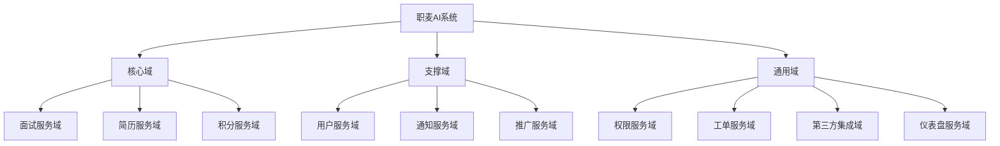
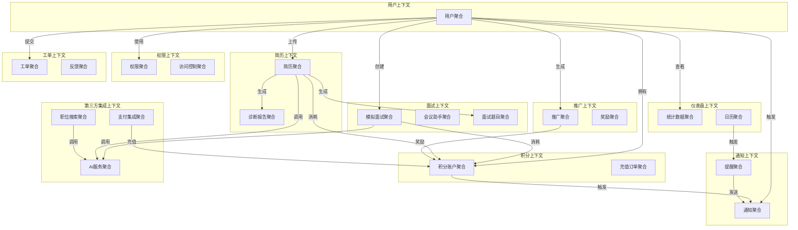
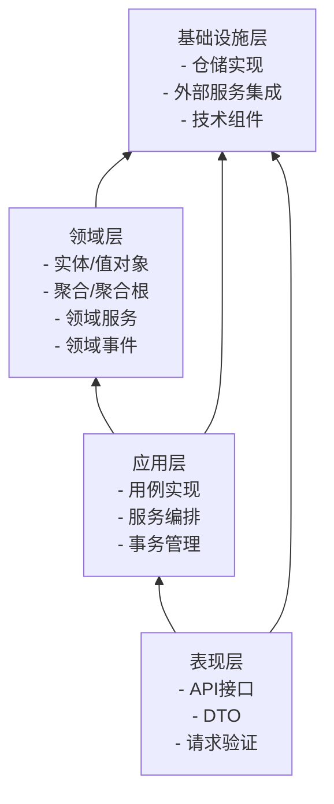
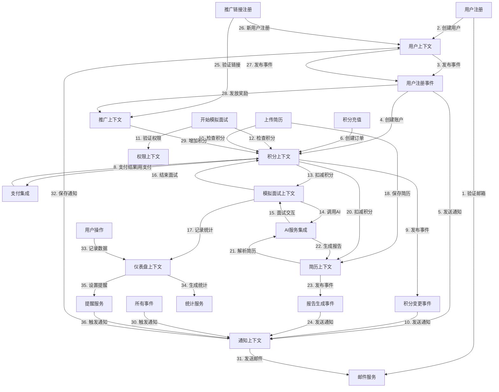
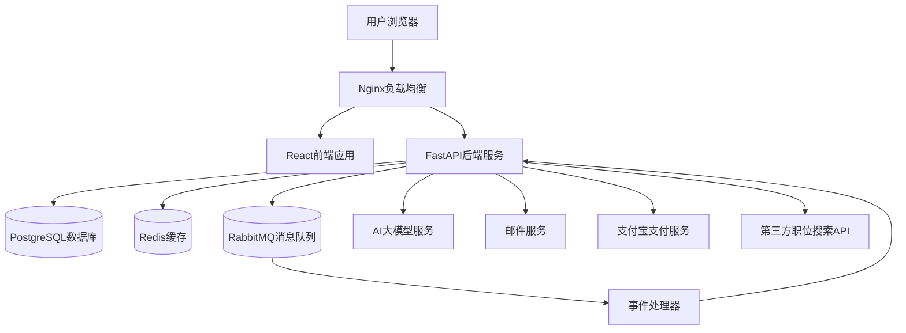

# 职麦 AI 系统 - DDD 架构设计文档

## 1. 系统概述

职麦 AI 系统是一个面向求职面试的综合性平台，集成了模拟面试、简历诊断、面试押题等核心功能，并通过积分系统实现服务计费。本设计文档基于领域驱动设计 (DDD) 思想，对系统进行全面架构设计，确保系统具备良好的可扩展性、松耦合性和业务适应性。

## 2. 领域与子域划分

### 2.1 领域划分




### 2.2 子域说明


| 子域     | 类型  | 说明                    |
| ------ | --- | --------------------- |
| 面试服务域  | 核心域 | 包含模拟面试、会议助手、面试押题等核心功能 |
| 简历服务域  | 核心域 | 负责简历上传、解析和诊断等功能       |
| 积分服务域  | 核心域 | 处理积分的创建、消耗、充值等核心交易    |
| 用户服务域  | 支撑域 | 管理用户注册、信息维护等功能        |
| 通知服务域  | 支撑域 | 处理邮件提醒、系统通知等功能        |
| 推广服务域  | 支撑域 | 管理合作推广链接和奖励机制         |
| 权限服务域  | 通用域 | 负责权限校验、接口限流等横切关注点     |
| 工单服务域  | 通用域 | 处理用户反馈和问题工单           |
| 第三方集成域 | 通用域 | 集成职位搜索、支付、AI 服务等第三方能力 |
| 仪表盘服务域 | 通用域 | 负责数据统计和日历提醒功能         |

## 3. 限界上下文设计

### 3.1 限界上下文划分

为每个子域定义限界上下文，明确业务边界：


1. **用户上下文 (User Context)**：用户注册、信息管理

2. **积分上下文 (Points Context)**：积分账户、充值、消费

3. **面试上下文 (Interview Context)**：模拟面试、会议助手

4. **简历上下文 (Resume Context)**：简历管理、诊断、面试押题

5. **通知上下文 (Notification Context)**：邮件发送、系统通知

6. **推广上下文 (Promotion Context)**：推广链接、奖励发放

7. **权限上下文 (Permission Context)**：认证授权、接口限流

8. **工单上下文 (Ticket Context)**：意见反馈、问题工单

9. **第三方集成上下文 (ThirdParty Context)**：外部 API 集成

10. **仪表盘上下文 (Dashboard Context)**：数据统计、日历提醒

### 3.2 上下文映射图




## 4. 聚合设计

### 4.1 核心聚合定义


| 限界上下文    | 聚合      | 聚合根                  | 实体                             | 值对象                           |
| -------- | ------- | -------------------- | ------------------------------ | ----------------------------- |
| 用户上下文    | 用户聚合    | User                 | User, UserProfile              | Email, Phone, Address         |
| 积分上下文    | 积分账户聚合  | PointsAccount        | PointsAccount, PointsRecord    | PointsAmount, TransactionType |
| 积分上下文    | 充值订单聚合  | RechargeOrder        | RechargeOrder, PaymentRecord   | OrderStatus, PaymentMethod    |
| 面试上下文    | 模拟面试聚合  | MockInterview        | MockInterview, InterviewConfig | InterviewStatus, Duration     |
| 面试上下文    | 会议助手聚合  | MeetingAssistant     | Meeting, AIChatRecord          | MeetingStatus, Transcript     |
| 面试上下文    | 面试题目聚合  | InterviewQuestionSet | QuestionSet, Question          | QuestionType, Difficulty      |
| 简历上下文    | 简历聚合    | Resume               | Resume, ResumeSection          | FileInfo, TextContent         |
| 简历上下文    | 诊断报告聚合  | DiagnosticReport     | Report, ReportSection          | Score, Suggestion             |
| 通知上下文    | 通知聚合    | Notification         | Notification                   | NotificationType, Content     |
| 通知上下文    | 提醒聚合    | Reminder             | Reminder                       | ReminderTime, Frequency       |
| 推广上下文    | 推广聚合    | Promotion            | Promotion, PromotionRecord     | PromoCode, Link               |
| 推广上下文    | 奖励聚合    | Reward               | Reward                         | RewardType, Amount            |
| 权限上下文    | 权限聚合    | Role                 | Role, Permission               | PermissionCode                |
| 权限上下文    | 访问控制聚合  | AccessControl        | AccessLog, RateLimitRule       | IPAddress, RequestInfo        |
| 工单上下文    | 工单聚合    | Ticket               | Ticket, TicketProcess          | TicketStatus, Priority        |
| 工单上下文    | 反馈聚合    | Feedback             | Feedback                       | FeedbackType, Content         |
| 第三方集成上下文 | 职位搜索聚合  | JobSearch            | SearchRecord, JobInfo          | SearchCriteria, JobDetail     |
| 第三方集成上下文 | 支付集成聚合  | PaymentIntegration   | PaymentConfig, PaymentLog      | PaymentResult                 |
| 第三方集成上下文 | AI 服务聚合 | AIService            | AIRequest, AIResponse          | Prompt, ModelType             |
| 仪表盘上下文   | 统计数据聚合  | Statistic            | StatisticRecord                | StatType, TimeRange           |
| 仪表盘上下文   | 日历聚合    | Calendar             | CalendarEvent                  | EventTime, EventType          |

## 5. 领域事件设计

```mermaid
graph TD
    UserRegistered[用户注册事件] -->|触发| SendWelcomeEmail[发送欢迎邮件]
    UserRegistered -->|触发| CreatePointsAccount[创建积分账户]
    
    PointsRecharged[积分充值事件] -->|触发| SendPointsNotification[发送积分通知]
    PointsConsumed[积分消费事件] -->|触发| SendPointsNotification
    
    MockInterviewStarted[模拟面试开始事件] -->|触发| DeductPoints[扣除积分]
    MockInterviewEnded[模拟面试结束事件] -->|触发| CreateInterviewReport[生成面试报告]
    
    ResumeUploaded[简历上传事件] -->|触发| AnalyzeResume[分析简历]
    
    DiagnosticReportGenerated[诊断报告生成事件] -->|触发| NotifyUser[通知用户]
    
    InterviewQuestionsGenerated[面试题生成事件] -->|触发| NotifyUser
    
    PromotionSucceeded[推广成功事件] -->|触发| GrantRewardPoints[发放奖励积分]
    
    TicketSubmitted[工单提交事件] -->|触发| AssignTicket[分配工单]
    
    ReminderTriggered[提醒触发事件] -->|触发| SendReminderEmail[发送提醒邮件]
```




## 6. 系统分层架构

采用 DDD 经典四层架构，每层职责明确：




### 6.1 各层职责


1. **表现层**：

* 提供 REST API 接口

* 请求参数验证

* 响应数据格式化

* 处理 HTTP 相关逻辑

1. **应用层**：

* 实现完整业务用例

* 协调领域对象完成业务操作

* 处理事务边界

* 发布领域事件

1. **领域层**：

* 核心业务逻辑实现

* 领域模型（实体、值对象、聚合）

* 领域服务

* 领域事件定义

1. **基础设施层**：

* 数据库访问实现

* 外部服务集成（支付、AI 等）

* 提供技术组件（缓存、消息队列等）

* 实现仓储接口

## 7. 信息数据流转全景图




## 8. 技术架构设计

### 8.1 技术栈选择


* 前端框架：React

* 后端框架：FastAPI

* ORM：SQLAlchemy

* 数据库：PostgreSQL

* 缓存：Redis

* 反向代理：Nginx

* AI 服务：大模型 API

* 消息队列：RabbitMQ（用于事件传递）

### 8.2 部署架构




## 9. 代码示例

以下是基于 FastAPI 的核心模块代码示例：

### 9.1 项目结构


```
jobwheat\_ai/

├── app/

│   ├── api/                  # 表现层

│   │   ├── v1/

│   │   │   ├── endpoints/    # API端点

│   │   │   ├── schemas/      # DTO定义

│   │   │   └── deps.py       # 依赖项

│   ├── application/          # 应用层

│   │   ├── services/         # 应用服务

│   │   └── events/           # 事件处理

│   ├── domain/               # 领域层

│   │   ├── models/           # 领域模型

│   │   ├── services/         # 领域服务

│   │   └── events/           # 领域事件

│   ├── infrastructure/       # 基础设施层

│   │   ├── repositories/     # 仓储实现

│   │   ├── services/         # 外部服务集成

│   │   └── database/         # 数据库配置

│   └── main.py               # 应用入口

└── tests/                    # 测试代码
```

### 9.2 核心代码示例

#### 9.2.1 领域模型（用户聚合）


```
\# app/domain/models/user.py

from dataclasses import dataclass

from datetime import datetime

from uuid import UUID, uuid4

@dataclass(frozen=True)

class Email:

&#x20;   value: str

&#x20;  &#x20;

&#x20;   def \_\_post\_init\_\_(self):

&#x20;       if "@" not in self.value:

&#x20;           raise ValueError("Invalid email address")

@dataclass(frozen=True)

class UserId:

&#x20;   value: UUID = uuid4()

@dataclass

class UserProfile:

&#x20;   full\_name: str

&#x20;   phone: str | None = None

&#x20;   title: str | None = None

&#x20;   bio: str | None = None

@dataclass

class User:

&#x20;   id: UserId

&#x20;   email: Email

&#x20;   hashed\_password: str

&#x20;   is\_active: bool = True

&#x20;   is\_verified: bool = False

&#x20;   profile: UserProfile | None = None

&#x20;   created\_at: datetime = datetime.now()

&#x20;   updated\_at: datetime = datetime.now()

&#x20;  &#x20;

&#x20;   def verify(self) -> None:

&#x20;       self.is\_verified = True

&#x20;       self.updated\_at = datetime.now()

&#x20;  &#x20;

&#x20;   def update\_profile(self, profile: UserProfile) -> None:

&#x20;       self.profile = profile

&#x20;       self.updated\_at = datetime.now()
```

#### 9.2.2 领域事件


```
\# app/domain/events/user.py

from dataclasses import dataclass

from datetime import datetime

from uuid import UUID

@dataclass

class UserRegisteredEvent:

&#x20;   user\_id: UUID

&#x20;   email: str

&#x20;   occurred\_at: datetime = datetime.now()
```

#### 9.2.3 仓储接口


```
\# app/domain/repositories/user\_repository.py

from abc import ABC, abstractmethod

from uuid import UUID

from app.domain.models.user import User, UserId, Email

class UserRepository(ABC):

&#x20;   @abstractmethod

&#x20;   def get\_by\_id(self, user\_id: UserId) -> User | None:

&#x20;       pass

&#x20;  &#x20;

&#x20;   @abstractmethod

&#x20;   def get\_by\_email(self, email: Email) -> User | None:

&#x20;       pass

&#x20;  &#x20;

&#x20;   @abstractmethod

&#x20;   def add(self, user: User) -> None:

&#x20;       pass

&#x20;  &#x20;

&#x20;   @abstractmethod

&#x20;   def update(self, user: User) -> None:

&#x20;       pass
```

#### 9.2.4 仓储实现


```
\# app/infrastructure/repositories/user\_repository.py

from sqlalchemy import select, update

from sqlalchemy.orm import Session

from app.domain.models.user import User, UserId, Email, UserProfile

from app.domain.repositories.user\_repository import UserRepository

from app.infrastructure.database.models import User as DBUser

from app.infrastructure.database.models import UserProfile as DBUserProfile

class SqlAlchemyUserRepository(UserRepository):

&#x20;   def \_\_init\_\_(self, session: Session):

&#x20;       self.session = session

&#x20;  &#x20;

&#x20;   def get\_by\_id(self, user\_id: UserId) -> User | None:

&#x20;       db\_user = self.session.execute(

&#x20;           select(DBUser).where(DBUser.id == user\_id.value)

&#x20;       ).scalar\_one\_or\_none()

&#x20;      &#x20;

&#x20;       if not db\_user:

&#x20;           return None

&#x20;          &#x20;

&#x20;       return self.\_map\_to\_domain(db\_user)

&#x20;  &#x20;

&#x20;   def get\_by\_email(self, email: Email) -> User | None:

&#x20;       db\_user = self.session.execute(

&#x20;           select(DBUser).where(DBUser.email == email.value)

&#x20;       ).scalar\_one\_or\_none()

&#x20;      &#x20;

&#x20;       if not db\_user:

&#x20;           return None

&#x20;          &#x20;

&#x20;       return self.\_map\_to\_domain(db\_user)

&#x20;  &#x20;

&#x20;   def add(self, user: User) -> None:

&#x20;       db\_user = DBUser(

&#x20;           id=user.id.value,

&#x20;           email=user.email.value,

&#x20;           hashed\_password=user.hashed\_password,

&#x20;           is\_active=user.is\_active,

&#x20;           is\_verified=user.is\_verified,

&#x20;           created\_at=user.created\_at,

&#x20;           updated\_at=user.updated\_at

&#x20;       )

&#x20;      &#x20;

&#x20;       if user.profile:

&#x20;           db\_user.profile = DBUserProfile(

&#x20;               user\_id=user.id.value,

&#x20;               full\_name=user.profile.full\_name,

&#x20;               phone=user.profile.phone,

&#x20;               title=user.profile.title,

&#x20;               bio=user.profile.bio

&#x20;           )

&#x20;          &#x20;

&#x20;       self.session.add(db\_user)

&#x20;       self.session.commit()

&#x20;  &#x20;

&#x20;   def update(self, user: User) -> None:

&#x20;       self.session.execute(

&#x20;           update(DBUser)

&#x20;           .where(DBUser.id == user.id.value)

&#x20;           .values(

&#x20;               email=user.email.value,

&#x20;               hashed\_password=user.hashed\_password,

&#x20;               is\_active=user.is\_active,

&#x20;               is\_verified=user.is\_verified,

&#x20;               updated\_at=user.updated\_at

&#x20;           )

&#x20;       )

&#x20;      &#x20;

&#x20;       \# 更新用户资料

&#x20;       if user.profile:

&#x20;           \# 简化示例，实际可能需要upsert操作

&#x20;           self.session.execute(

&#x20;               update(DBUserProfile)

&#x20;               .where(DBUserProfile.user\_id == user.id.value)

&#x20;               .values(

&#x20;                   full\_name=user.profile.full\_name,

&#x20;                   phone=user.profile.phone,

&#x20;                   title=user.profile.title,

&#x20;                   bio=user.profile.bio

&#x20;               )

&#x20;           )

&#x20;          &#x20;

&#x20;       self.session.commit()

&#x20;  &#x20;

&#x20;   def \_map\_to\_domain(self, db\_user: DBUser) -> User:

&#x20;       profile = None

&#x20;       if db\_user.profile:

&#x20;           profile = UserProfile(

&#x20;               full\_name=db\_user.profile.full\_name,

&#x20;               phone=db\_user.profile.phone,

&#x20;               title=db\_user.profile.title,

&#x20;               bio=db\_user.profile.bio

&#x20;           )

&#x20;          &#x20;

&#x20;       return User(

&#x20;           id=UserId(db\_user.id),

&#x20;           email=Email(db\_user.email),

&#x20;           hashed\_password=db\_user.hashed\_password,

&#x20;           is\_active=db\_user.is\_active,

&#x20;           is\_verified=db\_user.is\_verified,

&#x20;           profile=profile,

&#x20;           created\_at=db\_user.created\_at,

&#x20;           updated\_at=db\_user.updated\_at

&#x20;       )
```

#### 9.2.5 应用服务


```
\# app/application/services/user\_service.py

from uuid import UUID

from app.domain.models.user import User, UserId, Email, UserProfile

from app.domain.repositories.user\_repository import UserRepository

from app.domain.events.user import UserRegisteredEvent

from app.infrastructure.services.email\_service import EmailService

from app.application.events.publisher import EventPublisher

class UserService:

&#x20;   def \_\_init\_\_(

&#x20;       self,&#x20;

&#x20;       user\_repository: UserRepository,

&#x20;       email\_service: EmailService,

&#x20;       event\_publisher: EventPublisher

&#x20;   ):

&#x20;       self.user\_repository = user\_repository

&#x20;       self.email\_service = email\_service

&#x20;       self.event\_publisher = event\_publisher

&#x20;  &#x20;

&#x20;   async def register\_user(

&#x20;       self,&#x20;

&#x20;       email: str,&#x20;

&#x20;       password: str,

&#x20;       full\_name: str | None = None

&#x20;   ) -> User:

&#x20;       \# 检查邮箱是否已注册

&#x20;       existing\_user = self.user\_repository.get\_by\_email(Email(email))

&#x20;       if existing\_user:

&#x20;           raise ValueError("Email already registered")

&#x20;      &#x20;

&#x20;       \# 创建用户

&#x20;       user\_id = UserId()

&#x20;       hashed\_password = self.\_hash\_password(password)

&#x20;      &#x20;

&#x20;       profile = None

&#x20;       if full\_name:

&#x20;           profile = UserProfile(full\_name=full\_name)

&#x20;      &#x20;

&#x20;       user = User(

&#x20;           id=user\_id,

&#x20;           email=Email(email),

&#x20;           hashed\_password=hashed\_password,

&#x20;           profile=profile,

&#x20;           is\_verified=False

&#x20;       )

&#x20;      &#x20;

&#x20;       \# 保存用户

&#x20;       self.user\_repository.add(user)

&#x20;      &#x20;

&#x20;       \# 发送验证邮件

&#x20;       verification\_code = self.\_generate\_verification\_code()

&#x20;       await self.email\_service.send\_verification\_email(

&#x20;           email=email,

&#x20;           code=verification\_code

&#x20;       )

&#x20;      &#x20;

&#x20;       \# 发布用户注册事件

&#x20;       self.event\_publisher.publish(UserRegisteredEvent(

&#x20;           user\_id=user\_id.value,

&#x20;           email=email

&#x20;       ))

&#x20;      &#x20;

&#x20;       return user

&#x20;  &#x20;

&#x20;   async def verify\_user(self, user\_id: UUID, code: str) -> None:

&#x20;       \# 验证逻辑实现...

&#x20;       pass

&#x20;  &#x20;

&#x20;   def update\_user\_profile(

&#x20;       self,&#x20;

&#x20;       user\_id: UUID,&#x20;

&#x20;       profile: UserProfile

&#x20;   ) -> User:

&#x20;       user = self.user\_repository.get\_by\_id(UserId(user\_id))

&#x20;       if not user:

&#x20;           raise ValueError("User not found")

&#x20;      &#x20;

&#x20;       user.update\_profile(profile)

&#x20;       self.user\_repository.update(user)

&#x20;       return user

&#x20;  &#x20;

&#x20;   def \_hash\_password(self, password: str) -> str:

&#x20;       \# 密码哈希实现...

&#x20;       return password  # 简化示例

&#x20;  &#x20;

&#x20;   def \_generate\_verification\_code(self) -> str:

&#x20;       \# 生成验证码实现...

&#x20;       return "123456"  # 简化示例
```

#### 9.2.6 API 接口


```
\# app/api/v1/endpoints/users.py

from fastapi import APIRouter, Depends, HTTPException

from sqlalchemy.orm import Session

from app.api.v1.schemas.user import UserCreate, UserResponse, UserProfileUpdate

from app.application.services.user\_service import UserService

from app.infrastructure.repositories.user\_repository import SqlAlchemyUserRepository

from app.infrastructure.services.email\_service import EmailService

from app.application.events.publisher import EventPublisher

from app.infrastructure.database.session import get\_db

from app.api.v1.deps import get\_current\_user

router = APIRouter()

def get\_user\_service(db: Session = Depends(get\_db)) -> UserService:

&#x20;   return UserService(

&#x20;       user\_repository=SqlAlchemyUserRepository(db),

&#x20;       email\_service=EmailService(),

&#x20;       event\_publisher=EventPublisher()

&#x20;   )

@router.post("/register", response\_model=UserResponse)

async def register\_user(

&#x20;   user\_create: UserCreate,

&#x20;   user\_service: UserService = Depends(get\_user\_service)

):

&#x20;   try:

&#x20;       user = await user\_service.register\_user(

&#x20;           email=user\_create.email,

&#x20;           password=user\_create.password,

&#x20;           full\_name=user\_create.full\_name

&#x20;       )

&#x20;       return user

&#x20;   except ValueError as e:

&#x20;       raise HTTPException(status\_code=400, detail=str(e))

@router.put("/profile", response\_model=UserResponse)

def update\_profile(

&#x20;   profile\_update: UserProfileUpdate,

&#x20;   current\_user\_id: str = Depends(get\_current\_user),

&#x20;   user\_service: UserService = Depends(get\_user\_service)

):

&#x20;   profile = UserProfile(

&#x20;       full\_name=profile\_update.full\_name,

&#x20;       phone=profile\_update.phone,

&#x20;       title=profile\_update.title,

&#x20;       bio=profile\_update.bio

&#x20;   )

&#x20;   return user\_service.update\_user\_profile(

&#x20;       user\_id=current\_user\_id,

&#x20;       profile=profile

&#x20;   )
```

## 10. 总结与扩展建议

本设计基于 DDD 思想，将职麦 AI 系统划分为多个限界上下文，每个上下文内包含高内聚的聚合，通过领域事件实现上下文间的松耦合通信。系统采用分层架构，确保业务逻辑集中在领域层，与技术实现解耦。

### 10.1 扩展建议


1. **性能优化**：

* 对高频访问数据添加缓存

* 实现 API 响应压缩

* 考虑使用异步任务处理耗时操作（如简历解析、报告生成）

1. **可扩展性**：

* 采用微服务架构，按限界上下文拆分服务

* 实现服务发现和负载均衡

* 考虑使用 API 网关统一入口

1. **安全性**：

* 实现更严格的身份验证和授权

* 敏感数据加密存储

* 定期安全审计和渗透测试

1. **可观测性**：

* 添加分布式追踪

* 实现全面的日志记录

* 设计监控仪表盘和告警机制

通过本设计，职麦 AI 系统将具备良好的业务适应性和技术扩展性，能够随着业务需求的变化而灵活演进。

> （注：文档部分内容可能由 AI 生成）