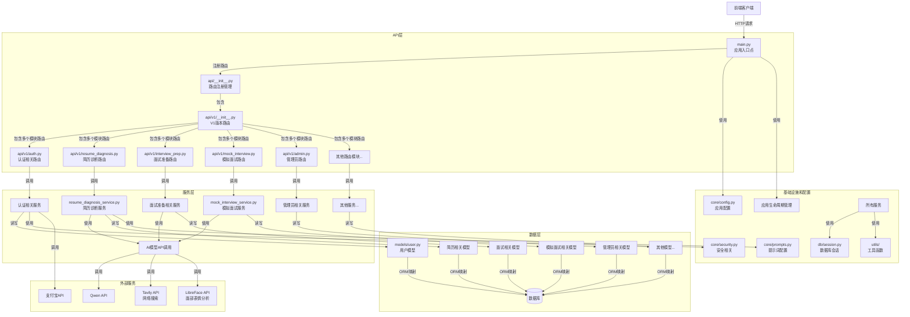

# 职麦AI后端系统架构设计

## 整体架构图



## 模块关系详解

### 1. 分层架构

系统采用经典的分层架构设计，各层职责清晰：

1. **API层（接口层）**：
   - 位于`api/`目录下
   - 负责处理HTTP请求和响应
   - 实现路由注册和请求参数验证
   - 将请求转发给相应的服务层处理

2. **服务层（业务逻辑层）**：
   - 位于`services/`目录下
   - 实现核心业务逻辑
   - 调用外部API（如AI模型）
   - 处理数据转换和业务规则

3. **数据层**：
   - 位于`models/`目录下
   - 使用SQLAlchemy ORM定义数据模型
   - 处理数据持久化和查询

4. **基础设施层**：
   - 位于`core/`、`db/`、`utils/`等目录下
   - 提供配置管理、数据库连接、工具函数等基础功能

### 2. 主要模块关系

#### API模块（`api/`）
- `api/__init__.py`：统一注册所有API路由
- `api/v1/`：包含所有v1版本的API路由模块
- 各路由模块负责特定功能领域的API端点定义

#### 服务模块（`services/`）
- 服务模块与API模块一一对应
- 每个服务模块实现特定业务领域的核心逻辑
- 服务模块可以相互调用，或调用外部API

#### 数据模型（`models/`）
- 定义数据库表结构和关系
- 包含用户、简历、面试、聊天等核心业务实体
- 服务层通过模型进行数据访问

#### 数据验证模式（`schemas/`）
- 定义API请求和响应的数据结构
- 使用Pydantic进行数据验证
- 确保数据的一致性和完整性

#### 核心配置（`core/`）
- 应用配置（`config.py`）：管理环境变量和应用设置
- 安全性（`security.py`）：处理认证和授权
- 提示词（`prompts.py`）：管理AI模型的提示词模板

### 3. 数据流向

1. **请求处理流程**：
   - 客户端发送HTTP请求到API端点
   - FastAPI路由请求到相应的处理函数
   - API层验证请求参数，调用相应的服务
   - 服务层处理业务逻辑，可能调用其他服务或外部API
   - 服务层读写数据库获取或存储数据
   - 服务层返回处理结果给API层
   - API层构建响应并返回给客户端

2. **数据流示例**（以简历诊断为例）：
   ```mermaid
   sequenceDiagram
       participant Client as 前端
       participant API as API层<br>(resume_diagnosis.py)
       participant Service as 服务层<br>(resume_diagnosis_service.py)
       participant AI as AI API
       participant DB as 数据库
       
       Client->>API: POST /api/v1/resume-diagnosis/full
       API->>API: 验证请求参数
       API->>Service: 调用analyze_resume_full()
       Service->>AI: 调用AI模型分析简历
       AI-->>Service: 返回分析结果
       Service->>DB: 保存诊断记录
       DB-->>Service: 确认保存
       Service-->>API: 返回处理结果
       API-->>Client: 返回JSON响应
   ```

### 4. 依赖关系

- **API层** 依赖于 **服务层** 和 **schemas**
- **服务层** 依赖于 **数据模型**、**核心配置** 和 **工具函数**
- **数据模型** 依赖于 **数据库会话**
- 所有模块都依赖于 **核心配置**

## 扩展架构

### 1. 应用层与领域层

系统中包含`application/`和`domain/`目录，实现了领域驱动设计（DDD）的部分概念：

- `application/commands/`：实现命令模式，封装业务操作
- `application/event/`：实现事件驱动，处理系统事件
- `domain/`：包含领域模型和业务规则

### 2. 基础设施扩展

- `infrastructure/cache/`：缓存服务
- `infrastructure/database/`：数据库访问抽象
- `infrastructure/repositories/`：仓储模式实现
- `infrastructure/services/`：外部服务适配器

## 总结

职麦AI后端采用了清晰的分层架构，实现了高度模块化和可维护的系统设计。通过API层、服务层、数据层的分离，使系统具有良好的扩展性和可测试性。系统还融入了领域驱动设计的理念，通过应用层和领域层进一步抽象业务逻辑，使系统能够更好地应对业务变化。

主要特点：

1. **模块化设计**：功能按模块划分，降低耦合度
2. **分层架构**：职责清晰，便于维护和扩展
3. **依赖注入**：通过依赖注入提高代码可测试性
4. **ORM映射**：使用SQLAlchemy简化数据库操作
5. **数据验证**：使用Pydantic确保数据一致性
6. **外部集成**：与多个AI和第三方服务集成

## 项目结构优化建议

为了保持现有代码逻辑不变，同时提高项目的可维护性和可扩展性，以下是针对职麦AI后端项目的结构优化建议：

### 1. 架构分层优化

#### 1.1 清晰区分领域层和应用层
- **现状**：当前项目中`application/`和`domain/`目录存在但未充分利用，业务逻辑主要集中在`services/`目录
- **优化建议**：
  - 将核心业务逻辑迁移到`domain/`目录，按业务领域划分模块（如简历、面试、职位等）
  - 使用`application/`目录实现应用服务，协调领域对象和基础设施
  - 保留`services/`目录作为跨领域服务的整合层
- **预期收益**：提高业务逻辑的内聚性，便于理解和维护各业务领域

#### 1.2 完善基础设施层
- **现状**：`infrastructure/`目录结构已存在，但部分功能分散在其他目录
- **优化建议**：
  - 将数据库访问、缓存、外部服务调用等统一整合到`infrastructure/`目录
  - 实现仓储模式（Repository Pattern），封装数据访问逻辑
  - 为外部服务（如大模型、搜索服务）创建统一的适配器接口
- **预期收益**：降低业务层与基础设施的耦合，便于替换或升级基础设施组件

### 2. 模块组织优化

#### 2.1 按功能域重组模块
- **现状**：当前模块划分较为混杂，部分相关功能分散在不同目录
- **优化建议**：
  - 按核心功能域重组目录结构，如：
    ```
    app/
    ├── modules/
    │   ├── resume/
    │   │   ├── api/           # 简历相关API路由
    │   │   ├── domain/        # 简历领域模型和业务逻辑
    │   │   ├── application/   # 简历应用服务
    │   │   ├── infrastructure/ # 简历相关数据访问
    │   │   └── schemas/       # 简历相关数据模型
    │   ├── interview/
    │   └── job/
    └── shared/                # 共享组件和工具
    ```
  - 每个功能域内部遵循相同的分层结构
- **预期收益**：提高模块内聚性，降低模块间耦合，便于新功能开发和维护

#### 2.2 统一API路由组织
- **现状**：API路由集中在`api/v1/`目录下，按功能命名文件
- **优化建议**：
  - 将API路由与对应的功能域整合
  - 保留版本控制机制，通过路由前缀实现
  - 实现路由自动注册机制，减少手动配置
- **预期收益**：API路由与业务逻辑更紧密关联，便于维护和扩展

### 3. 代码组织优化

#### 3.1 服务层代码拆分
- **现状**：部分服务文件过大（如`resume_diagnosis_service.py`超过77KB）
- **优化建议**：
  - 将大型服务拆分为多个 smaller 服务或功能模块
  - 按功能职责划分服务方法，避免单一服务承担过多职责
  - 使用组合模式替代继承，提高服务的灵活性
- **预期收益**：提高代码可读性和可维护性，便于单元测试

#### 3.2 实现依赖注入
- **现状**：服务间依赖关系通过直接实例化或模块导入实现
- **优化建议**：
  - 引入依赖注入框架（如FastAPI的Depends机制或第三方库）
  - 定义清晰的服务接口，通过接口注入依赖
  - 实现服务的生命周期管理
- **预期收益**：降低服务间耦合，提高代码的可测试性和可扩展性

#### 3.3 统一异常处理
- **现状**：异常处理逻辑分散在各个服务中
- **优化建议**：
  - 定义统一的异常类型体系
  - 实现全局异常处理器，集中处理异常
  - 为不同类型的异常返回标准化的错误响应
- **预期收益**：提高错误处理的一致性，简化业务代码，便于客户端处理错误

### 4. 配置管理优化

#### 4.1 分层配置管理
- **现状**：当前配置集中在`config.py`文件中
- **优化建议**：
  - 按功能域划分配置（如数据库配置、AI服务配置、认证配置等）
  - 支持多环境配置（开发、测试、生产）
  - 实现配置验证机制，确保配置完整性和正确性
- **预期收益**：提高配置的可维护性和灵活性，便于不同环境部署

#### 4.2 外部化敏感配置
- **现状**：敏感配置可能硬编码在代码或配置文件中
- **优化建议**：
  - 将敏感配置（如API密钥、数据库密码）存储在环境变量或密钥管理服务中
  - 实现配置加密机制，保护敏感数据
  - 禁止在代码中硬编码敏感信息
- **预期收益**：提高系统安全性，符合最佳实践

### 5. 依赖管理优化

#### 5.1 清晰的依赖分层
- **现状**：项目依赖管理通过`requirements.txt`实现
- **优化建议**：
  - 使用`pyproject.toml`或`setup.py`管理项目依赖
  - 将依赖划分为核心依赖、开发依赖、测试依赖等
  - 固定依赖版本，确保构建的可重复性
- **预期收益**：提高依赖管理的清晰度和可靠性，便于项目维护和部署

#### 5.2 减少循环依赖
- **现状**：可能存在模块间的循环依赖
- **优化建议**：
  - 定期检查并解决循环依赖问题
  - 使用依赖图工具（如`pydeps`）可视化依赖关系
  - 重构代码，打破循环依赖
- **预期收益**：提高代码的可维护性和可测试性，避免运行时问题

### 6. 测试架构优化

#### 6.1 完善测试目录结构
- **现状**：`tests/`目录存在但可能未充分利用
- **优化建议**：
  - 按功能域和分层架构组织测试目录
  - 分别实现单元测试、集成测试和端到端测试
  - 使用测试框架（如pytest）和测试工具链
- **预期收益**：提高测试覆盖率，便于维护和扩展测试用例

#### 6.2 实现测试数据管理
- **优化建议**：
  - 使用工厂模式（如`factory_boy`）生成测试数据
  - 实现测试数据库的自动创建和清理
  - 编写测试夹具（fixtures），复用测试资源
- **预期收益**：提高测试的可靠性和可维护性，减少测试数据管理的工作量

### 7. 文档优化

#### 7.1 完善API文档
- **现状**：FastAPI自动生成API文档，但可能缺少详细的业务说明
- **优化建议**：
  - 为API端点添加详细的描述和示例
  - 编写API使用指南和最佳实践
  - 维护API变更日志
- **预期收益**：提高API的可用性，便于前端开发和集成

#### 7.2 增强代码文档
- **现状**：部分代码可能缺少足够的注释和文档
- **优化建议**：
  - 为公共API添加类型提示和文档字符串
  - 编写模块级文档，说明模块的功能和使用方法
  - 使用文档生成工具（如Sphinx）自动生成代码文档
- **预期收益**：提高代码的可读性和可维护性，便于团队协作

### 8. CI/CD优化

#### 8.1 实现自动化测试和构建
- **优化建议**：
  - 配置CI/CD流水线，自动运行测试和构建
  - 实现代码质量检查（如flake8、mypy）
  - 配置自动化部署流程
- **预期收益**：提高开发效率，减少人为错误，确保代码质量

#### 8.2 监控和日志优化
- **现状**：日志系统已存在，但可能缺少统一的日志管理
- **优化建议**：
  - 实现结构化日志，便于日志分析和监控
  - 配置日志级别和输出格式
  - 集成日志收集和监控系统（如ELK Stack、Prometheus）
- **预期收益**：提高系统的可观测性，便于问题排查和性能优化

### 9. 实施建议

#### 9.1 渐进式重构
- **建议**：采用渐进式重构策略，避免大规模重写
- **步骤**：
  1. 首先优化最关键的模块（如简历诊断模块）
  2. 逐步推广到其他模块
  3. 每次重构后运行测试，确保功能正常
- **预期收益**：降低重构风险，确保系统稳定性

#### 9.2 团队协作
- **建议**：建立统一的编码规范和架构指南
- **措施**：
  - 编写团队开发手册
  - 定期进行代码审查
  - 组织架构设计评审
- **预期收益**：提高团队协作效率，确保代码质量和架构一致性

#### 9.3 持续改进
- **建议**：建立持续改进机制，定期评估和优化架构
- **措施**：
  - 收集和分析系统运行数据
  - 定期进行架构评审
  - 跟踪和采用新技术和最佳实践
- **预期收益**：确保系统架构能够适应业务发展和技术变化

通过以上优化建议，可以在保持现有代码逻辑不变的情况下，显著提高职麦AI后端项目的可维护性、可扩展性和可测试性，为后续业务发展和技术升级奠定坚实的基础。

# 目录结构
## 目录结构参考1


## 目录结构参考2


