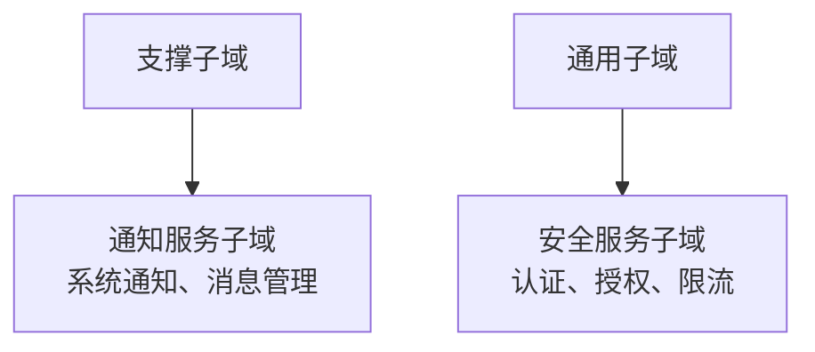
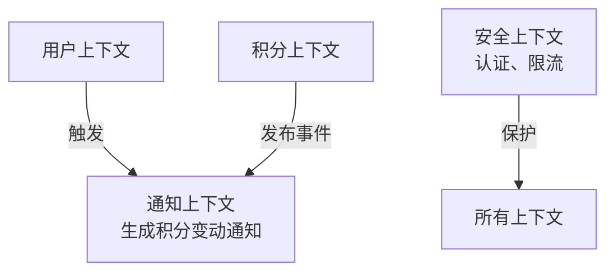
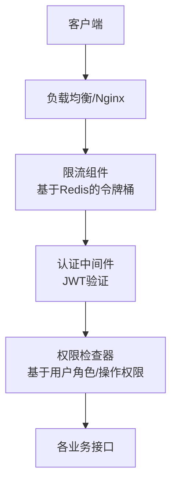
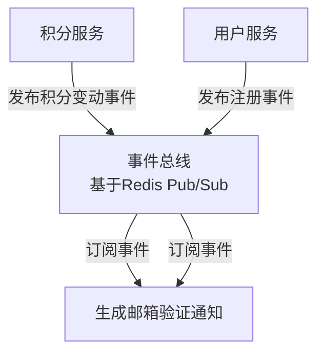

# 职麦 AI 系统 - 架构补充设计与代码示例（新增功能与 NFR）

## 一、架构补充设计

### 1. 领域与限界上下文补充

新增**通知子域**（支撑子域），负责处理系统通知（如积分变动、邮箱验证提醒等），并完善用户子域的邮箱验证流程。更新后的领域全景图与上下文映射如下：

#### 领域全景图补充




#### 上下文映射补充




### 2. 技术架构补充（针对 NFR）

#### 权限与限流架构




#### 松耦合通信（事件驱动）




## 二、可落地代码示例（补充功能与 NFR 实现）

### 1. 项目结构补充


```
jobmai\_ai/

├── app/

│   ├── domain/

│   │   └── notification/           # 新增：通知子域

│   │       ├── entities.py

│   │       └── repositories.py

│   ├── infrastructure/

│   │   ├── services/

│   │   │   ├── email\_service.py    # 新增：邮件服务

│   │   │   └── event\_bus.py        # 新增：事件总线

│   │   └── security/               # 新增：安全组件

│   │       ├── auth.py

│   │       └── rate\_limit.py

│   └── application/

│       ├── events/                 # 新增：领域事件

│       └── services/

│           ├── auth\_service.py     # 完善：用户注册与邮箱验证

│           └── notification\_service.py  # 新增：通知服务
```

### 2. 核心代码实现

#### 2.1 领域事件与事件总线（松耦合通信）


```
\# app/application/events/base.py

from dataclasses import dataclass

from datetime import datetime

from uuid import UUID, uuid4

@dataclass

class DomainEvent:

&#x20;   """领域事件基类"""

&#x20;   event\_id: UUID = uuid4()

&#x20;   occurred\_at: datetime = datetime.now()

\# app/application/events/user\_events.py

from dataclasses import dataclass

from uuid import UUID

from .base import DomainEvent

@dataclass

class UserRegisteredEvent(DomainEvent):

&#x20;   """用户注册事件"""

&#x20;   user\_id: UUID

&#x20;   email: str

\# app/application/events/points\_events.py

from dataclasses import dataclass

from uuid import UUID

from .base import DomainEvent

@dataclass

class PointsChangedEvent(DomainEvent):

&#x20;   """积分变动事件"""

&#x20;   user\_id: UUID

&#x20;   amount: int  # 正数为增加，负数为减少

&#x20;   reason: str

&#x20;   balance\_after: int
```


```
\# app/infrastructure/services/event\_bus.py

import redis

from typing import Callable, Dict, List

from app.config import settings

from app.application.events.base import DomainEvent

import json

from uuid import UUID

class RedisEventBus:

&#x20;   """基于Redis Pub/Sub的事件总线"""

&#x20;   def \_\_init\_\_(self):

&#x20;       self.redis = redis.from\_url(settings.REDIS\_URL)

&#x20;       self.subscribers: Dict\[str, List\[Callable]] = {}  # 事件类型 -> 订阅者列表

&#x20;   def publish(self, event: DomainEvent):

&#x20;       """发布事件"""

&#x20;       event\_type = event.\_\_class\_\_.\_\_name\_\_

&#x20;       event\_data = {

&#x20;           "event\_id": str(event.event\_id),

&#x20;           "occurred\_at": event.occurred\_at.isoformat(),

&#x20;           \*\*event.\_\_dict\_\_  # 事件特有属性

&#x20;       }

&#x20;       # 转换UUID为字符串（Redis不支持UUID序列化）

&#x20;       for k, v in event\_data.items():

&#x20;           if isinstance(v, UUID):

&#x20;               event\_data\[k] = str(v)

&#x20;       self.redis.publish(event\_type, json.dumps(event\_data))

&#x20;   def subscribe(self, event\_type: str, handler: Callable):

&#x20;       """订阅事件"""

&#x20;       if event\_type not in self.subscribers:

&#x20;           self.subscribers\[event\_type] = \[]

&#x20;       self.subscribers\[event\_type].append(handler)

&#x20;       # 启动后台监听（实际项目需用异步任务）

&#x20;       self.\_start\_listening(event\_type)

&#x20;   def \_start\_listening(self, event\_type: str):

&#x20;       """监听Redis频道并触发订阅者"""

&#x20;       import threading

&#x20;       def listen():

&#x20;           pubsub = self.redis.pubsub()

&#x20;           pubsub.subscribe(event\_type)

&#x20;           for message in pubsub.listen():

&#x20;               if message\["type"] == "message":

&#x20;                   data = json.loads(message\["data"])

&#x20;                   for handler in self.subscribers.get(event\_type, \[]):

&#x20;                       handler(data)

&#x20;       threading.Thread(target=listen, daemon=True).start()

\# 单例事件总线

event\_bus = RedisEventBus()
```

#### 2.2 用户注册与邮箱验证（新增功能）


```
\# app/domain/user/entities.py（补充）

from dataclasses import dataclass, field

from datetime import datetime, timedelta

@dataclass

class User:

&#x20;   # ... 原有字段 ...

&#x20;   email\_verified: bool = False  # 新增：邮箱是否验证

&#x20;   email\_verification\_code: str | None = None  # 新增：验证码

&#x20;   code\_expires\_at: datetime | None = None  # 新增：验证码过期时间

&#x20;   def generate\_verification\_code(self) -> str:

&#x20;       """生成6位邮箱验证码，有效期10分钟"""

&#x20;       import random

&#x20;       code = "".join(str(random.randint(0, 9)) for \_ in range(6))

&#x20;       self.email\_verification\_code = code

&#x20;       self.code\_expires\_at = datetime.now() + timedelta(minutes=10)

&#x20;       return code

&#x20;   def verify\_email(self, code: str) -> bool:

&#x20;       """验证邮箱验证码"""

&#x20;       if (self.email\_verification\_code == code&#x20;

&#x20;           and datetime.now() < self.code\_expires\_at):

&#x20;           self.email\_verified = True

&#x20;           self.email\_verification\_code = None

&#x20;           self.code\_expires\_at = None

&#x20;           return True

&#x20;       return False
```


```
\# app/infrastructure/services/email\_service.py

import smtplib

from email.mime.text import MIMEText

from app.config import settings

class EmailService:

&#x20;   """邮件服务适配器"""

&#x20;   def \_\_init\_\_(self):

&#x20;       self.smtp\_server = settings.SMTP\_SERVER  # 配置如"smtp.qq.com"

&#x20;       self.smtp\_port = settings.SMTP\_PORT      # 如587

&#x20;       self.smtp\_username = settings.SMTP\_USERNAME

&#x20;       self.smtp\_password = settings.SMTP\_PASSWORD  # 授权码

&#x20;   def send\_verification\_code(self, email: str, code: str):

&#x20;       """发送邮箱验证码"""

&#x20;       subject = "职麦AI - 邮箱验证"

&#x20;       content = f"您的邮箱验证码是：{code}，10分钟内有效，请勿泄露给他人。"

&#x20;       msg = MIMEText(content, "plain", "utf-8")

&#x20;       msg\["Subject"] = subject

&#x20;       msg\["From"] = self.smtp\_username

&#x20;       msg\["To"] = email

&#x20;       with smtplib.SMTP(self.smtp\_server, self.smtp\_port) as server:

&#x20;           server.starttls()

&#x20;           server.login(self.smtp\_username, self.smtp\_password)

&#x20;           server.send\_message(msg)
```


```
\# app/application/services/auth\_service.py

from uuid import UUID

from datetime import datetime

from app.domain.user.entities import User

from app.domain.user.repositories import UserRepository

from app.infrastructure.services.email\_service import EmailService

from app.application.events.user\_events import UserRegisteredEvent

from app.infrastructure.services.event\_bus import event\_bus

from passlib.context import CryptContext

pwd\_context = CryptContext(schemes=\["bcrypt"], deprecated="auto")

class AuthApplicationService:

&#x20;   def \_\_init\_\_(self, user\_repo: UserRepository, email\_service: EmailService):

&#x20;       self.user\_repo = user\_repo

&#x20;       self.email\_service = email\_service

&#x20;   def register(self, email: str, password: str, full\_name: str) -> User:

&#x20;       """用户注册（发送验证邮件）"""

&#x20;       if self.user\_repo.get\_by\_email(email):

&#x20;           raise ValueError("邮箱已被注册")

&#x20;      &#x20;

&#x20;       # 创建用户（未验证状态）

&#x20;       hashed\_password = pwd\_context.hash(password)

&#x20;       user = User.create(

&#x20;           email=email,

&#x20;           hashed\_password=hashed\_password,

&#x20;           full\_name=full\_name

&#x20;       )

&#x20;       user.generate\_verification\_code()  # 生成验证码

&#x20;       saved\_user = self.user\_repo.create(user)

&#x20;      &#x20;

&#x20;       # 发送验证邮件

&#x20;       self.email\_service.send\_verification\_code(

&#x20;           email=email,

&#x20;           code=user.email\_verification\_code

&#x20;       )

&#x20;      &#x20;

&#x20;       # 发布用户注册事件（通知服务会监听并处理）

&#x20;       event\_bus.publish(UserRegisteredEvent(user\_id=saved\_user.id, email=email))

&#x20;       return saved\_user

&#x20;   def verify\_email(self, user\_id: UUID, code: str) -> bool:

&#x20;       """验证邮箱验证码"""

&#x20;       user = self.user\_repo.get\_by\_id(user\_id)

&#x20;       if not user:

&#x20;           raise ValueError("用户不存在")

&#x20;       if user.email\_verified:

&#x20;           return True  # 已验证直接返回成功

&#x20;       if user.verify\_email(code):

&#x20;           self.user\_repo.update(user)

&#x20;           return True

&#x20;       return False
```

#### 2.3 积分消费与通知（新增功能）


```
\# app/domain/points/entities.py（补充）

from dataclasses import dataclass, field

from uuid import UUID, uuid4

from datetime import datetime

@dataclass

class PointsTransaction:

&#x20;   """积分交易记录"""

&#x20;   id: UUID = uuid4()

&#x20;   user\_id: UUID

&#x20;   amount: int  # 正数增加，负数减少

&#x20;   reason: str  # 如"模拟面试消耗"、"推广奖励"

&#x20;   balance\_after: int  # 交易后余额

&#x20;   created\_at: datetime = datetime.now()

@dataclass

class PointsAccount:

&#x20;   # ... 原有字段 ...

&#x20;   transactions: list\[PointsTransaction] = field(default\_factory=list)  # 交易记录

&#x20;   def deduct(self, amount: int, reason: str) -> PointsTransaction:

&#x20;       """扣除积分（amount为正数）"""

&#x20;       if self.balance < amount:

&#x20;           raise ValueError("积分不足")

&#x20;       self.balance -= amount

&#x20;       transaction = PointsTransaction(

&#x20;           user\_id=self.user\_id,

&#x20;           amount=-amount,

&#x20;           reason=reason,

&#x20;           balance\_after=self.balance

&#x20;       )

&#x20;       self.transactions.append(transaction)

&#x20;       return transaction
```


```
\# app/application/services/notification\_service.py

from uuid import UUID

from datetime import datetime

from app.domain.notification.entities import Notification

from app.domain.notification.repositories import NotificationRepository

from app.infrastructure.services.event\_bus import event\_bus

class NotificationApplicationService:

&#x20;   def \_\_init\_\_(self, notification\_repo: NotificationRepository):

&#x20;       self.notification\_repo = notification\_repo

&#x20;       # 订阅事件

&#x20;       event\_bus.subscribe("PointsChangedEvent", self.handle\_points\_changed)

&#x20;       event\_bus.subscribe("UserRegisteredEvent", self.handle\_user\_registered)

&#x20;   def handle\_points\_changed(self, event\_data: dict):

&#x20;       """处理积分变动事件，生成通知"""

&#x20;       user\_id = UUID(event\_data\["user\_id"])

&#x20;       amount = event\_data\["amount"]

&#x20;       reason = event\_data\["reason"]

&#x20;       if amount > 0:

&#x20;           content = f"您的积分增加了{amount}点，原因：{reason}"

&#x20;       else:

&#x20;           content = f"您的积分减少了{abs(amount)}点，原因：{reason}"

&#x20;      &#x20;

&#x20;       notification = Notification(

&#x20;           id=UUID(event\_data\["event\_id"]),  # 复用事件ID

&#x20;           user\_id=user\_id,

&#x20;           content=content,

&#x20;           is\_read=False,

&#x20;           created\_at=datetime.fromisoformat(event\_data\["occurred\_at"])

&#x20;       )

&#x20;       self.notification\_repo.create(notification)

&#x20;   def handle\_user\_registered(self, event\_data: dict):

&#x20;       """处理用户注册事件，生成邮箱验证提醒"""

&#x20;       user\_id = UUID(event\_data\["user\_id"])

&#x20;       notification = Notification(

&#x20;           id=UUID(event\_data\["event\_id"]),

&#x20;           user\_id=user\_id,

&#x20;           content="请尽快验证您的邮箱，完成注册流程",

&#x20;           is\_read=False,

&#x20;           created\_at=datetime.fromisoformat(event\_data\["occurred\_at"])

&#x20;       )

&#x20;       self.notification\_repo.create(notification)
```

#### 2.4 权限校验与接口限流（NFR 实现）


```
\# app/infrastructure/security/auth.py

from fastapi import Depends, HTTPException, status

from fastapi.security import OAuth2PasswordBearer

from jose import JWTError, jwt

from uuid import UUID

from datetime import datetime, timedelta

from app.config import settings

from app.domain.user.repositories import UserRepository

from app.dependencies import get\_user\_repository

oauth2\_scheme = OAuth2PasswordBearer(tokenUrl="/api/v1/auth/token")

def create\_access\_token(user\_id: UUID) -> str:

&#x20;   """生成JWT令牌"""

&#x20;   expire = datetime.now() + timedelta(minutes=settings.ACCESS\_TOKEN\_EXPIRE\_MINUTES)

&#x20;   to\_encode = {"sub": str(user\_id), "exp": expire}

&#x20;   return jwt.encode(to\_encode, settings.SECRET\_KEY, algorithm=settings.ALGORITHM)

async def get\_current\_active\_user(

&#x20;   token: str = Depends(oauth2\_scheme),

&#x20;   user\_repo: UserRepository = Depends(get\_user\_repository)

) -> UUID:

&#x20;   """获取当前活跃用户（已验证邮箱）"""

&#x20;   credentials\_exception = HTTPException(

&#x20;       status\_code=status.HTTP\_401\_UNAUTHORIZED,

&#x20;       detail="无效的令牌",

&#x20;       headers={"WWW-Authenticate": "Bearer"},

&#x20;   )

&#x20;   try:

&#x20;       payload = jwt.decode(

&#x20;           token, settings.SECRET\_KEY, algorithms=\[settings.ALGORITHM]

&#x20;       )

&#x20;       user\_id = UUID(payload\["sub"])

&#x20;   except (JWTError, ValueError):

&#x20;       raise credentials\_exception

&#x20;  &#x20;

&#x20;   user = user\_repo.get\_by\_id(user\_id)

&#x20;   if not user or not user.is\_active or not user.email\_verified:

&#x20;       raise HTTPException(

&#x20;           status\_code=status.HTTP\_403\_FORBIDDEN,

&#x20;           detail="用户未激活或邮箱未验证"

&#x20;       )

&#x20;   return user\_id
```


```
\# app/infrastructure/security/rate\_limit.py

from fastapi import Request, HTTPException

from slowapi import Limiter, \_rate\_limit\_exceeded\_handler

from slowapi.util import get\_remote\_address

from slowapi.errors import RateLimitExceeded

import redis

from app.config import settings

\# 基于Redis的限流器

redis\_client = redis.from\_url(settings.REDIS\_URL)

limiter = Limiter(

&#x20;   key\_func=get\_remote\_address,  # 按IP限流

&#x20;   storage\_uri=settings.REDIS\_URL,  # 存储到Redis

&#x20;   storage\_options={"socket\_connect\_timeout": 30},

)

def rate\_limit\_exceeded\_handler(request: Request, exc: RateLimitExceeded):

&#x20;   """限流异常处理"""

&#x20;   raise HTTPException(

&#x20;       status\_code=429,

&#x20;       detail=f"请求过于频繁，请{exc.retry\_after}秒后再试"

&#x20;   )

\# 注册限流异常处理器（在main.py中）
```

#### 2.5 接口层示例（整合权限与限流）


```
\# app/api/v1/endpoints/auth.py

from fastapi import APIRouter, Depends, HTTPException

from pydantic import BaseModel

from uuid import UUID

from app.application.services.auth\_service import AuthApplicationService

from app.dependencies import get\_auth\_service, get\_current\_active\_user

from app.infrastructure.security.auth import create\_access\_token

router = APIRouter(tags=\["auth"])

class RegisterDTO(BaseModel):

&#x20;   email: str

&#x20;   password: str

&#x20;   full\_name: str

class VerifyEmailDTO(BaseModel):

&#x20;   code: str

@router.post("/register")

def register(

&#x20;   data: RegisterDTO,

&#x20;   auth\_service: AuthApplicationService = Depends(get\_auth\_service)

):

&#x20;   try:

&#x20;       user = auth\_service.register(data.email, data.password, data.full\_name)

&#x20;       return {"message": "注册成功，请查收验证邮件", "user\_id": str(user.id)}

&#x20;   except ValueError as e:

&#x20;       raise HTTPException(status\_code=400, detail=str(e))

@router.post("/verify-email/{user\_id}")

def verify\_email(

&#x20;   user\_id: UUID,

&#x20;   data: VerifyEmailDTO,

&#x20;   auth\_service: AuthApplicationService = Depends(get\_auth\_service)

):

&#x20;   if auth\_service.verify\_email(user\_id, data.code):

&#x20;       return {"message": "邮箱验证成功"}

&#x20;   raise HTTPException(status\_code=400, detail="验证码无效或已过期")
```


```
\# app/api/v1/endpoints/interviews.py（补充权限与限流）

from fastapi import APIRouter, Depends, HTTPException

from slowapi import Limiter, \_rate\_limit\_exceeded\_handler

from app.infrastructure.security.rate\_limit import limiter, rate\_limit\_exceeded\_handler

from app.infrastructure.security.auth import get\_current\_active\_user

router = APIRouter(tags=\["interviews"])

router.state.limiter = limiter

router.add\_exception\_handler(RateLimitExceeded, rate\_limit\_exceeded\_handler)

@router.post("/", response\_model=InterviewDTO)

@limiter.limit("10/minute")  # 限制每分钟10次请求

def create\_interview(

&#x20;   interview\_data: CreateInterviewDTO,

&#x20;   current\_user\_id: UUID = Depends(get\_current\_active\_user),  # 权限校验

&#x20;   interview\_service: InterviewApplicationService = Depends(get\_interview\_service)

):

&#x20;   try:

&#x20;       return interview\_service.create\_interview(current\_user\_id, interview\_data)

&#x20;   except ValueError as e:

&#x20;       raise HTTPException(status\_code=400, detail=str(e))
```

### 3. 应用入口配置（main.py 补充）


```
\# app/main.py（补充限流配置）

from slowapi import FastAPI as SlowAPIFastAPI

from slowapi.errors import RateLimitExceeded

from app.infrastructure.security.rate\_limit import rate\_limit\_exceeded\_handler

\# 使用SlowAPI的FastAPI扩展支持限流

app = SlowAPIFastAPI(title="职麦AI系统 API")

\# 注册限流异常处理器

app.add\_exception\_handler(RateLimitExceeded, rate\_limit\_exceeded\_handler)

\# ... 原有初始化代码 ...
```

## 三、设计说明


1. **松耦合通信**：通过事件总线（Redis Pub/Sub）实现限界上下文交互（如积分变动后自动生成通知），避免直接依赖，提高可扩展性。

2. **权限与限流**：

* 权限校验：基于 JWT 令牌，通过依赖注入在接口层统一检查用户状态（是否激活、邮箱是否验证）。

* 接口限流：使用 slowapi 结合 Redis 实现令牌桶限流，按 IP 限制请求频率，保护接口稳定性。

1. **邮箱验证流程**：

* 注册时生成时效验证码，通过邮件服务发送。

* 验证通过后更新用户状态，确保账号安全性。

1. **积分与通知联动**：

* 积分变动后发布领域事件，通知服务订阅事件并自动创建通知，用户可在通知栏查看记录。

* 所有积分操作均记录交易明细，支持后续审计与追溯。

开发人员可基于此框架，进一步完善其他模块（如会议助手、面试押题）的积分消费逻辑，以及通知列表查询、已读状态更新等功能。

> （注：文档部分内容可能由 AI 生成）