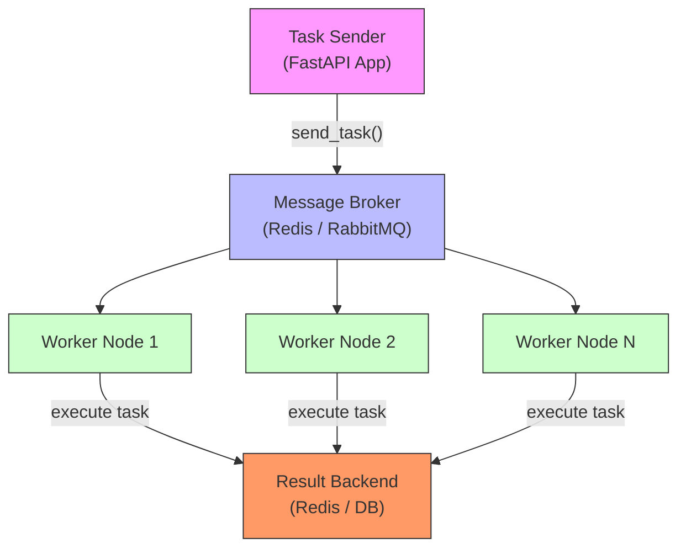
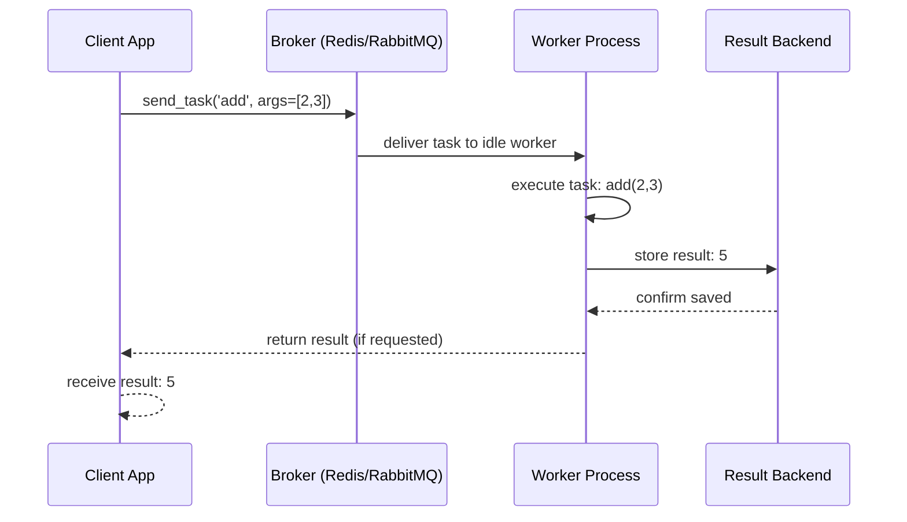
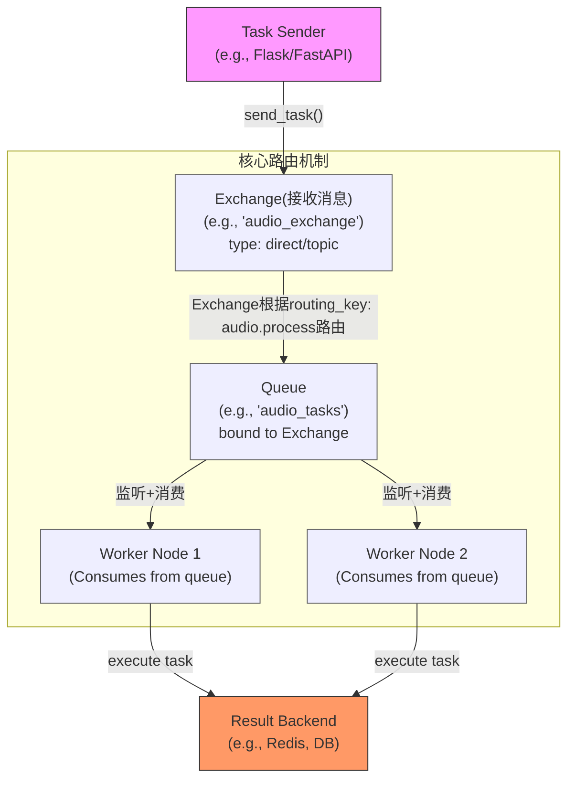

## 🧠 一、Celery 是什么？

> **Celery** 是一个 **分布式任务队列系统**，专为 Python 设计，支持异步任务执行、定时任务调度、任务结果持久化、多工作节点扩展等能力。

✅ 适用于：异步处理、后台任务、定时任务、事件驱动架构。

---

## 🔄 二、Celery 的基本工作机制（核心流程）

### 🔁 工作流程（步骤详解）：

1. **任务发送者（Producer）**  
   - 你的 FastAPI 应用调用 `celery.send_task()` 或 `celery.delay()`。
   - 任务内容（函数名 + 参数）被序列化后发送到 **消息代理（Broker）**。

2. **消息代理（Broker）**  
   - 通常是 **Redis** 或 **RabbitMQ**。
   - 作为消息中转站，持久化任务队列，支持多消费者。

3. **工作节点（Worker）**  
   - 一个或多个 Celery Worker 容器/进程。
   - 从 Broker 拉取任务，反序列化，执行对应的 Python 函数。

4. **结果后端（Result Backend）**  
   - 可选，用于存储任务执行结果（如 Redis、数据库、文件系统）。
   - 支持查询任务状态（`pending`, `success`, `failure`）。

5. **结果返回（Optional）**  
   - 任务完成后，结果写入后端。
   - 调用者可通过 `task_result.get()` 获取结果。

---

## 🖼️ 三、Celery 工作架构图（Mermaid）



**工作流程图**



## 🌟 四、Celery 的高级功能

| 功能 | 说明 |
|------|------|
| ✅ **任务重试（Retry）** | 支持自动失败重试（带指数退避） |
| ✅ **任务链（Chains）** | 将多个任务串联执行（如：`task1 → task2 → task3`） |
| ✅ **任务组（Groups）** | 并行执行多个任务（如：并发处理 100 个音频文件） |
| ✅ **任务扇出/扇入（Chord）** | 组合 + 回调，常用于大数据聚合（如：所有子任务完成后再执行汇总） |
| ✅ **定时任务（Celery Beat）** | 基于 cron 表达式定时触发任务（如：每天凌晨 2 点清理日志） |
| ✅ **任务签名（Task Signature）** | 用于构建任务对象，支持序列化和远程调用 |
| ✅ **任务状态监控** | 通过 `task.delay()` 返回的 `AsyncResult` 查询任务状态 |
| ✅ **消息确认（Acknowledgement）** | Worker 只有在任务成功执行后才从 Broker 中删除任务 |
| ✅ **任务路由与优先级** | 可将任务路由到特定worker，或支持设置任务优先级（高/中/低），用于资源调度 |

---

## 🧩 五、Celery 的典型使用场景

| 场景 | 说明 |
|------|------|
| 🎙️ **语音识别任务** | 主应用调用语音服务，Celery 异步处理音频转文字任务 |
|**图片/视频处理**|如缩略图生成、格式转换、人脸识别|
| 📧 **邮件/短信发送（异步）** | 用户注册后，不阻塞主流程，Celery 后台发送验证邮件 |
| 📊 **报表生成（耗时任务）** | 每月生成销售报表，Celery 异步处理，不卡主服务 |
| 🔁 **定时数据同步** | 每小时从外部 API 同步商品价格（Celery Beat） |
|**定时任务调度**|如每日生成报表、定时备份数据库、清理缓存|
| 📦 **文件处理流水线** | 用户上传视频 → Celery 转码 → 保存 → 发送通知 |
| 🧠 **AI 模型推理** | 接收用户请求 → Celery 异步运行大模型推理 → 返回结果 |
|**大数据批量计算**| 如日志分析、报表生成、数据清洗|

---

## 🎯 六、Celery 的核心特性总结

| 特性 | 说明 |
|------|------|
| 🌐 **分布式支持** | 多个 Worker 可分布在不同服务器部署，实现弹性伸缩 |
| ⏱️ **异步执行** | 主流程不阻塞，提升响应速度 |
| 🔁 **失败重试机制** | 支持自动重试 + 退避策略 |
| 🕰️ **定时任务调度** | 通过 Celery Beat 实现 Cron 风格调度 |
| 📦 **任务组合编排能力** | 支持 Chains、Groups、Chords 等复杂任务编排，chord：先并行执行一组任务，再执行回调<br>- chain：任务串行执行<br>- group：并行执行多个任务 |
| 📊 **结果追踪与监控** | 可查询任务状态、结果、执行时间等，使用 Flower 提供 Web UI，实时监控任务状态、Worker、队列、延迟等|
| 🛡️ **安全机制** | 可结合 JWT、API Key、IP 白名单等增强安全性 |
|**多种消息协议**|支持 Redis, RabbitMQ, Amazon SQS 等|

---

## ✅ 七、最佳实践建议（结合你的项目）

1. **任务签名验证**：在接收任务时，验证 API Key 或 JWT。
2. **结果后端使用 Redis**：速度快，支持 TTL，适合高频任务。
3. **任务优先级控制**：关键任务（如语音识别）设为高优先级。
4. **使用 Celery Beat 定时清理任务日志**。
5. **任务失败后发送告警消息**（通过消息中心）。
6. **限制任务执行时间**（使用 `soft_time_limit` / `time_limit`）。

---

## ✅ 八、常见问题与最佳实践
|问题	|解决方案|
|---|---|
|任务堆积	|增加 Worker 数量或优化任务逻辑|
|任务丢失	|使用持久化 Broker（如 Redis 持久化、RabbitMQ）|
|结果存储慢|使用 Redis 作为 Result Backend，避免数据库瓶颈|
|任务超时	|设置 timeout 和 soft_time_limit 参数|
|不支持跨进程|所有任务函数必须可被序列化（避免使用 lambda、闭包）|

## 📦 附：Celery 任务示例（Python）

```python
# tasks.py
from celery import Celery

app = Celery('tasks', broker='redis://redis:6379/1')

@app.task
def process_voice_file(audio_path: str, user_id: int):
    # 模拟语音识别耗时操作
    import time
    time.sleep(5)
    return {"user_id": user_id, "status": "processed", "text": "你好，这是语音识别结果"}
```

```python
# main.py (FastAPI)
from celery import Celery
from fastapi import FastAPI

app = FastAPI()

celery_app = Celery('main', broker='redis://redis:6379/1')

@app.post("/process-voice")
async def process_voice(audio_path: str, user_id: int):
    task = celery_app.send_task("tasks.process_voice_file", args=[audio_path, user_id])
    return {"task_id": task.id, "status": "task queued"}
```

---

## 附：Celery消息路由协同图解


**🔑 关键点总结**
|组件	|职责|	与 routing_key 的关系|
|---|---|---|
|Exchange	|消息的“分发中心”	|根据 routing_key 决定消息去向|
|routing_key|	消息的“路由标签”	|与 Exchange 类型配合使用（direct/topic）|
|Queue	|消息的“等待区”	|被 Exchange 通过 routing_key 填充|


---

## 📌 总结

> ✅ **Celery = 分布式任务队列 + 异步执行 + 定时调度 + 任务编排**

非常适合 **FastAPI/Flask/Django + Celery 架构**，能完美支撑：
- 主应用异步调用语音服务
- Celery 发布事件给消息中心
- 任务失败重试、状态追踪、结果持久化
- 异步发送邮件、短信
- 异步生成报表等
